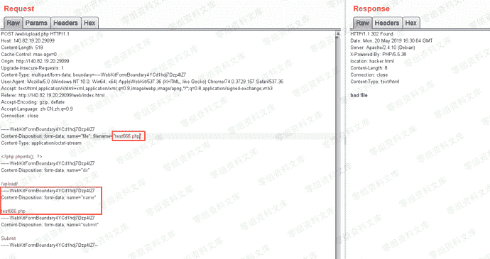
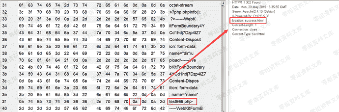
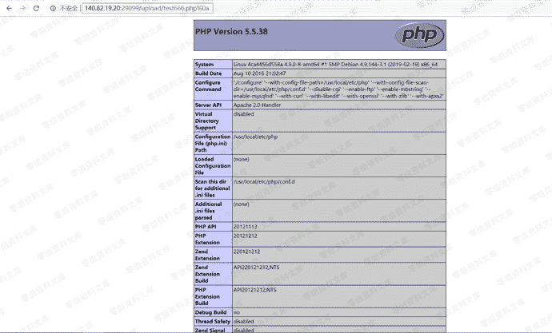

# （CVE-2017-15715）Apache解析漏洞

> 原文：[https://www.zhihuifly.com/t/topic/2808](https://www.zhihuifly.com/t/topic/2808)

# （CVE-2017-15715）Apache解析漏洞

## 一、漏洞简介

## 二、漏洞影响

Apache 2.4.0到2.4.29

## 三、复现过程

首先正常上传一个图片，发现无法上传

如果文件名取自$_FILES['file']['name']，就会自动把换行符去掉，而文件名取自post参数name中，就能很好的利用到这个解析漏洞

下面我们上传一个包含换行符的文件，这里需要注意只能时\x0a而不是\x0d\x0a，\x0d\x0a的情况是我们直接添加一个换行符，我们利用burp的hex功能在test666.php后面添加一个\x0a

从响应包中可以看到上传成功了，但是相应页面success.html中并没有告诉我们上传文件的目录

但是我们在请求包中还可以看到一个参数dir = /upload/，所以猜测上传目录为·/upload/test666.php%0a

