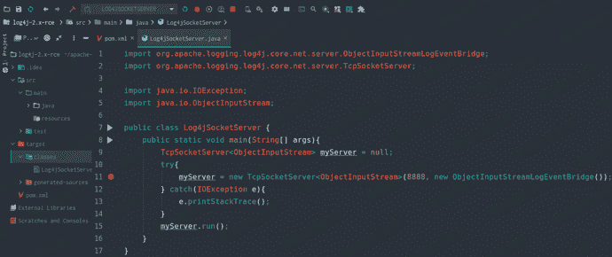
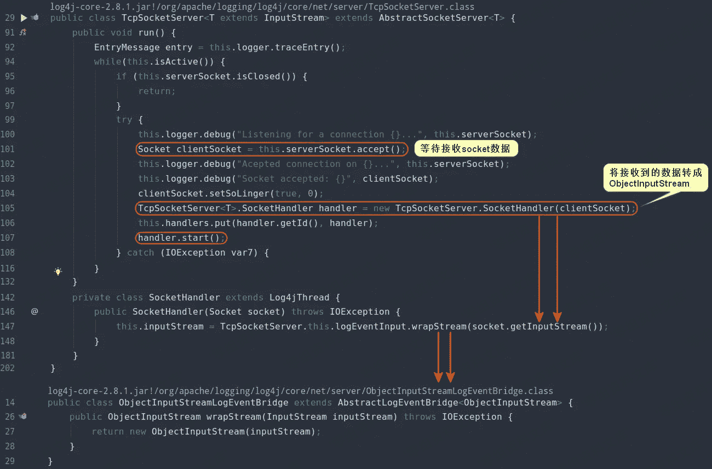
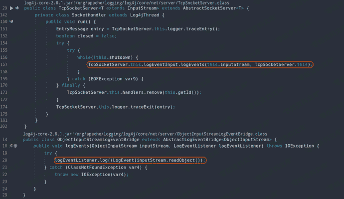
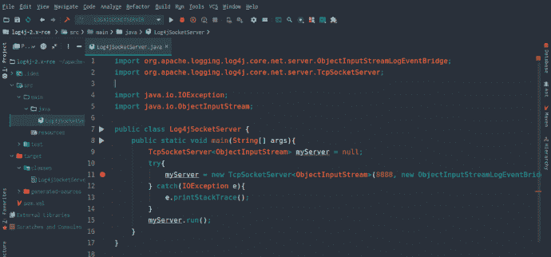

# （CVE-2017-5645）Log4j 2.X反序列化漏洞

> 原文：[https://www.zhihuifly.com/t/topic/2817](https://www.zhihuifly.com/t/topic/2817)

# （CVE-2017-5645）Log4j 2.X反序列化漏洞

## 一、漏洞简介

## 二、漏洞影响

Log4j 2.x<=2.8.1

## 三、复现过程

### 漏洞分析

漏洞本质和上面是一样的，我们先创建如下 **Demo** 代码用于测试。



```
// src/main/java/Log4jSocketServer.java
import org.apache.logging.log4j.core.net.server.ObjectInputStreamLogEventBridge;
import org.apache.logging.log4j.core.net.server.TcpSocketServer;

import java.io.IOException;

import java.io.ObjectInputStream; `public class Log4jSocketServer {

public static void main(String[] args){

TcpSocketServer<ObjectInputStream> myServer = null;

try{

myServer = new TcpSocketServer<ObjectInputStream>(8888, new ObjectInputStreamLogEventBridge());

} catch(IOException e){

e.printStackTrace();

}

myServer.run();

}

}` 
```

```
<!-- maven文件pom.xml -->
<?xml version="1.0" encoding="UTF-8"?>
<project xmlns="http://maven.apache.org/POM/4.0.0"
         xmlns:xsi="http://www.w3.org/2001/XMLSchema-instance"
         xsi:schemaLocation="http://maven.apache.org/POM/4.0.0 http://maven.apache.org/xsd/maven-4.0.0.xsd">
    <modelVersion>4.0.0</modelVersion>

    <groupId>org.example</groupId>
    <artifactId>log4j-2.x-rce</artifactId>
    <version>1.0-SNAPSHOT</version>
    <dependencies>
        <!-- https://mvnrepository.com/artifact/org.apache.logging.log4j/log4j-core -->
        <dependency>
            <groupId>org.apache.logging.log4j</groupId>
            <artifactId>log4j-core</artifactId>
            <version>2.8.1</version>
        </dependency>
        <!-- https://mvnrepository.com/artifact/org.apache.logging.log4j/log4j-api -->
        <dependency>
            <groupId>org.apache.logging.log4j</groupId>
            <artifactId>log4j-api</artifactId>
            <version>2.8.1</version>
        </dependency>
        <!-- https://mvnrepository.com/artifact/commons-collections/commons-collections -->
        <dependency>
            <groupId>commons-collections</groupId>
            <artifactId>commons-collections</artifactId>
            <version>3.1</version>
        </dependency>
    </dependencies>

</project> 
```

当我们运行代码后，程序会在本地的 **8888** 端口开始等待接收数据，然后在下图第105行代码处，将接收到的数据转换成 **ObjectInputStream** 对象数据，最终在 `handler.start()` 中调用 **SocketHandler** 类的 **run** 方法。



在 **SocketHandler** 类的 **run** 方法中， **ObjectInputStream** 对象数据被传入了 **ObjectInputStreamLogEventBridge** 类的 **logEvents** 方法，而反序列化就发生在这个方法中。



同样这里我们添加一条 **commons-collections** 的 **Gadget** 链用来演示命令执行。



## 参考链接

> https://mochazz.github.io/2019/12/26/Log4j%E5%8F%8D%E5%BA%8F%E5%88%97%E5%8C%96%E5%88%86%E6%9E%90/#%E6%BC%8F%E6%B4%9E%E5%88%86%E6%9E%90-1