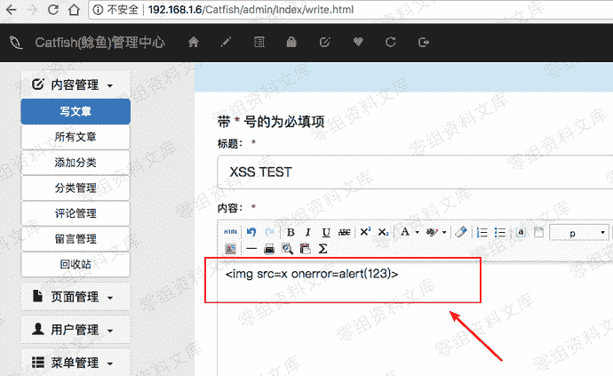
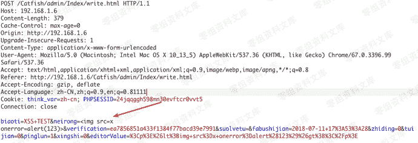
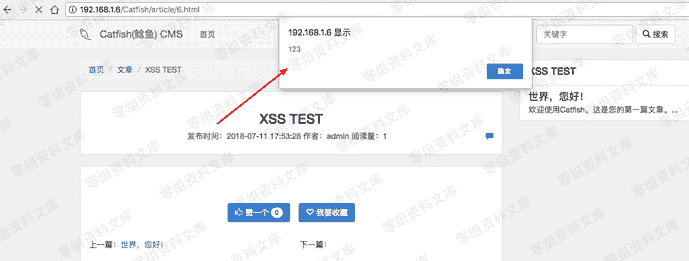

# CatfishCMS后台储存型xss

> 原文：[https://www.zhihuifly.com/t/topic/2836](https://www.zhihuifly.com/t/topic/2836)

# CatfishCMS后台储存型xss

## 一、漏洞简介

网站背景中的管理员可以发布包含存储XSS漏洞的文章 提交标题以抓取数据包 使用burp修改参数 浏览文章可以触发XSS

## 二、漏洞影响

## 三、复现过程



```
neiron= 
```



