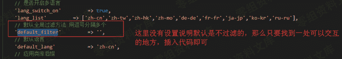
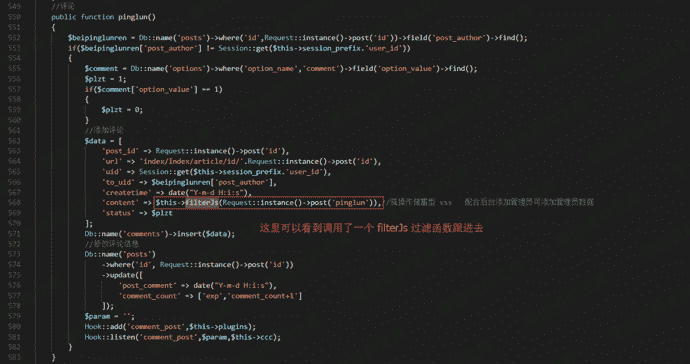

# CatfishCMS 4.5.7 xss

> 原文：[https://www.zhihuifly.com/t/topic/2837](https://www.zhihuifly.com/t/topic/2837)

# CatfishCMS 4.5.7 xss

## 一、漏洞简介

## 二、漏洞影响

CatfishCMS 4.5

## 三、复现过程

### 漏洞分析

文件：application\config.php

参数：default_filter

最后找到一处未过滤的地方

文件：application/index/controller/Index.php

方法：pinglun()

过滤函数

文件：application\index\controller\Common.php

方法：filterJs()

可以看到只是简单的过滤