# CatfishCMS 4.5.7 csrf getshell

> 原文：[https://www.zhihuifly.com/t/topic/2838](https://www.zhihuifly.com/t/topic/2838)

# CatfishCMS 4.5.7 csrf getshell

## 一、漏洞简介

## 二、漏洞影响

CatfishCMS 4.5

## 三、复现过程

思路：

前台评论出插入xss代码->诱骗后台管理员访问网站-内容管理-评论管理-自动执行xss代码->通过csrf插入一条新文章->通过csrf清除缓存->在通过js访问前端任意页面生成缓存建立shell
大概的想法就是这样做了。

后台创建文章方法

地址：application\admin\controller\Index.php

方法：write();

这个方法没有什么可以讲的只是后面的组合漏洞要使用到他

后台清除缓存方法

地址：application\admin\controller\Index.php

方法：clearcache()

这个方法没有什么可以讲的只是后面的组合漏洞要使用到他

例子：

1， 准备好脚本

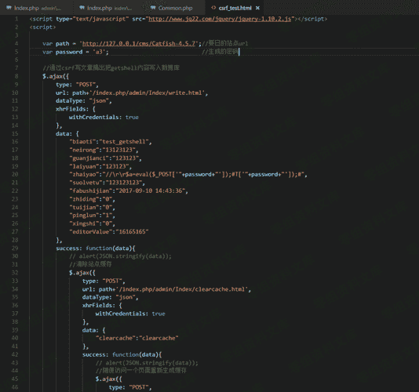

2，利用前面的xss漏洞，配合这个脚本形成xsrf漏洞

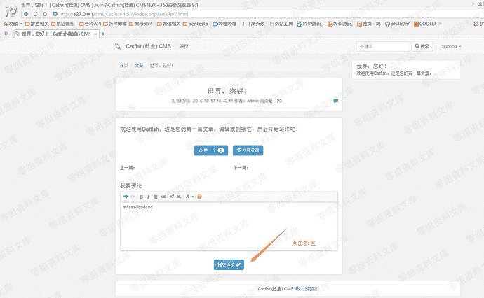

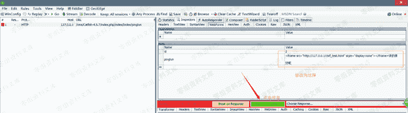

这样我们在前端的事情就完事了。接着我们模拟后台管理员进入后台的操作

模拟的后端管理员操作：

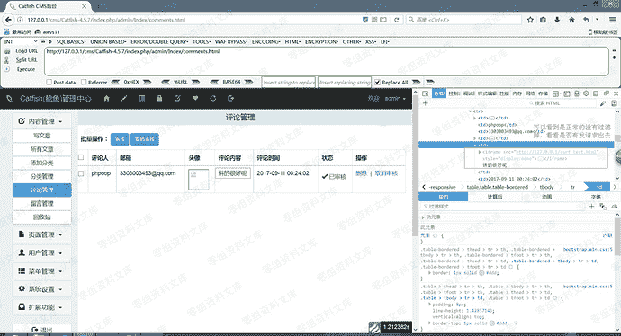

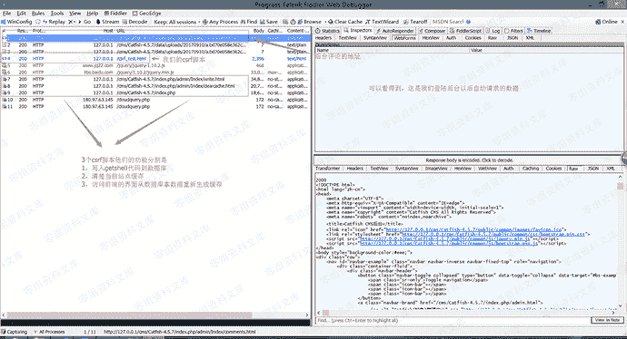

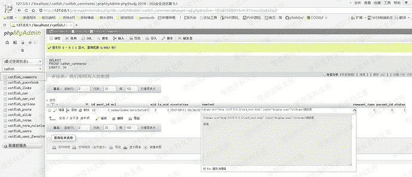

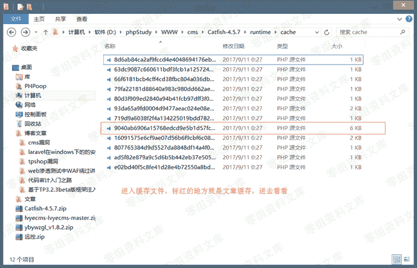

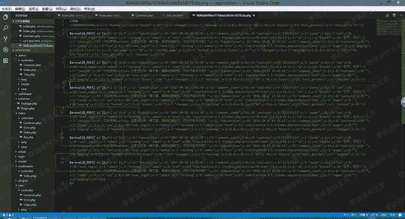

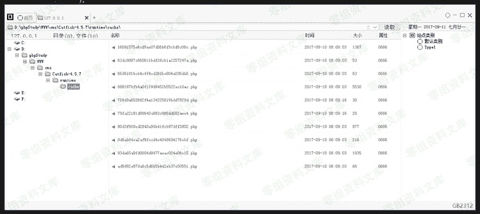

### 漏洞原理与流程：

1,后台创建文章方法
地址：application\admin\controller\Index.php
方法：write();
这个方法没有什么可以讲只是单纯的从前端获取数据然后写入数据库罢了

2,后台清除缓存方法
地址：application\admin\controller\Index.php
方法：clearcache()
这个方法没有什么可以讲的。只是单纯的删除缓存数据

3,访问前端重新生成缓存
地址： application\index\controller\Index.php
方法：index()

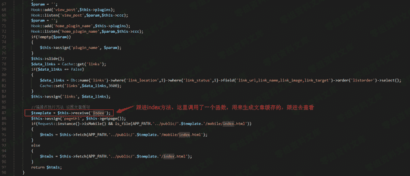

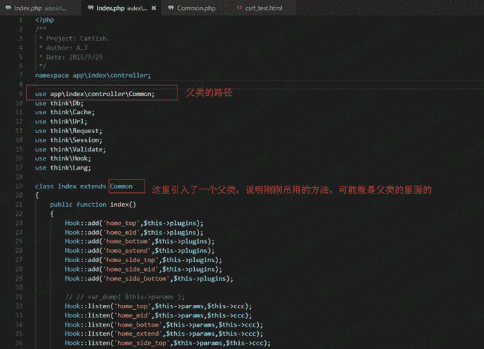

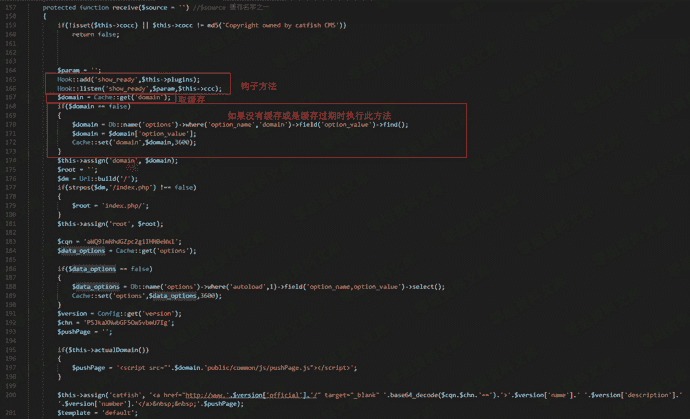

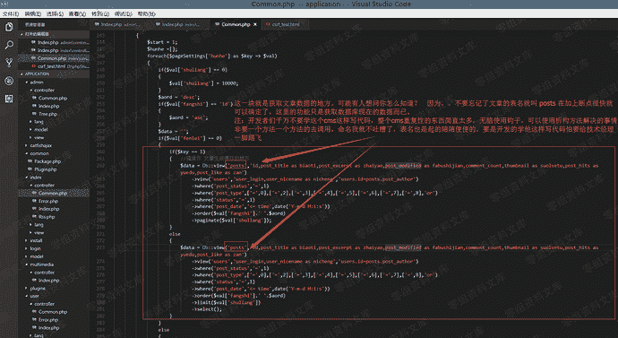

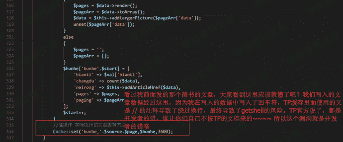

缓存的名字由来
缓存的名字组成就是比较简单的了。

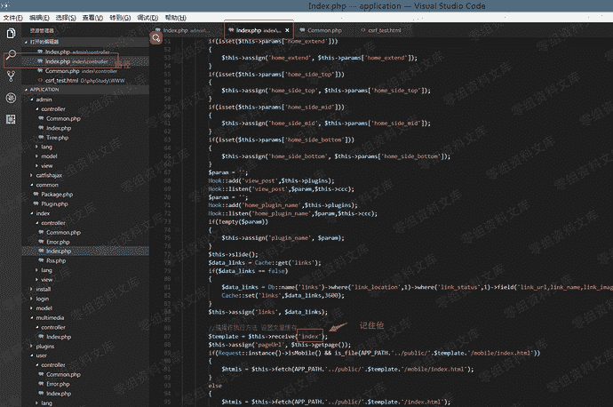

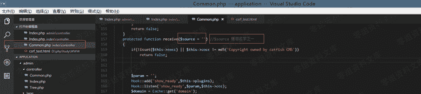

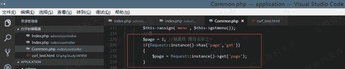


这上面几幅图就是缓存的名字了什么意思呢？很简单

首先是从index目录里面的index模块下面的index方法
调用了一个方法
$template
= $this->receive('index'); = index

然后是ndex目录里面的Common模块里面的receive 方法
获取了变量$source 值 = index
获取了变量$page 值 = 1

Cache::set('hunhe_'.$source.$page,$hunhe,3600); 缓存方法
最后就是

MD5(hunhe_index1) = 9040ab6906a15768edcd9e5b1d57fcda

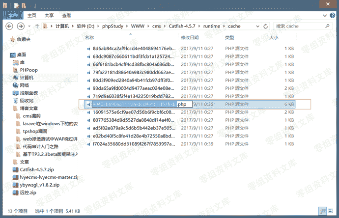

### 后记：

使用此方法的话，尝试一下在url中输入

```
http://www.xxxxxxx.com/runtime
http://www.xxxxxxx.com/runtime/cache
http://www.xxxxxxx.com/runtime/cache/8d6ab84ca2af9fccd4e4048694176ebf.php
按顺序输入如果前两个访问得到的结果是403  最后的结果不是403或是404 而是返回正常的页面，那么说明站点的缓存目录是可以访问的，这个时候可以使用此漏洞。配合xss+csrf 获取getshell 
```