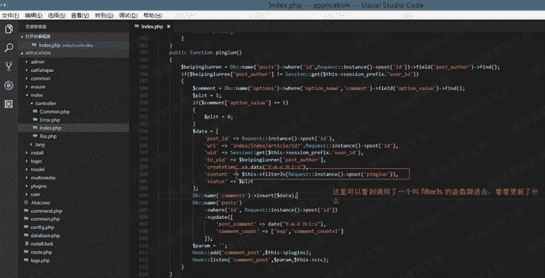
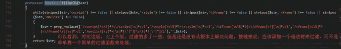
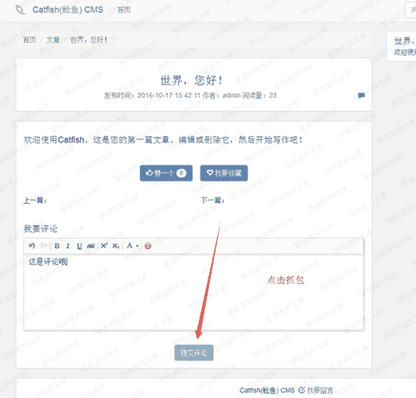
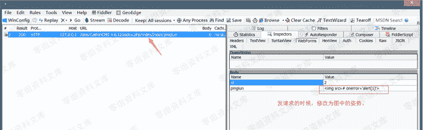
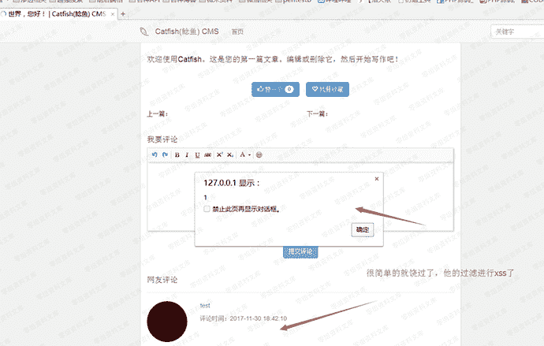
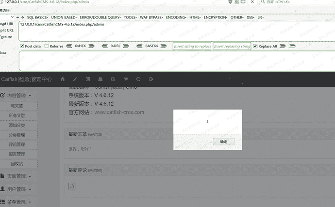

# CatfishCMS 4.6.15 前台xss

> 原文：[https://www.zhihuifly.com/t/topic/2839](https://www.zhihuifly.com/t/topic/2839)

# CatfishCMS 4.6.15 前台xss

## 一、漏洞简介

## 二、漏洞影响

CatfishCMS 4.6

## 三、复现过程

### 代码分析

url：

```
http://0-sec.org/cms/CatfishCMS-4.6.12/index.php/index/Index/pinglun 
```

文件：application/index/controller/Index.php

方法：pinglun(



文件：application\index\controller\Common.php

过滤函数：filterJs()



### 漏洞复现

首先注册一个用户







