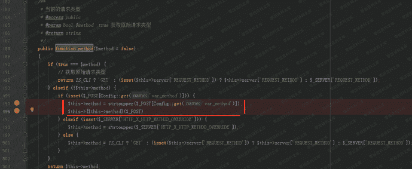
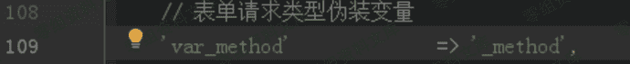
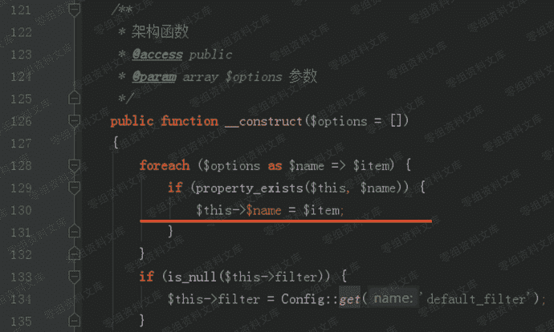
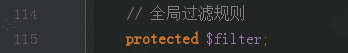
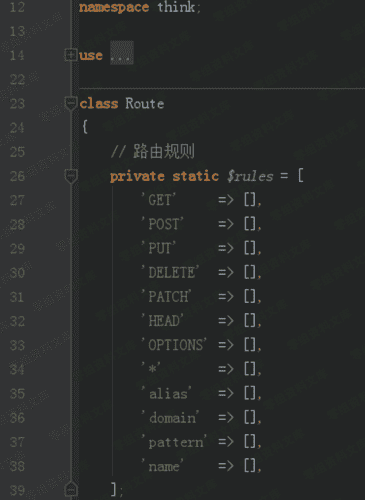

# （CNVD-2019-06255）CatfishCMS远程命令执行

> 原文：[https://www.zhihuifly.com/t/topic/2842](https://www.zhihuifly.com/t/topic/2842)

# （CNVD-2019-06255）CatfishCMS远程命令执行

## 一、漏洞简介

## 二、漏洞影响

v4.8.54

## 三、复现过程

### 1、_method=__construct

CatfishCMS基于thinkPHP5开发。
Request类（catfish/library/think/Request.php）用于处理请求。
它的成员函数method用于获取请求的类型。



application/config.php 中定义了“表单请求类型伪装变量”:



POST请求参数 “ _method=__construct ”，将 __construct 传给了var_method ，在Request类的method函数中执行后，实现了对Request类的 __construct 构造函数的调用；并且将完整的POST参数传给了构造函数。

### 2、method=*&filter[]=system

catfish/library/think/Request.php模块中的Request类的构造函数：



中存在的参数，就取用户传入的值为其赋值。

_method=__construct 使得 method 函数调用了 __construct 构造函数， 并且将完整的POST参数传递过去。实现了对本类中的 $method 和 $filter 两个全局变量的覆盖。




filter[]=system 的补充说明：
filter[]=system 或者 filter=system都可以，[]符号可有可无；system意为执行系统命令。

Method=* 的补充说明：

method参数的取值限定为：catfish/library/think/Route.php 模块中定义的路由规则。如：GET、POST、PUT、* 等任何一个值都可以；如果值不在此表或为空，都会报错。



### 3、s=dir

application/config.php 中定义PATHINFO变量名为’ s ’。可用s传入需要执行的命令，如s=dir

最终的的payload：

```
s=dir&_method=__construct&method=*&filter[]=system 
```

_method=__construct 使得 Request类的method函数调用 __construct 构造函数，并且将完整的payload传递给构造函数；构造函数中对 method 和filter 两个全局变量进行覆盖，method=&filter[]=system ；参数s=dir传入需要执行的系统命令 dir 。

```
s=echo "shell" >shell.php&filter[]=system&method=*&_method=__construct 
```