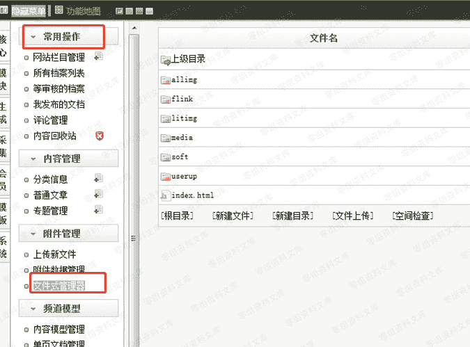
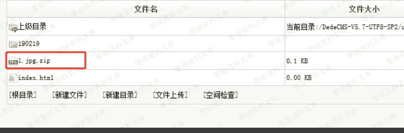
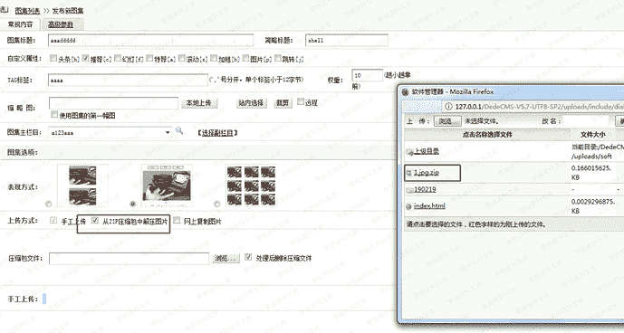
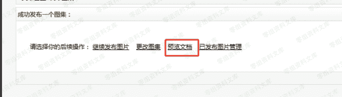
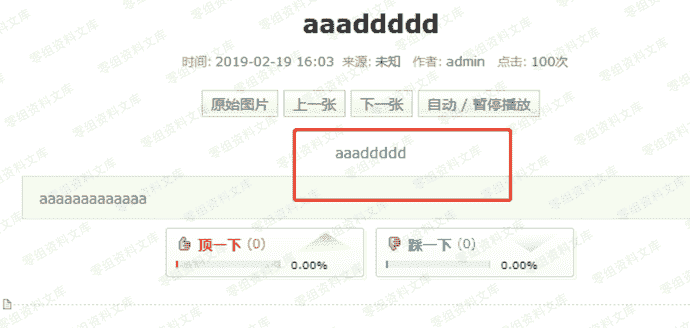
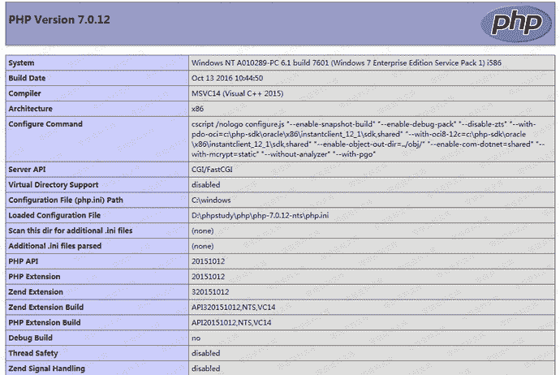
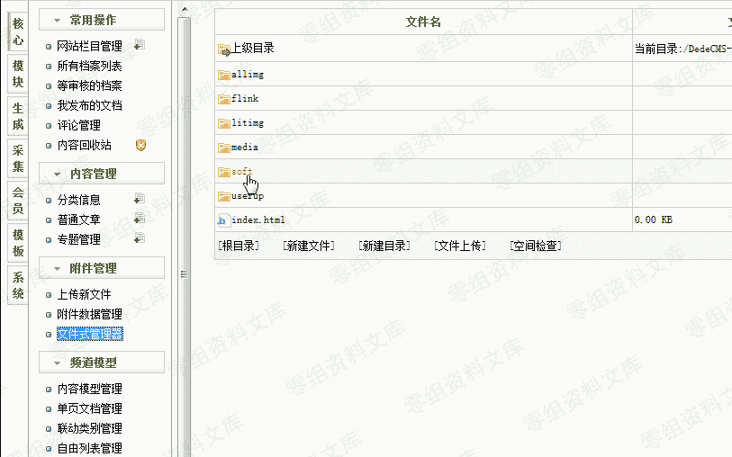

# （CVE-2019-8362）Dedecms v5.7 sp2 后台文件上传 getshell

> 原文：[https://www.zhihuifly.com/t/topic/2868](https://www.zhihuifly.com/t/topic/2868)

# （CVE-2019-8362）Dedecms v5.7 sp2 后台文件上传 getshell

## 一、漏洞简介

上传zip文件解压缩对于文件名过滤不周，导致getshell

## 二、漏洞影响

## 三、复现过程

### 代码分析

/dede/album_add.php 175行验证后缀

$fm->GetMatchFiles($tmpzipdir,"jpg|png|gif",$imgs);

进入函数：

```
function GetMatchFiles($indir, $fileexp, &$filearr)
   {
       $dh = dir($indir);
       while($filename = $dh->read())
       {
           $truefile = $indir.'/'.$filename;
           if($filename == "." || $filename == "..")
           {
               continue;
           }
           else if(is_dir($truefile))
           {
               $this->GetMatchFiles($truefile, $fileexp, $filearr);
           }
           else if(preg_match("/\.(".$fileexp.")/i",$filename))
           {
               $filearr[] = $truefile;
           }
       }
       $dh->close();
   } 
```

可以确定preg_match("/.(".$fileexp.")/i",$filename)只是判断了文件名中是否存在.jpg、.png、.gif中的一个，只要构造1.jpg.php就可以绕过。

### 复现

#### 1、首先构造一个文件名为1.jpg.php的文件，内容为

#### 2、将该文件进行压缩

#### 3、在常用操作-文件式管理器处上传压缩文件到soft目录下





#### 4、访问dede/album_add.php，选择从 从ZIP压缩包中解压图片



#### 5、发布预览







