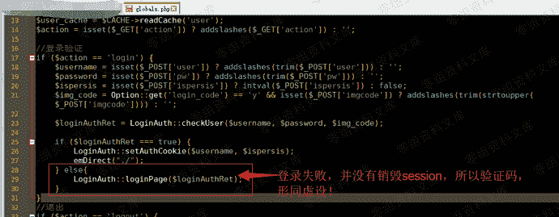
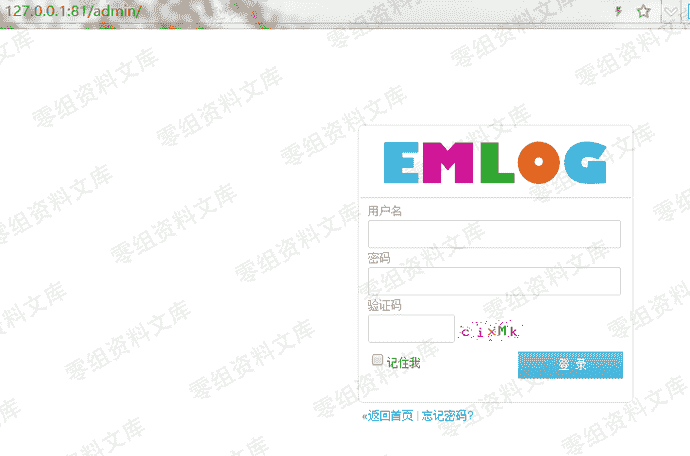
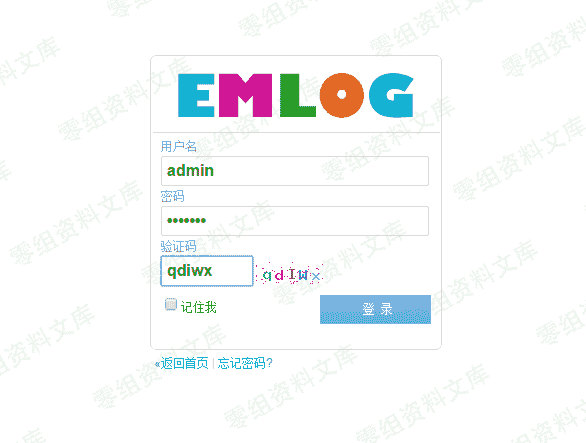
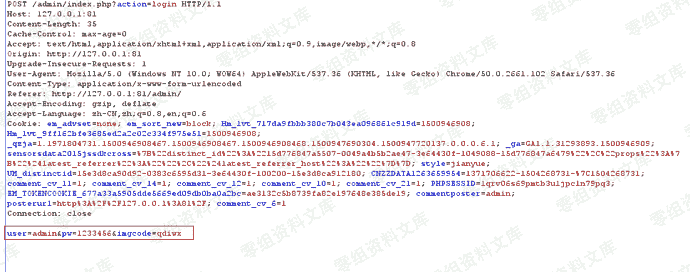
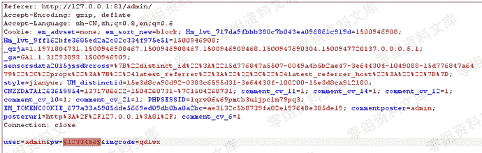
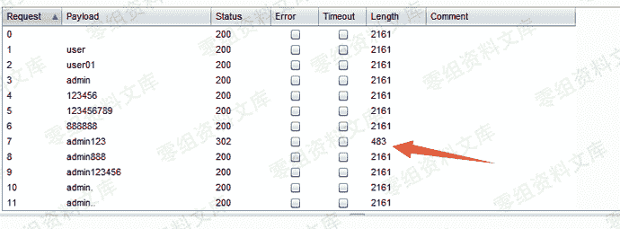
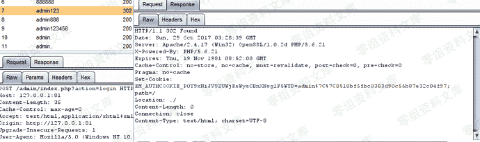

# Emlog 6.0 后台暴力破解

> 原文：[https://www.zhihuifly.com/t/topic/2912](https://www.zhihuifly.com/t/topic/2912)

# Emlog 6.0 后台暴力破解

## 一、漏洞简介

Emlog博客系统默认后台登陆地址为http://域名/admin/login.php而后台登陆时，错误情况下，验证码未刷新，导致可暴力破解登陆管理员账号低危漏洞，但是在emlog5.3.1和6.0测试版本均存在 ...

## 二、漏洞影响

emlog5.3.1和6.0

## 三、复现过程



访问

```
http://0-sec.org:81/admin/ 
```



已知管理员用户名为：admin（可在前端文章页寻找作者用户名）


登陆后台



随便输入admin admin123 qdiwx，点击登陆

然后burpsuite抓包



CTRL+I尝试暴力破解：







成功爆破出密码，所以再次验证：验证码没消除会话，导致可暴力破解漏洞的存在

## 四、参考链接

> http://www.dyboy.cn/post-900.html