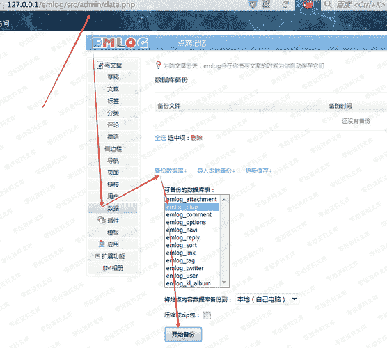
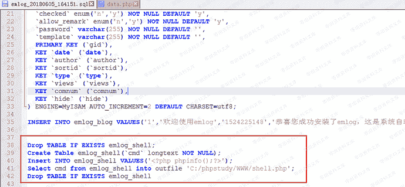
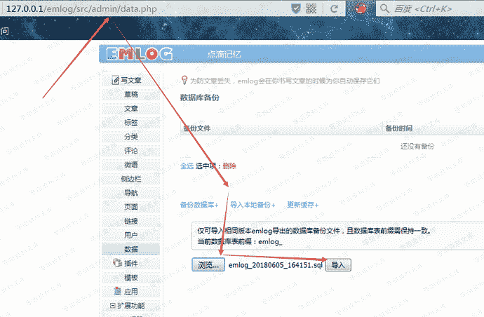
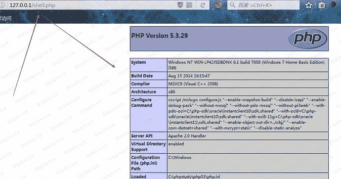

# Emlog 6.0 数据库备份与导入功能导致后台getshell

> 原文：[https://www.zhihuifly.com/t/topic/2914](https://www.zhihuifly.com/t/topic/2914)

# Emlog 6.0 数据库备份与导入功能导致后台getshell

## 一、漏洞简介

## 二、漏洞影响

Emlog<=6.0

## 三、复现过程

备份数据库到本地：

修改数据库文件，将备份的数据库文件进行修改，在最后一段添加上自己构造的SQL语句：

这一段sql语句主要功能是：首先判断是否存在emlog_shell数据表，如果存在则删除该表，之后创建一个新的emlog数据表，之后再向该表中添加信息（这里可以填入一句话木马），之后使用select.....  into  outfile  ....将数据表中的表项内容读入到一个shell.php的PHP文件汇总，之后再删除该数据表！

导入数据库：

之后访问之：

