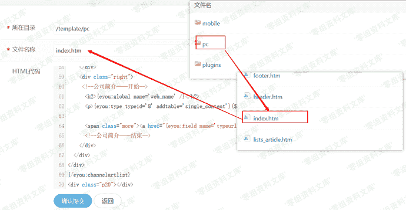
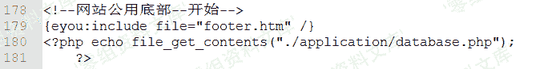
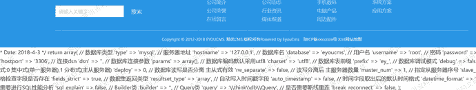

# Eyoucms 1.4.3 后台代码执行漏洞

> 原文：[https://www.zhihuifly.com/t/topic/2928](https://www.zhihuifly.com/t/topic/2928)

# Eyoucms 1.4.3 后台代码执行漏洞

## 一、漏洞简介

Eyoucms v1.4.3 版本后台修改模板文件可代码执行

## 二、漏洞影响

Eyoucms 1.4.3

## 三、复现过程

从官网下载最新版反复确认v1.4.3暂未修复。利用也很简单直接在高级选项 -> 模板管理 -> 修改pc模板。修改index.htm为例。

回到index页面刷新

