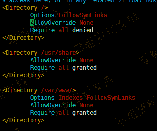
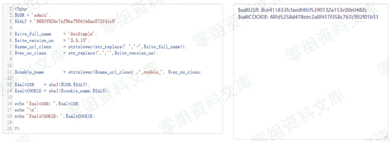
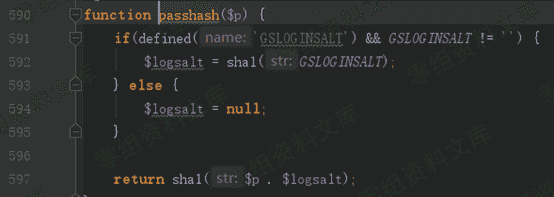
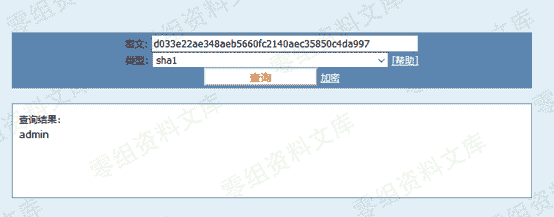
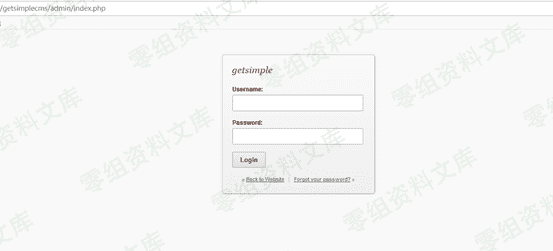
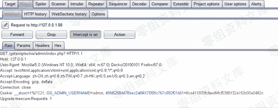
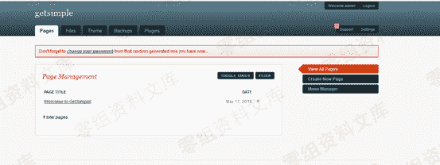
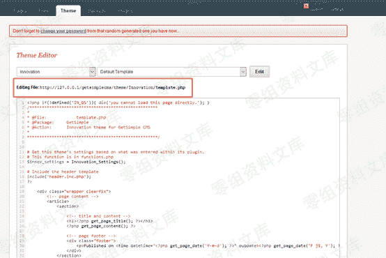
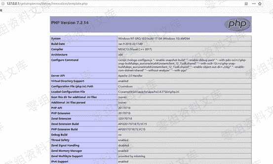

# （CVE-2019-11231）GetSimple CMS远程命令执行

> 原文：[https://www.zhihuifly.com/t/topic/2950](https://www.zhihuifly.com/t/topic/2950)

# （CVE-2019-11231）GetSimple CMS 远程命令执行

## 一、漏洞简介

在GetSimple 3.3.15版本中，攻击者可以通过伪造管理员cookie，绕过身份验证登陆后台，进而通过后台编辑模板功能模块写入php代码，造成远程代码执行漏洞。

## 二、漏洞影响

GetSimple<=3.3.15

## 三、复现过程

### 漏洞分析

在分析该漏洞前，不得不提.htaccess文件，本次漏洞的产生，是因为默认情况下apache对.htaccess配置文件的开启情况不同而产生的。

htaccess文件是Apache服务器中的配置文件，它负责相关目录下的网页配置。通过配置htaccess文件，可以实现众多功能，例如：允许/阻止特定的用户或者目录的访问、禁止目录列表、配置默认文档等。

启用.htaccess，需要在apache配置文件中，启用AllowOverride。

在笔者测试了两款环境，分别为配置了wamp的windows与ubuntu服务器，在这两个环境中，默认情况对htaccess文件的启用情况是不同的。

先来看安装有wamp的windows环境，打开apahce配置文件httpd.conf


可以看到，这里将位于conf/extra/httpd-vhosts.conf文件导入

跟进 httpd-vhosts.conf文件


可以看到，在这里，默认情况下 AllowOverride 默认值是All

当AllowOverride指令设置为 All时，所有具有”.htaccess”作用域的指令都允许出现在.htaccess文件中。

此时，目录中的.htaccess配置文件为启用状态

例如位于getsimplecms/data目录中的.htaccess配置文件


当此.htaccess配置文件被加载时，是禁止该目录被web端访问的


也就是说，通过该方法，通过web端访问data目录时，不会显示其中文件列表

与其中文件内容，是可以很好的保护存在于该目录下的文件，不被泄露

但是在笔者的ubuntu服务器，ubuntu apache2.conf中



AllowOverride 默认值是None，默认的情况下，不加载目录中的.htaccess

我们将上述的.htaccess文件放入ubuntu服务器的web目录中


再通过浏览器访问这个路径


如上图可见，.htaccess并没有生效，而路径中的文件，是可以被泄露的

回归到本次漏洞：

访问http://127.0.0.1/getsimplecms/data/users/admin.xml


在.htaccess没有生效的情况下，我们获取admin.xml中记录的用户相关信息，该cms并没有将用户信息写入数据库，而是全部存于该文件中


访问http://127.0.0.1/getsimplecms/data/other/authorization.xml获取authorization.xml中记录的apikey

现在我们得到如下的信息：（用户名/加密后的密码/apikey）

该cms并没有将用户信息写入数据库，而是全部存于xml文件中

通过获取的信息，接下来进一步分析如何利用这些泄露的信息：

Cookie**算法分析：**

分析下GetSimple中的cookie是如何生成的

位于\GetSimpleCMS\admin\inc\cookie_functions.php

create_cookie方法


计算cookie所需的$USR $SALT 对应如下：

GetSimpleCMS\data\users\admin.xml文件


getsimplecms\data\other\authorization.xml


这些信息是可以直接读取出来的

getsimplecms 中Cookie的算法的实现如下:



算法相对简单，通过$SALT值与$USR进行拼接；$SALT值与$cookie_name拼接，最终通过sha1进行加密，算出对应的cookie键值对

通过泄露的文件与cookie算法，可以顺利计算出对应用户的cookie

现在，可以伪造任意成员的cookie了

以USR :admin举例说明：

最终拼接的cookie为：

GS_ADMIN_USERNAME=admin;48fd5258d478eec2a8f417f358c767c992f01b51=8ce411833fcfaedf4fcf5390132a153c00e0482c

Password**算法分析：**

分析下Password的计算方式


Password的加密，是通过passhash()方法来实现的



GSLOGINSALT是用来保护的密码的额外的salt值，默认情况为空。

所以这里的密码计算就比较直接了，通过sha1方法对明文密码进行加密

```
sha1($p) 
```

通过sha1 hash将明文密码加密为密文。


也就是说，只要获取了加密后的password，有一定几率，可以破解为明文：



获取到管理员cookie/password后，使用管理员账号登陆后台

通过伪造cookie访问后台：

未登录时，访问后台地址




此时需要填写正确的用户名密码才可以登陆后台

这里，通过改包的方式，将cookie修改为之前计算出的值



此时，无需登陆，直接进入后台



访问如下url

http://127.0.0.1/getsimplecms/admin/theme-edit.php



在这里可以对模板文件进行编辑，在这里可以写入任意php代码，造成远程代码执行漏洞

例如：


访问如下地址：

http://127.0.0.1/getsimplecms/theme/Innovation/template.php



插入的php代码被成功执行