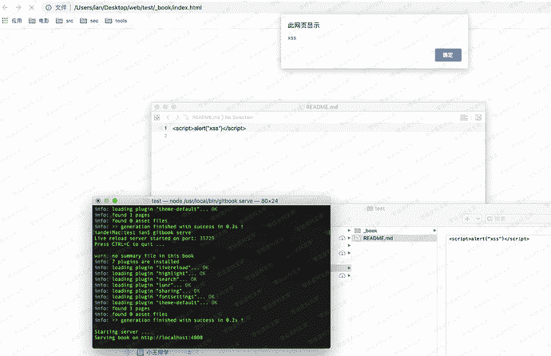

# （CVE-2019-19596）Gitbook 储存型xss

> 原文：[https://www.zhihuifly.com/t/topic/2956](https://www.zhihuifly.com/t/topic/2956)

# （CVE-2019-19596）Gitbook 储存型xss

## 一、漏洞简介

GitBook through 2.6.9 allows XSS via a local .md file

By entering script in MD file, it can be executed by gitbook

## 二、漏洞影响

GitBook 2.6.9

## 三、复现过程

