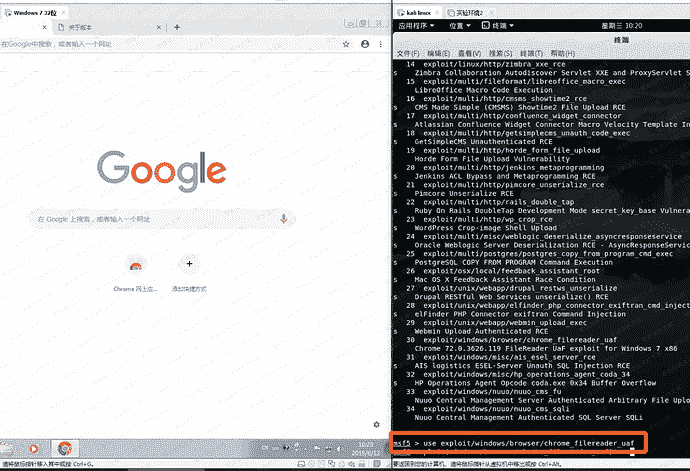
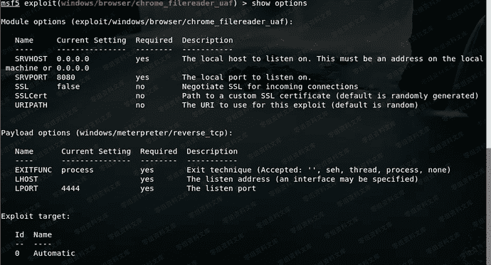
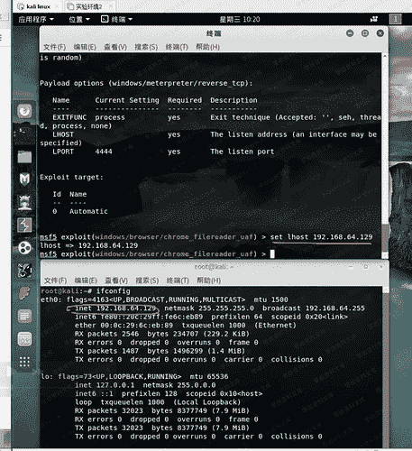
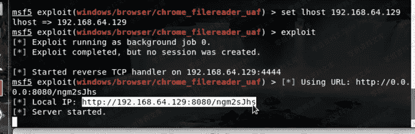
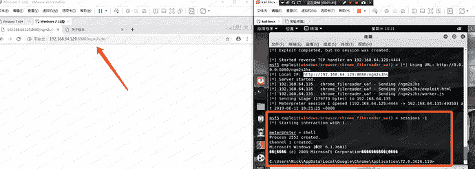

# （CVE-2019-5786）Chrome 远程代码执行漏洞

> 原文：[https://www.zhihuifly.com/t/topic/2959](https://www.zhihuifly.com/t/topic/2959)

# （CVE-2019-5786）Chrome 远程代码执行漏洞

## 一、漏洞简介

攻击者利用该漏洞配合一个win32k.sys的内核提权（CVE-2019-0808 ）可以在win7上穿越Chrome沙箱

## 二、漏洞影响

72.0.3626.121或更高版本

## 三、复现过程

测试环境为：

```
win7 x86
谷歌浏览器版本为72.0.3626.119 
```



这里看一下参数说明



设置lhost为我们的本机ip



执行exploit之后，会返回一个链接



只要被攻击者访问了这个链接，就会触发漏洞，返回session

