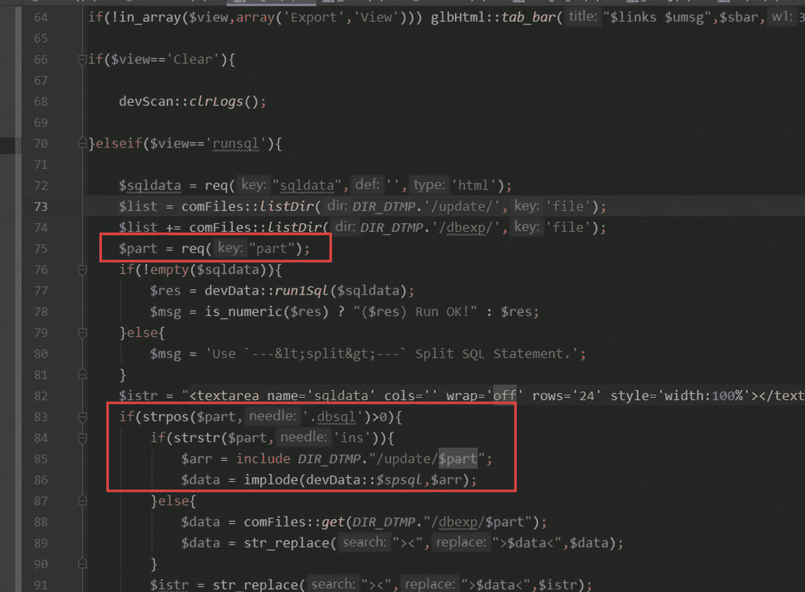
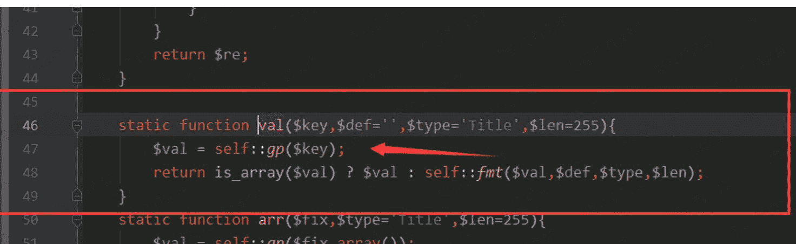
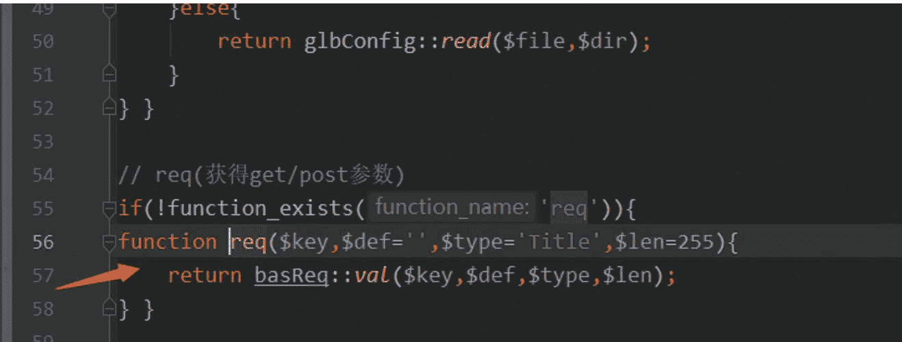
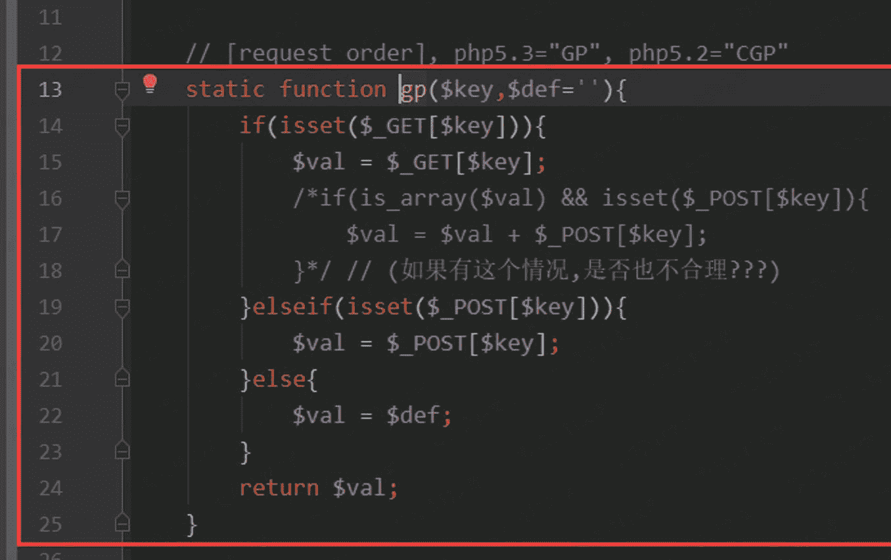
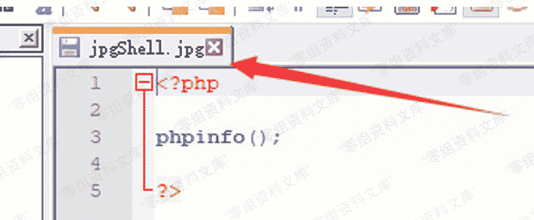
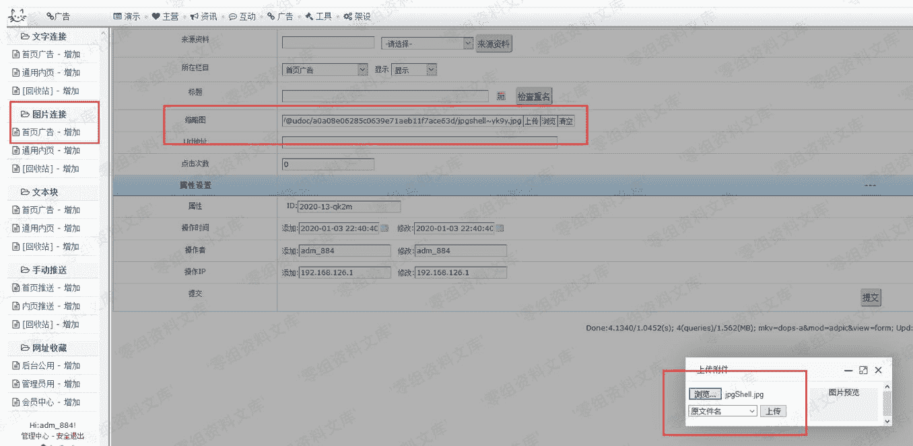
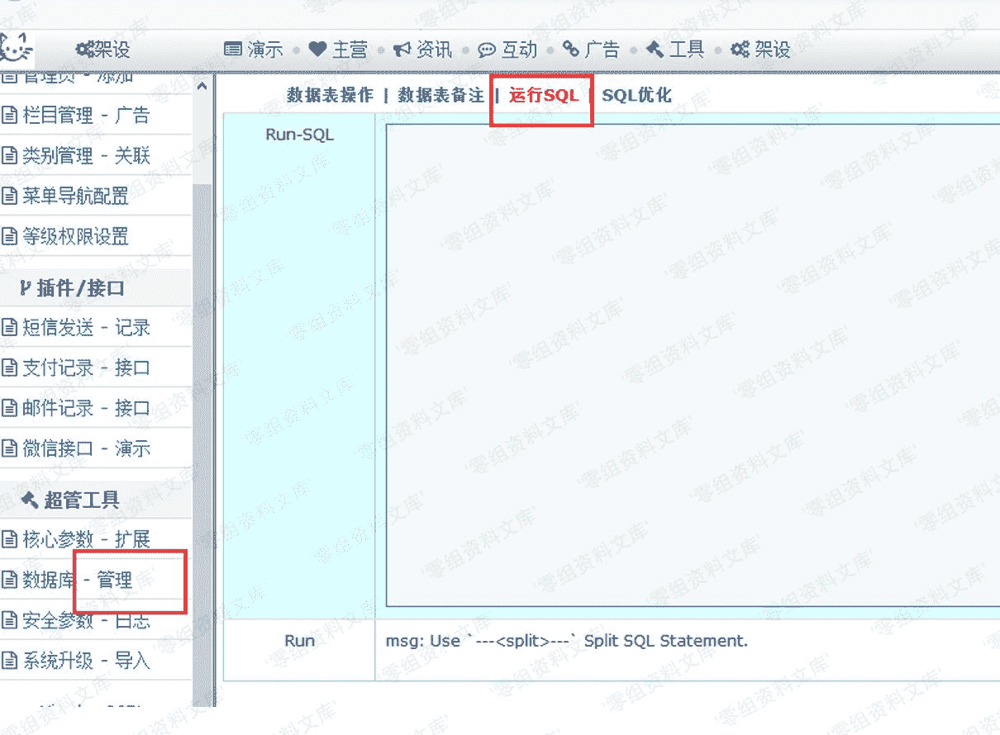
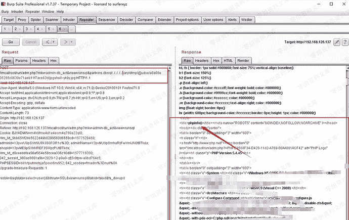

# Imcatcms 4.2 后台文件包含getshell

> 原文：[https://www.zhihuifly.com/t/topic/2969](https://www.zhihuifly.com/t/topic/2969)

# Imcat 4.2 后台文件包含getshell

## 一、漏洞简介

Imcat cms（贴心猫）4.2 存在一个sql shell的功能上，通过这个sql shell功能也是可以直接getshell的，但是当mysql版本过高的时候，默认有些权限是禁止的，不好弄，不过在这个功能中存在本地文件包含，
所以还可以通过文件包含来进行getshell。

## 二、漏洞影响

Imcat 4.2

## 三、复现过程

### 漏洞分析

找到相应的sql shell功能对应的代码，存在问题的参数是$part，从代码中可以看到$part参数直接传入到include进行文件包含的，虽有两个if判断，但是这很容易就可进行绕过了进入文件包含语句中，
所以只要跟踪的$part参数的传入即可。

跟踪req()函数

继续跟进

最后跟进到这里，其实就是通过get/post等其他方式接收就好，而且并没有进行任何的过滤

### 漏洞复现

写好的图片格式的shell

找到上传文件的功能，这个在后台中肯定很多可以上传功能，比如上传图片的地方，并获取返回的地址。

然后就可以进入到sql shell的地方中随意执行sql语句就好

抓包，因为**默认是没有$part这个参数的传入**的，需要自行添加，然后指定到图片的文件地址即可。

备注：ins.dbsql 这个是用来的绕过两个if判断进入到if代码块中的。