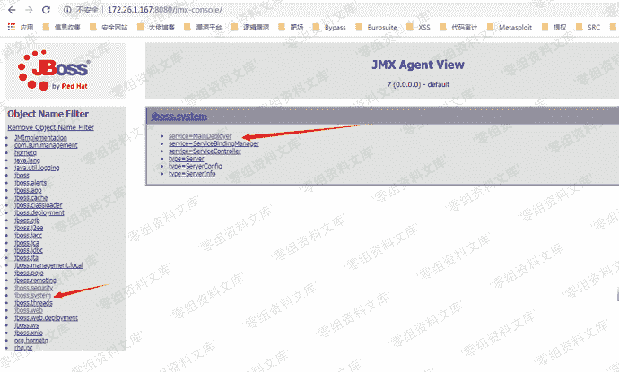
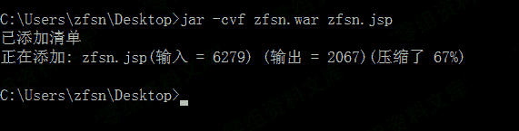
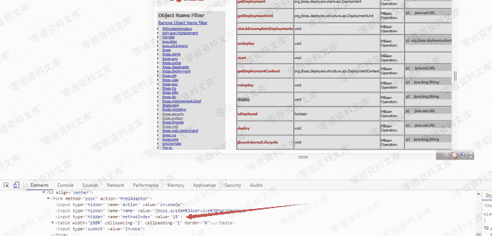
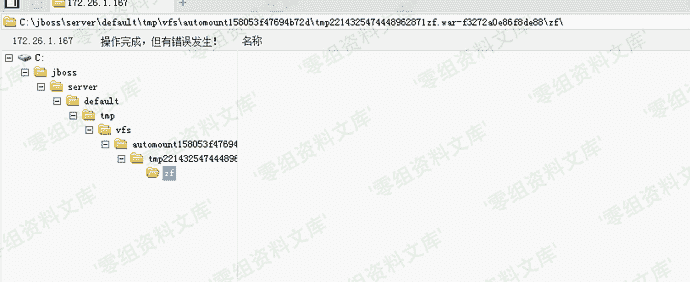

# JBoss JMX Console未授权访问Getshell

> 原文：[https://www.zhihuifly.com/t/topic/2979](https://www.zhihuifly.com/t/topic/2979)

# JBoss JMX Console未授权访问Getshell

## 一、漏洞简介

## 二、漏洞影响

全版本

## 三、复现过程

先输入[http://172.26.1.167:8080/jmx](http://172.26.1.167:8080/jmx-console/)-console/[null](http://172.26.1.167:8080/jmx-console/)[-console/](http://172.26.1.167:8080/jmx-console/)进入到页面

*   先点击[jboss.system](http://172.26.1.167:8080/jmx-console/HtmlAdaptor?action=displayMBeans&filter=jboss.system),然后点击[service=MainDeployer](http://172.26.1.167:8080/jmx-console/HtmlAdaptor?action=inspectMBean&name=jboss.system%3Aservice%3DMainDeployer)

> 创建一个war包

先准备好一个jsp的木马,然后打开cmd创建,输入命令:jar -cvf zfsn.war(你要创建war的名字，可随意填) zfsn. jsp

我们找到methodIndex为17 or 19的deploy，把远程的war包填入进去，进行远程war包的部署

部署完成之后,我们的木马地址为[http://172.26.1.167/zfsn/zfsn.jsp](http://172.26.1.167/zfsn/zfsn.jsp)

