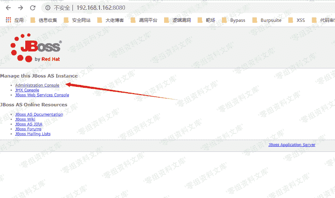
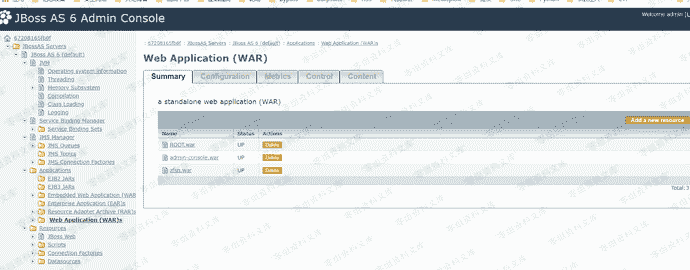
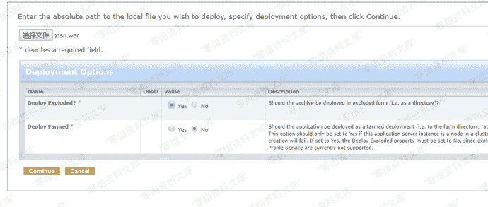
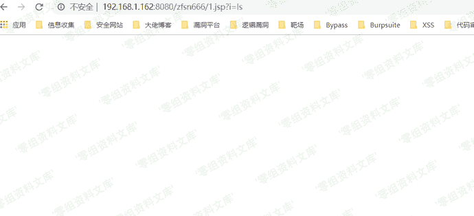

# JBoss Administration Console 弱口令 Getshell

> 原文：[https://www.zhihuifly.com/t/topic/2982](https://www.zhihuifly.com/t/topic/2982)

# JBoss Administration Console 弱口令 Getshell

## 一、漏洞简介

Administration Console 存在默认密码 admin admin 我们可以登录到后台部署war包getshell

## 二、漏洞影响

全版本

## 三、复现过程

1、点击Administration console

2、输入弱口令 admin admin 进去

3、点击Web application ,然后点击右上角的add

4、把文件传上去即可getshell

