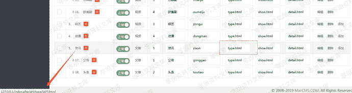
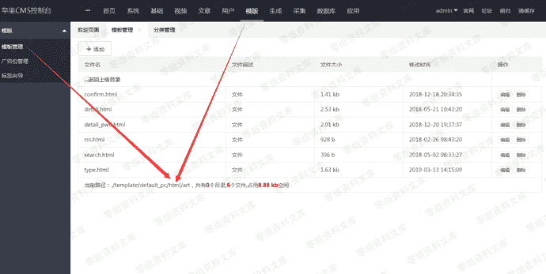
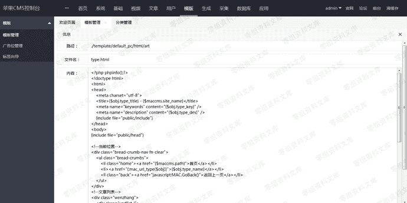
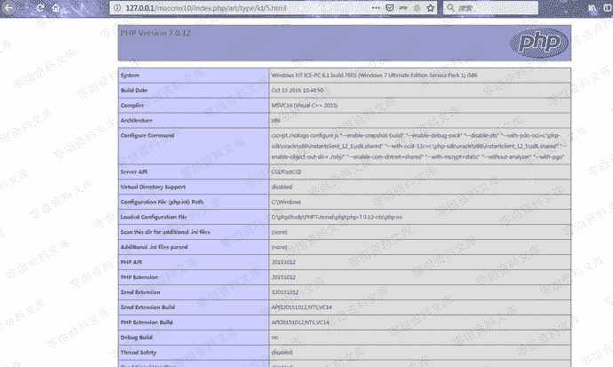
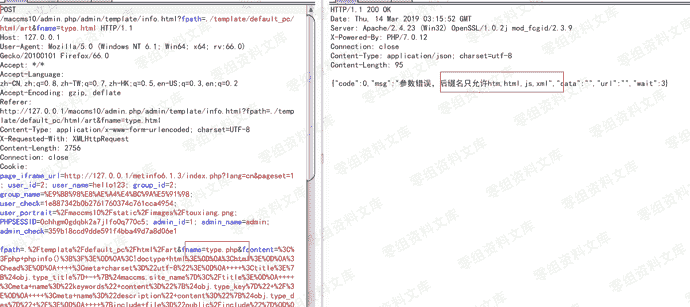
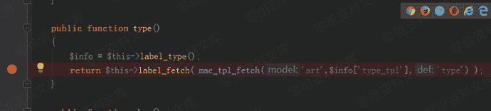
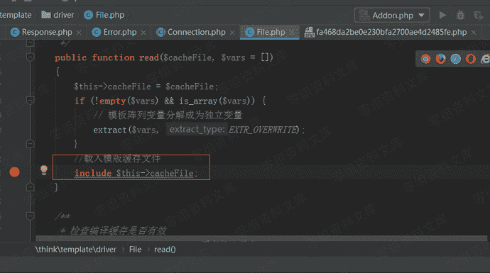
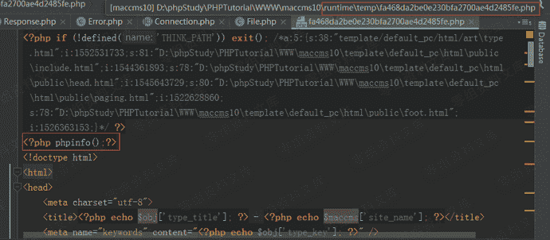

# （CVE-2019-9829）Maccms背景任意文件写入getshell

> 原文：[https://www.zhihuifly.com/t/topic/3013](https://www.zhihuifly.com/t/topic/3013)

# （CVE-2019-9829）Maccms背景任意文件写入getshell

## 一、漏洞简介

## 二、漏洞影响

v10

## 三、复现过程

登录到后台，单击基本->类别管理；您可以看到用于每个类别的类别页面模板。您会看到这里使用的模板是/art/type.html

在后台，您可以编辑模板：单击模板-“模板管理”，转到./template/default_pc/html/art的模板管理区域，单击“编辑”，

输入php代码。

访问 index.php/art/type/id/5.html

PHP代码成功执行。

### 原理分析

该程序最初旨在禁止将模板更改为PHP文件：

但是，在渲染模板时，该程序会将模板文件写入缓存文件，然后将其包含在“ include”中，因此，禁止将模板更改为php文件后，仍然可以执行代码。

