# MyBB 后台代码执行漏洞

> 原文：[https://www.zhihuifly.com/t/topic/3033](https://www.zhihuifly.com/t/topic/3033)

# MyBB 后台代码执行漏洞

## 一、漏洞简介

## 二、漏洞影响

## 三、复现过程

### 漏洞分析

首先全局搜索inclued函数，在`\mybb\admin\modules\config\languages.php`页面的432行发现include函数：@include $editfile;

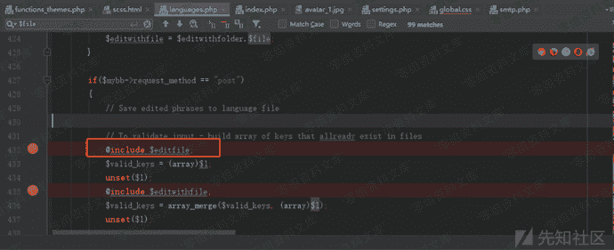

该函数包含`editfile`文件，进行查看该文件来源，可以看到418行该文件由folder文件夹和file文件拼接，其中408行看到file文件由post请求提交，接下来查看folder文件夹来源

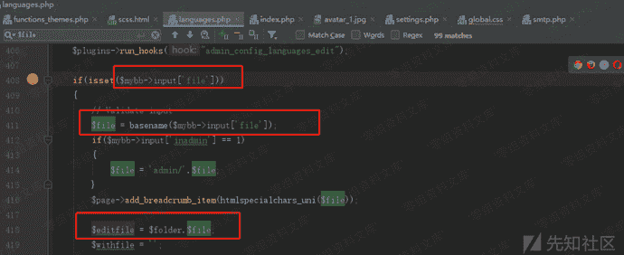

通过该文件84行看到foler文件夹为`MYBB_ROOT."inc/languages/".$editlang."/"`，接下来查看editlang变量，通过89行看到判断该文件名后缀为php的文件是否存在，然后查看该文件下辖的php文件只有english文件，猜测editlang为english，稍后验证，该变量会通过post请求输入

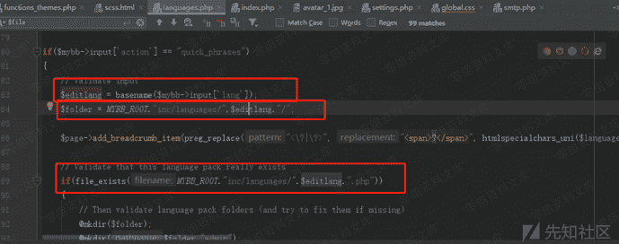

现在文件的目录结构分析完毕，接下来查看该漏洞页面的接口位置：由于该文件目录为`\mybb\admin\modules\config\languages.php`，因此，入口为config模板的language方法中，其中控制器为edit，从369行可以看到，同时408行看到post请求中输入file文件

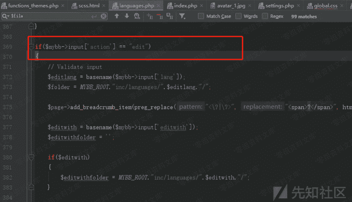

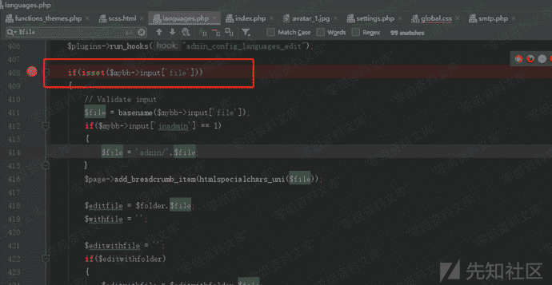

因此我们查看该页面uri大概为以下样子：
`/mybb/admin/index.php?module=config-languages&action=edit`
现在进行分析，该目录为`inc/languages/english`，因此我们需要向该文件夹下进行上传一个图片，因此我们需要将上传文件目录修改为该文件夹，现在分析如何修改该文件夹：
通过对头像上传文件夹进行跟踪，发现在`function_upload.php`的222行，该文件夹由全局变量settings控制

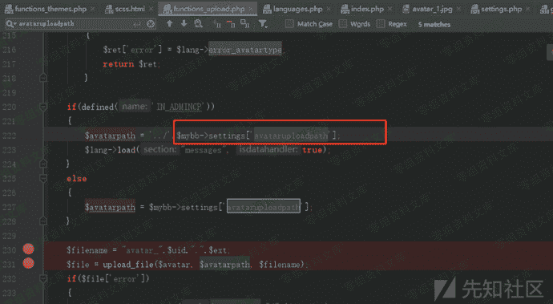

对该变量进行跟踪，`$mybb->settings['avataruploadpath']`，发现对$mybb->settings['uploadspath']变量的控制就需要对文件进行修改进行查询，针对关键函数进行搜索：`$db->update_query("settings"`发现在`\mybb\admin\modules\config\settings.php`文件下1101行：

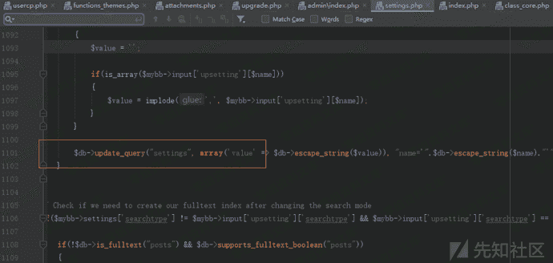

通过value和name变量进行更新，其中value变量是从post请求中的`upsetting`数组中进行获取其name变量的值：

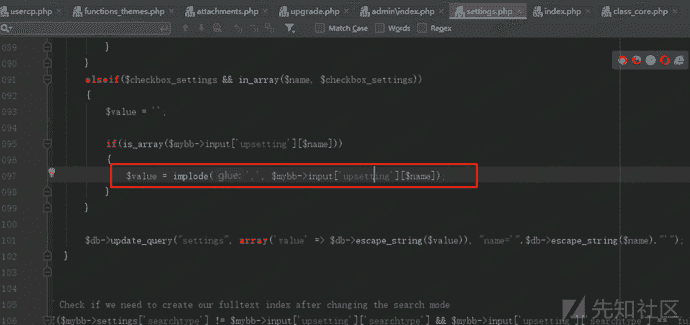

我们跟踪`avataruploadpath`变量，进行搜索，有1042行定义数组，而`avataruploadpath`为数组中的参数，同时也有post请求的`upsetting`数组进行输入:

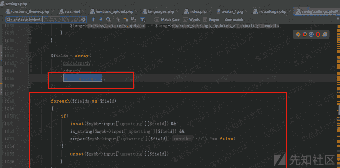

现在寻找数据传入方式，发现action方法为`change`，请求方式为`post`：

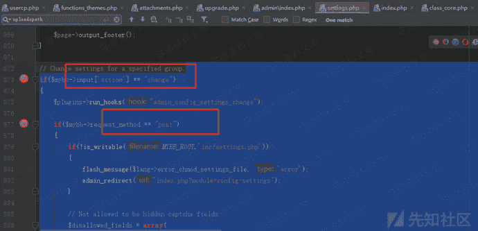

通过该页面17行，发现页面在index页面下调用的模板为config下的`setting`模板：

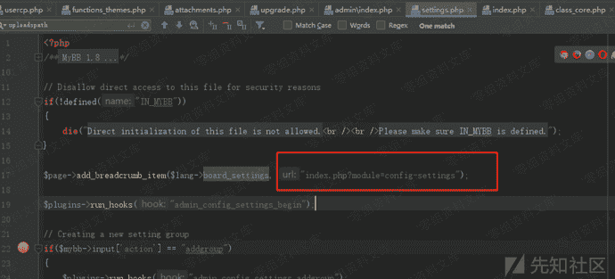

因此我们构建的页面就可以为这样，从该页面进行传入数据

```
http://www.0-sec.org/mybb/admin/index.php?module=config-settings&action=change 
```

### 漏洞复现

通过上传头像（上传的头像图片小于1kb，因为网站会进行压缩，将php脚本破坏，因此制作木马要保证大小小于1kb，已做好的图片放在了附件中）
通过修改setting中的`avataruploadpath`值为`./inc/languages/english`

修改`avataruploadpath`值为`./inc/languages/English`，查看所有的settins变量：
链接：http://www.0-sec.org/mybb/admin/index.php?module=config-settings&action=change

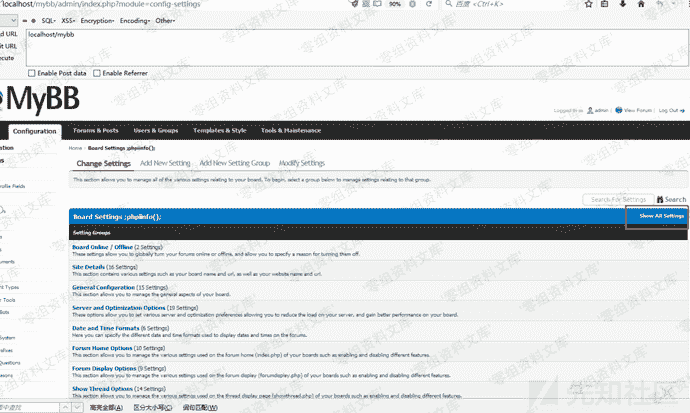

找到**`Avatar Upload Path`**并修改`./inc/languages/english`

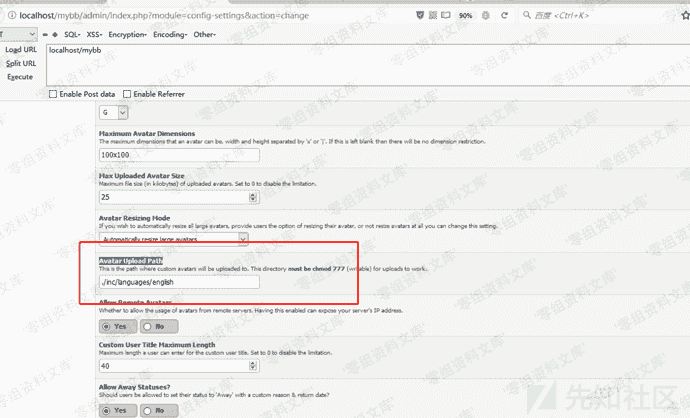

通过上传头像图片：
http://www.0-sec.org/mybb/admin/index.php?module=user-users&action=edit&uid=1#tab_avatar
勾选去掉当前头像

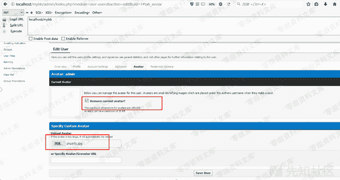

点击save user
发现文件已经上传成功，并且`avataruploadpath`也修改成功，下面进行包含操作，访问url：http://www.0-sec.org/mybb/admin/index.php?module=config-languages&action=edit&lang=english
Config模块下的languages下，

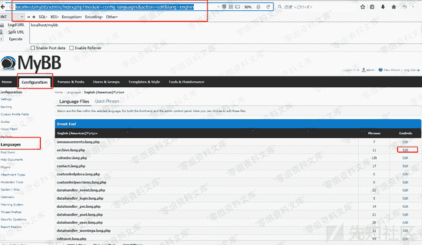

因为该页面包含需要post请求，并且控制器入口为edit，因此我们进行edit，随便点一个php文件进行编辑：

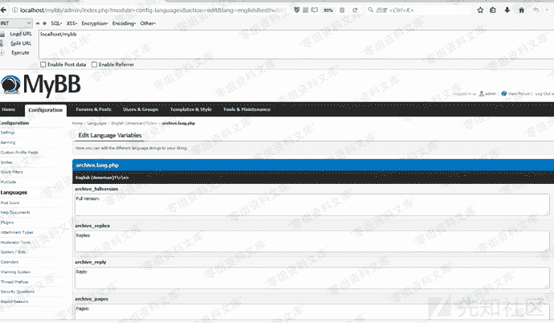

**什么都不用更改**，点击save languagefile

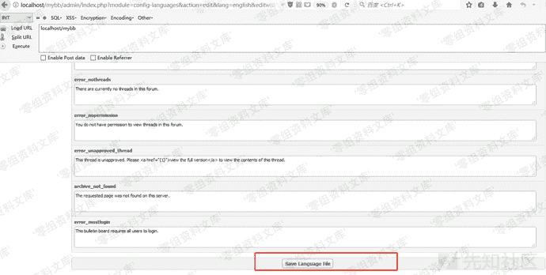

bp抓包：

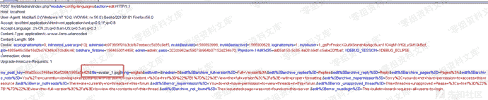

将file变量改为我们的头像图片文件名，名字可以从这里看到

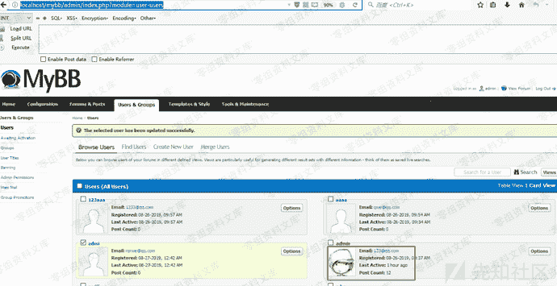

通过邮件查看图片链接：
右键复制链接打开可以看到文件名为`avatar_1.jpg`

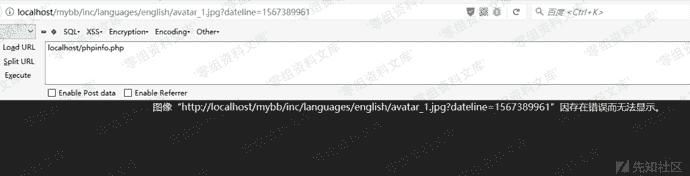

然后放包发现该代码执行成功，phpinfo()

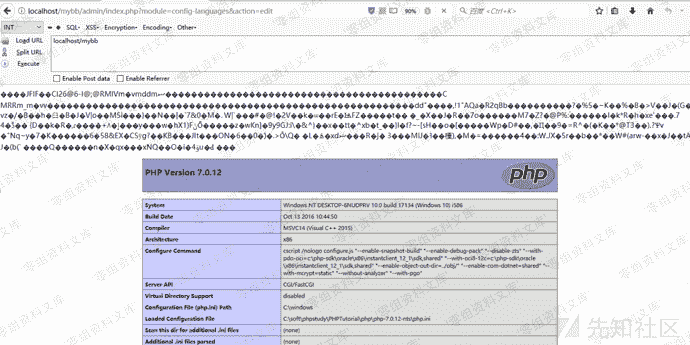

测试一句话木马eval($_GET['a']);

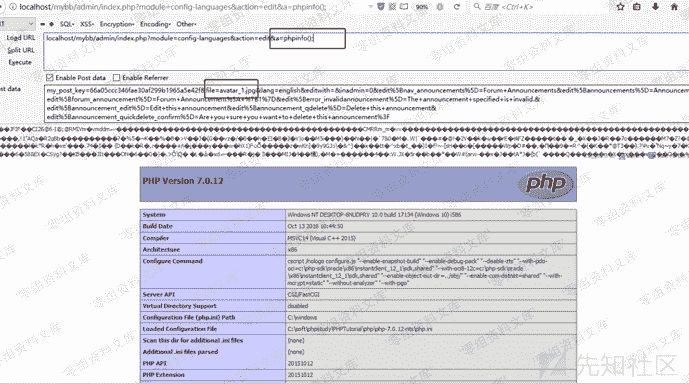

测试成功
文件上传后，包含后图像文件会损坏，所以需要执行完命令，创建一个新的shell文件，然后通过poc进行验证shell文件存在
写一句话木马到网站，请使用muma.jpg,然后包含，会在/mybb/admin生成shell.php,一句话木马密码为a

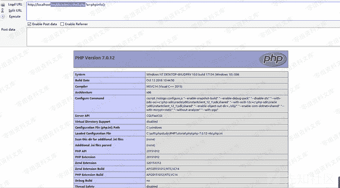

### 文中附件下载链接

> http://wiki.0-sec.org/download/Mybb_pic.7z

## 参考链接

> https://xz.aliyun.com/t/7213#toc-2