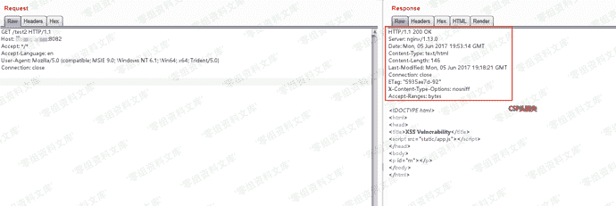

# Nginx 配置错误漏洞 add_header被覆盖

> 原文：[https://www.zhihuifly.com/t/topic/3043](https://www.zhihuifly.com/t/topic/3043)

# Nginx 配置错误漏洞 add_header被覆盖

## 一、漏洞简介

## 二、漏洞影响

## 三、复现过程

Nginx配置文件子块（server、location、if）中的`add_header`，将会覆盖父块中的`add_header`添加的HTTP头，造成一些安全隐患。

如下列代码，整站（父块中）添加了CSP头：

```
add_header Content-Security-Policy "default-src 'self'";
add_header X-Frame-Options DENY;

location = /test1 {

rewrite ^(.*)$ /xss.html break;

} `location = /test2 {

add_header X-Content-Type-Options nosniff;

rewrite ^(.*)$ /xss.html break;

}` 
```

但`/test2`的location中又添加了`X-Content-Type-Options`头，导致父块中的`add_header`全部失效：



XSS可被触发：

