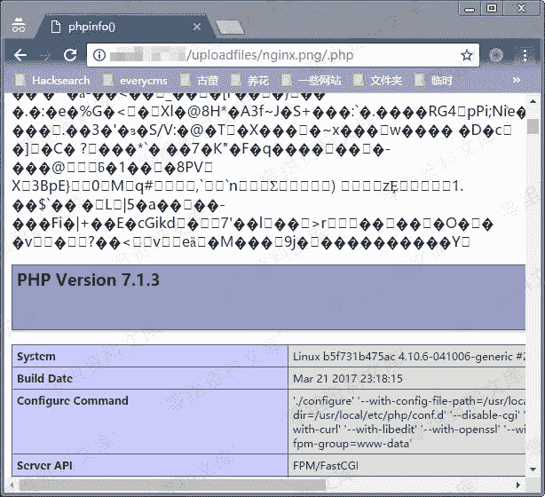

# Nginx 解析漏洞

> 原文：[https://www.zhihuifly.com/t/topic/3044](https://www.zhihuifly.com/t/topic/3044)

# Nginx 解析漏洞

## 一、漏洞简介

## 二、漏洞影响

*   Nginx 1.x 最新版
*   PHP 7.x最新版

## 三、复现过程

直接执行`docker-compose up -d`启动容器，无需编译。

访问`http://www.0-sec.org/uploadfiles/nginx.png`和`http://your-ip/uploadfiles/nginx.png/.php`即可查看效果。

正常显示：

增加`/.php`后缀，被解析成PHP文件：

