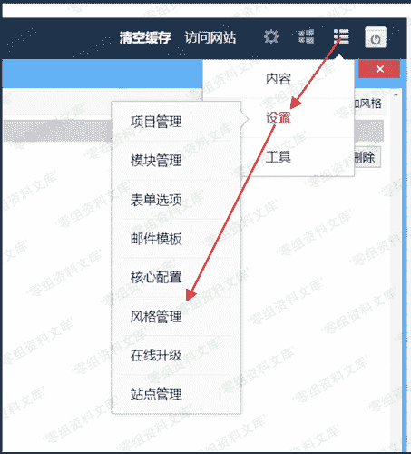
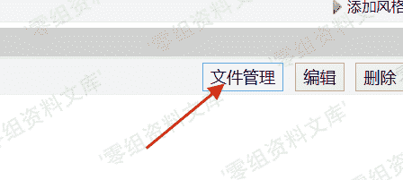
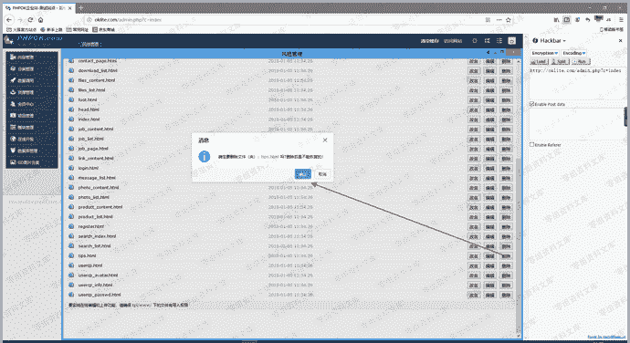
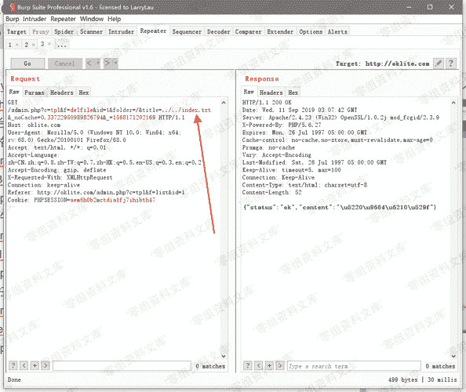

# （CVE-2019-16132） OKLite v1.2.25 存在任意文件删除漏洞

> 原文：[https://www.zhihuifly.com/t/topic/3057](https://www.zhihuifly.com/t/topic/3057)

# （CVE-2019-16132） OKLite v1.2.25 存在任意文件删除漏洞

## 一、漏洞简介

Ethan发现OKLite v1.2.25 存在任意文件删除漏洞（需要登录后台）

后台删除文件时抓包修改`title`参数可以直接删除网站任意文件

## 二、漏洞影响

OKLite v1.2.25 版本

## 三、复现过程

1.进入后台
2.选择风格管理

3.进入文件管理

4.抓包，删除一个文件

5.拦截到请求后，改title为../../index.txt

## 参考链接

> https://www.jianshu.com/p/27360b192ae3