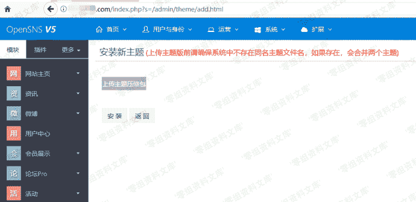
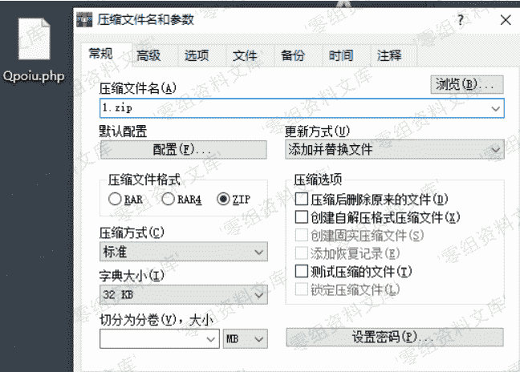
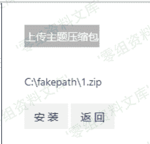
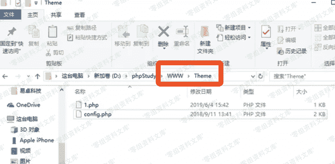

# OpenSNS 后台getshell

> 原文：[https://www.zhihuifly.com/t/topic/3059](https://www.zhihuifly.com/t/topic/3059)

# OpenSNS 后台getshell

## 一、漏洞简介

## 二、漏洞影响

## 三、复现过程

### 1\. 打开网站后台找到模板上传位置：

http://www.0-sec.org/index.php?s=/admin/theme/add.html



### 2\. 配置一个压缩包，压缩包里是一句话木马：



### 3\. 选择上传：



### 4、会在./Theme目录下自动生成刚刚上传好的马儿

```
http://www.0-sec.org/Theme/shell.php 
```

