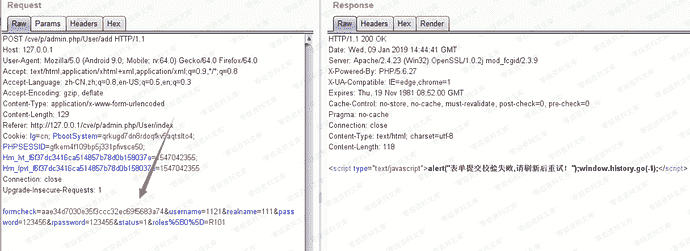
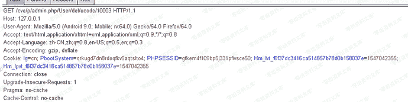
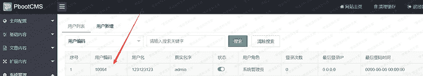
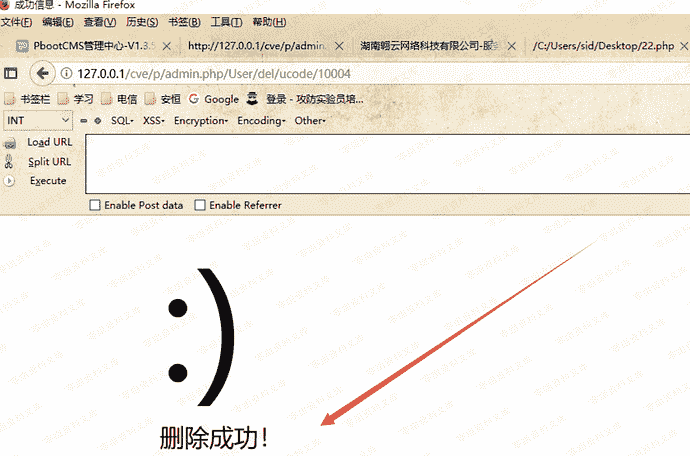
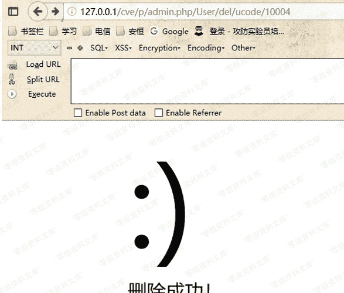

# PbootCMS csrf

> 原文：[https://www.zhihuifly.com/t/topic/3066](https://www.zhihuifly.com/t/topic/3066)

# PbootCMS csrf

## 一、漏洞简介

## 二、漏洞影响

## 三、复现过程

我将网站建立在本地，本来想测试添加用户的操作，但是发现这里有formcheck验证，所以失败了

然后我想到了删除用户位置，首先我使用管理员账号登陆，在删除用户的操作时抓包。发现很简单。只有一个id来判断删除哪个用户

于是我直接构造一个新的url，http://www.0-sec.org/cve/p/admin.php/User/del/ucode/10004（上面是10003）

确认这个用户是存在的。然后访问http://www.0-sec.org/cve/p/admin.php/User/del/ucode/10004

删除成功

但是这样很容易被熟悉的管理员识别，我们可以利用段网站来进行攻击。

短网址生成网站https://www.ft12.com/

http://www.0-sec.org/cve/p/admin.php/User/del/ucode/10004

可以缩短为http://u6.gg/gPCcN

访问这个短网址，也可以变为http://www.0-sec.org/cve/p/admin.php/User/del/ucode/10004触发漏洞

