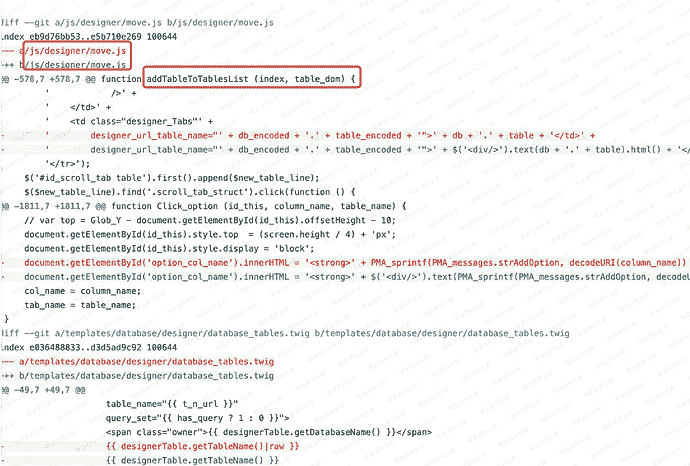
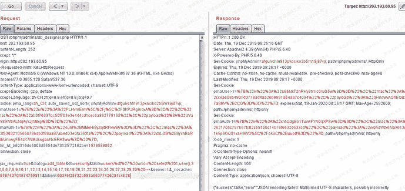
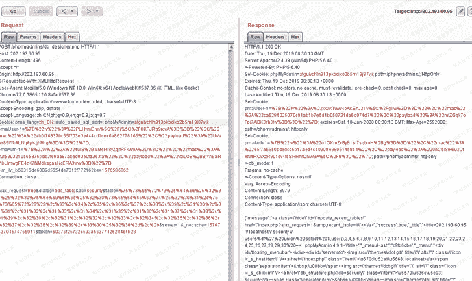
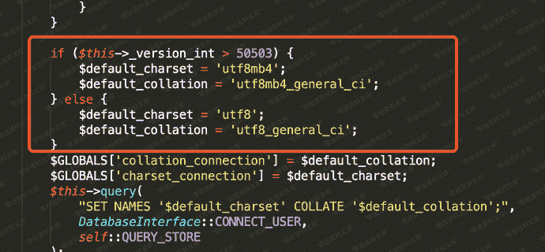
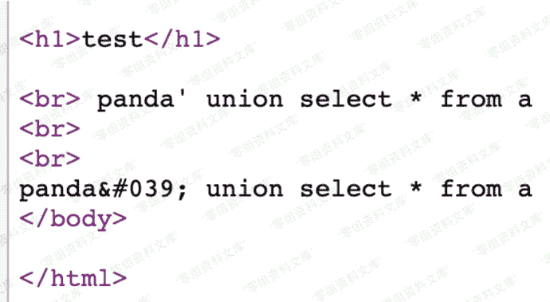
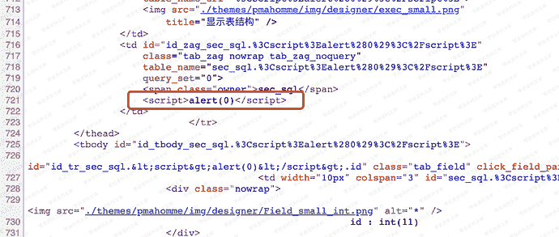
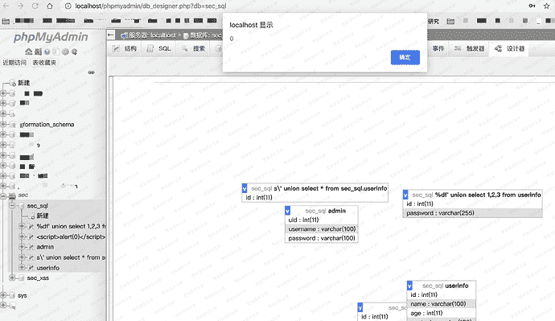
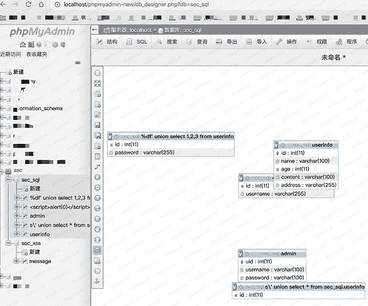

# （CVE-2019-18622）Phpmyadmin xss

> 原文：[https://www.zhihuifly.com/t/topic/3085](https://www.zhihuifly.com/t/topic/3085)

# （CVE-2019-18622）Phpmyadmin xss

## 一、漏洞简介

官方公布的是sql注入漏洞，但是实际是xss漏洞

## 二、漏洞影响

Phpmyadmin <=4.9.2，至少影响到4.7.7。

## 三、复现过程

### 漏洞分析

首先看官方修复的方式：



如上图，先关注/js/designer/move.js文件，可以看到单纯的修改了取值方式，最终的值通过POST 方式提交到db_desingner.php文件，关键内容如下：

```
if (isset($_POST['dialog'])) {

```
 ....

} elseif ($_POST['dialog'] == 'add_table') {
    // Pass the db and table to the getTablesInfo so we only have the table we asked for
    $script_display_field = $designerCommon-&gt;getTablesInfo($_POST['db'], $_POST['table']);
 ... 
``` `}` 
```

传到了getTablesInfo()函数中，该函数内容主要如下：

```
public function getTablesInfo($db = null, $table = null)
    {
        .....
        foreach ($tables as $one_table) {
            $DF = $this->relation->getDisplayField($db, $one_table['TABLE_NAME']);
            $DF = is_string($DF) ? $DF : '';
            $DF = ($DF !== '') ? $DF : null;
            $designerTables[] = new DesignerTable(
                                    $db,
                                    $one_table['TABLE_NAME'],
                                    $one_table['ENGINE'],
                                    $DF
                                );
        }

```
 return $designerTables;
} 
``` 
```

跟进getDisplayField()，内容如下：

```
public function getDisplayField($db, $table)
    {
        $cfgRelation = $this->getRelationsParam();

```
 /**
     * Try to fetch the display field from DB.
     */
    if ($cfgRelation['displaywork']) {
        $disp_query = '
            SELECT `display_field`
            FROM ' . Util::backquote($cfgRelation['db'])
                . '.' . Util::backquote($cfgRelation['table_info']) . '
            WHERE `db_name`    = \'' . $GLOBALS['dbi']-&gt;escapeString($db) . '\'
                AND `table_name` = \'' . $GLOBALS['dbi']-&gt;escapeString($table)
            . '\'';

        $row = $GLOBALS['dbi']-&gt;fetchSingleRow(
            $disp_query, 'ASSOC', DatabaseInterface::CONNECT_CONTROL
        );
        if (isset($row['display_field'])) {
            return $row['display_field'];
        }
    } 
``` `…` 
```

通过escapeString过滤 table 名，查看该过滤函数：

```
public function escapeString($link, $str)
    {
        return mysql_real_escape_string($str, $link);
    } 
```

引入了mysql_real_escape_string()函数

这个函数类似于addslashes()函数，当编码不当的时候，可能导致宽字节注入

但真的那么简单吗？继续往下看

这里获得的table_name 参数会传入以下语句：

```
SELECT *, `COLUMN_NAME` AS `Field`, `COLUMN_TYPE` AS `Type`, `COLLATION_NAME` AS `Collation`, `IS_NULLABLE` AS `Null`, `COLUMN_KEY` AS `Key`, `COLUMN_DEFAULT` AS `Default`, `EXTRA` AS `Extra`, `PRIVILEGES` AS `Privileges`, `COLUMN_COMMENT` AS `Comment` FROM `information_schema`.`COLUMNS` WHERE `TABLE_SCHEMA` = 'day1' AND `TABLE_NAME` = '$table_name'; 
```

这里的$table_name在 db_designer.php中可控，然而当环境准备好，语句配置好后，却出现了以下错误：



```
JSON encoding failed: Malformed UTF-8 characters, possibly incorrectly encoded 
```

提示是因为编码问题，因此我们重新将 payload url 编码后再传入：



这次无误，查看执行的语句：


%df%27并没有按照我们想法闭合单引号，到底是什么原因呢？



在数据库连接的时候，phpmyadmin会将默认的字符格式设置为 utf8mb4，而我们宽字节注入必须要求编码为g bk，因此其实这里不存在宽字节注入。

说明这里的修复对SQL 漏洞并无多大关系（其实从修复文件上看，就知道了），继续看下一处修复。

```
/templates/database/designer/database_tables.twig处 
```

diff 如下：

```
-                    {{ designerTable.getTableName()|raw }}
+                    {{ designerTable.getTableName() }} 
```

可以看到，唯一的差别就是删除了|raw，这种写法是Twig模板语言的写法，raw 的作用就是让数据在 autoescape过滤器里失效，可以安装一个 twig 模板看看实例。

```
composer require "twig/twig:^3.0" 
```


运行命令后该目录下会生成2个文件：composer.json、composer.lock以及一个目录vendor

然后在同目录下创建文件夹templates、tmp

进入templates目录下创建index.html.twig文件，内容如下

```
<!DOCTYPE html>
<html lang="en">
<head>
    <meta charset="UTF-8">
    <title>twig</title>
</head>
<body>
<h1>test</h1><br>
 {{ name |raw}}
<br>
{{ name }}
</body>
</html> 
```

根目录下创建index.php，内容如下：

```
 require_once 'vendor/autoload.php';

$loader = new \Twig\Loader\FilesystemLoader(‘templates’);

$twig = new \Twig\Environment($loader, [

‘cache’ => ‘/Library/WebServer/Documents/twig/tmp’,

]); `echo $twig->render(‘index.html.twig’, [‘name’ => ‘panda’ union select 1,2, from a’]);` 
```

访问index.php可以发现：



单引号被转义成了实体字符

修复的 SQL 漏洞点在这里吗？

并不是。这里修复的仅仅是前端显示字符串的问题，与后端的 sql 注入也并无关系。

前文中提到的move.js修复的也是前端的内容，其实也和后端的 sql 注入并无关系。

那么这个修复方式和 sql 注入到底是什么关系呢？

可能没关系吧。

考虑到该修复内容全部为前端的内容，于是将表名改为 XSS 的 payload：

```
<script>alert(0)</script> 
```

果然，和当初想的一样，触发了 XSS 漏洞。





然后看v4.9.2版本的 phpmyadmin：




转义成实体字符，无法触发 XSS 攻击 payload